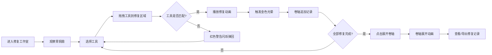

## 1. 产品概述
青铜器修复模拟器是一款基于Web的交互式3D文物修复体验应用，让用户以古代工匠的身份在虚拟修复台上对青铜鼎进行清理、补缺和摹刻纹饰，最终生成可展开的修复记录卷轴。

- **核心价值**：通过沉浸式3D交互体验，传承和展示中华传统文物修复技艺，普及青铜文化知识
- **目标用户**：文物爱好者、历史学习者、游戏玩家、文化传播受众
- **产品定位**：寓教于乐的文化体验类Web应用

## 2. 核心功能

### 2.1 用户角色
| 角色 | 注册方式 | 核心权限 |
|------|----------|----------|
| 普通用户 | 无需注册，直接访问 | 完整的修复体验、工具使用、卷轴查看与导出 |

### 2.2 功能模块
1. **3D修复工作室场景**：古色古香的修复台、青铜鼎模型、工具架、可交互视角控制
2. **工具交互系统**：工具选择、拖拽使用、正确/错误反馈动画、区域修复判定
3. **修复效果系统**：铜绿清理、刻线摹刻、补缺修复、区域完成光效
4. **卷轴记录系统**：实时记录修复操作、竖排毛笔书法展示、宣纸墨水效果
5. **卷轴展开查看器**：从右向左展开动画、前后对比缩略图、最终成果评价

### 2.3 页面详情
| 页面名称 | 模块名称 | 功能描述 |
|----------|----------|----------|
| 修复工作室主界面 | 3D场景模块 | 渲染修复台、青铜鼎、工具架，处理鼠标拖拽旋转视角、滚轮缩放 |
| 修复工作室主界面 | 工具面板模块 | 左侧三层工具架，展示毛刷、刻刀、补土、细砂纸，支持悬停放大显示说明，拖拽使用 |
| 修复工作室主界面 | 修复交互模块 | 判定工具与修复区域的匹配关系，播放正确/错误动画，更新鼎身状态 |
| 修复工作室主界面 | 卷轴记录模块 | 右侧宣纸卷轴区域，竖排文字实时记录每一步修复操作 |
| 卷轴查看弹窗 | 卷轴展开模块 | 点击展开按钮后全屏展示修复卷轴，从右向左展开动画，缩放查看细节 |

## 3. 核心流程

用户打开应用 → 进入古色古香的修复工作室 → 拖拽旋转视角观察青铜鼎 → 从左侧工具架悬停查看工具说明 → 拖拽合适的工具到鼎身待修区域 → 工具匹配正确则播放修复动画 → 区域修复完成触发金色光晕 → 卷轴自动追加修复记录 → 全部修复完成后点击展开卷轴 → 卷轴从右向左展开展示完整修复记录 → 可缩放查看细节和导出记录

## 4. 用户界面设计

### 4.1 设计风格
- **主色调**：青铜绿 `#4a7c59`、铜锈褐 `#8b4513`、宣纸米黄 `#f5e6c8`、深灰背景 `#2c2c2c`
- **辅助色**：青铜原色 `#b87333`、金色光晕 `#ffd700`、墨色文字 `#1a1a1a`、红色警告 `#dc2626`
- **字体**：标题使用 "Ma Shan Zheng" 毛笔楷体，正文使用系统宋体
- **材质质感**：青石板磨损纹理、青铜金属质感、宣纸纹理、木纹肌理
- **动画风格**：ease-in-out缓动曲线，0.2-1.0秒响应反馈，流畅自然

### 4.2 页面设计概述
| 页面名称 | 模块名称 | UI元素 |
|----------|----------|--------|
| 修复工作室 | 3D场景 | 深灰背景渐层、青石板修复台（4x3单位）、青铜鼎（铜绿+锈迹+兽面纹残缺）、光照系统（主光+环境光+补光） |
| 修复工作室 | 工具架 | 左侧三层四格布局、半透明方盒悬停放大、工具名称与用法说明弹出 |
| 修复工作室 | 卷轴记录 | 右侧宣纸卷轴、竖排毛笔文字、墨水渗透晕开效果、记录逐条追加动画 |
| 修复工作室 | 交互反馈 | 修复区域径向渐变扫除（0.8s）、刻线细密扩散（0.5s）、金色光晕扩散（1s）、红色警告闪烁（0.3s×3） |
| 卷轴查看器 | 展开动画 | 800px×1500px仿古宣纸、边缘磨损虫蛀纹理、从右向左展开（3s）、缩放控制按钮 |

### 4.3 响应式设计
- **桌面优先**：最小宽度768px，适配桌面和平板设备
- **布局适配**：工具架和卷轴区域在小屏幕上调整为上下布局
- **触控优化**：支持触屏拖拽旋转和缩放，长按选择工具

### 4.4 3D场景设计
- **环境**：深灰背景 `#2c2c2c`，轻微噪点纹理模拟旧纸张质感
- **光照**：三光源系统（主光暖黄色45度角、环境光柔和填充、补光突出鼎身轮廓）
- **相机**：OrbitControls，Y轴旋转0-360度，俯仰角15-75度，距离3-12单位
- **材质**：
  - 修复台：青石板 `#4a4a4a`，粗糙度0.8，金属度0.1，磨损纹理法线贴图
  - 青铜鼎：多层材质（基础青铜色、铜绿层、锈迹层），金属度0.7，粗糙度0.6
  - 工具：毛刷木柄 `#c0a080`、刻刀金属 `#a0a0a0`、补土 `#d2b48c`、砂纸 `#9e8c6c`
- **性能优化**：模型面数控制在5万以内，纹理压缩，阴影使用PCFSoftShadowMap，帧率目标60FPS
- **后处理**：轻微Bloom效果增强光晕，色调映射ACESFilmicToneMapping
