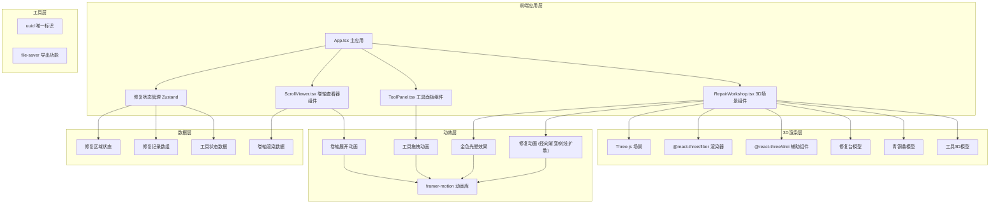

## 1. 架构设计



## 2. 技术描述

- **前端框架**：React 18 + TypeScript
- **构建工具**：Vite 5
- **3D渲染**：Three.js r159 + @react-three/fiber 8.15 + @react-three/drei 9.92
- **状态管理**：Zustand 4.4
- **动画系统**：framer-motion 10.16
- **样式方案**：CSS Modules + CSS Variables
- **工具库**：uuid 9.0、file-saver 2.0

## 3. 项目结构

```
src/
├── main.tsx                 # React应用入口
├── App.tsx                  # 主应用组件，状态管理中心
├── store/
│   └── useRepairStore.ts    # Zustand修复状态管理
├── components/
│   ├── RepairWorkshop.tsx   # 3D修复工作室场景
│   ├── ToolPanel.tsx        # 2D工具面板侧边栏
│   └── ScrollViewer.tsx     # 卷轴展开查看器
├── types/
│   └── index.ts             # TypeScript类型定义
├── utils/
│   ├── bronzeTextures.ts    # 青铜材质配置
│   └── repairRegions.ts     # 修复区域定义
└── styles/
    └── globals.css          # 全局样式与CSS变量
```

## 4. 核心数据模型

### 4.1 类型定义

```typescript
// 工具类型
type ToolType = 'brush' | 'chisel' | 'putty' | 'sandpaper';

// 修复区域类型
type RegionType = 'patina' | 'engraving' | 'missing' | 'rust';

// 修复状态
type RepairStatus = 'pending' | 'in-progress' | 'completed';

// 工具定义
interface Tool {
  id: string;
  type: ToolType;
  name: string;
  description: string;
  color: string;
  applicableRegions: RegionType[];
}

// 修复区域
interface RepairRegion {
  id: string;
  type: RegionType;
  position: [number, number, number];
  radius: number;
  status: RepairStatus;
  requiredTool: ToolType;
  description: string;
}

// 修复记录
interface RepairRecord {
  id: string;
  timestamp: number;
  toolType: ToolType;
  regionId: string;
  regionType: RegionType;
  description: string;
  beforeImage?: string;
  afterImage?: string;
}

// 修复状态
interface RepairState {
  regions: RepairRegion[];
  records: RepairRecord[];
  selectedTool: ToolType | null;
  isDragging: boolean;
  dragPosition: { x: number; y: number } | null;
  showScrollViewer: boolean;
  completionRate: number;
}
```

### 4.2 修复区域配置

| 区域ID | 类型 | 位置 | 所需工具 | 描述 |
|--------|------|------|----------|------|
| region-1 | patina | [0, 0.5, 0.8] | brush | 鼎腹左侧铜绿覆盖区 |
| region-2 | patina | [0, 0.5, -0.8] | brush | 鼎腹右侧铜绿覆盖区 |
| region-3 | rust | [0.5, 0.3, 0.6] | sandpaper | 鼎耳锈蚀区域 |
| region-4 | rust | [-0.5, 0.3, 0.6] | sandpaper | 鼎耳锈蚀区域 |
| region-5 | engraving | [0, 0.6, 0.85] | chisel | 兽面纹左侧缺失 |
| region-6 | engraving | [0, 0.6, -0.85] | chisel | 兽面纹右侧缺失 |
| region-7 | missing | [0.6, 0.2, 0] | putty | 鼎足缺口修复 |
| region-8 | missing | [-0.6, 0.2, 0] | putty | 鼎足缺口修复 |

## 5. 核心组件交互

### 5.1 RepairWorkshop 组件
- **Props**：`regions`, `onRepairComplete`, `onToolUse`, `selectedTool`, `isDragging`
- **职责**：渲染3D场景、处理相机控制、检测工具与区域碰撞、播放修复动画
- **关键方法**：
  - `handleRaycast()`: 射线检测工具与修复区域的碰撞
  - `playRepairAnimation()`: 播放区域修复动画
  - `playGlowEffect()`: 播放完成光晕效果
  - `playErrorAnimation()`: 播放错误警告动画

### 5.2 ToolPanel 组件
- **Props**：`tools`, `selectedTool`, `onToolSelect`, `onToolDragStart`, `onToolDragEnd`
- **职责**：渲染工具架、处理工具拖拽、显示工具提示
- **关键方法**：
  - `handleDragStart()`: 开始拖拽工具
  - `handleDragEnd()`: 结束拖拽并通知3D场景

### 5.3 ScrollViewer 组件
- **Props**：`records`, `isOpen`, `onClose`, `completionRate`
- **职责**：卷轴展开动画、渲染竖排修复记录、前后对比图
- **关键方法**：
  - `animateScrollUnfurl()`: 卷轴从右向左展开动画
  - `renderVerticalText()`: 竖排毛笔文字渲染
  - `exportScroll()`: 导出修复记录

## 6. 性能优化策略

1. **3D渲染优化**
   - 使用 `@react-three/fiber` 的 `useFrame` 节流，避免每帧过度计算
   - 修复动画使用 `THREE.ShaderMaterial` 实现GPU加速
   - 模型使用 `BufferGeometry` 减少内存占用
   - 开启 `frustumCulled` 视锥体剔除

2. **动画优化**
   - `framer-motion` 使用 `transform` 和 `opacity` 触发GPU合成
   - 卷轴展开使用 CSS `clip-path` 动画而非 DOM 重排
   - 光晕效果使用 `requestAnimationFrame` 手动控制

3. **状态管理优化**
   - Zustand 使用 `select` 避免不必要的重渲染
   - 修复区域状态更新批量处理

4. **帧率目标**
   - 3D场景：60 FPS
   - 卷轴展开：≥ 30 FPS
   - 工具拖拽：60 FPS
