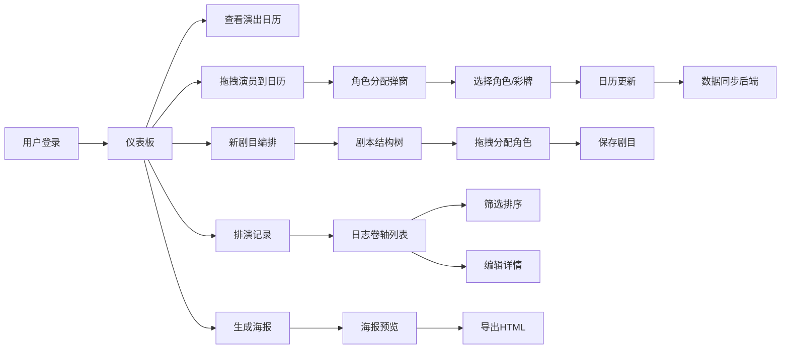

## 1. 产品概述

戏班后台管理系统是一款专为传统戏曲班社设计的全栈Web应用，解决传统戏曲班社在人员调度、角色分配和演出记录方面依赖纸质手抄、效率低且难以回溯的问题。通过数字化管理演员信息、编排演出流程、记录场次反馈，最终生成可查看的戏班演出日历与角色排班表，并支持按剧目筛选和导出为HTML海报。

### 1.1 核心价值
- **数字化管理**：替代纸质手抄，提高管理效率
- **可视化调度**：日历形式直观展示演出安排
- **角色智能分配**：通过拖拽操作快速分配角色行当
- **演出记录回溯**：完整记录每场演出的详细信息
- **海报自动生成**：一键生成古风演出海报

## 2. 核心功能

### 2.1 用户角色
| 角色 | 注册方式 | 核心权限 |
|------|----------|----------|
| 班主/管理员 | 用户名密码注册登录 | 完整权限：演员管理、剧目编排、演出安排、日志记录、海报生成 |

### 2.2 功能模块
1. **登录注册**：用户认证入口
2. **仪表板**：演出日历、角色行当池、角色分配弹窗
3. **剧目编排**：剧本结构树、角色分配表
4. **表演日志**：演出记录列表、筛选排序、详情编辑
5. **海报生成**：古风海报预览、HTML导出

### 2.3 页面详情
| 页面名称 | 模块名称 | 功能描述 |
|---------|---------|----------|
| 登录页 | 表单区域 | 用户注册、登录验证 |
| 仪表板 | 顶部导航栏 | 戏台檐角飞檐造型，功能入口按钮 |
| 仪表板 | 演出日历表格 | 80x80px单元格，展示当月演出安排，悬停显示详情气泡 |
| 仪表板 | 角色行当池 | 展示30位演员信息，支持拖拽到日历 |
| 仪表板 | 角色分配弹窗 | 400x300px磨砂玻璃效果，指派角色、选择上场彩牌 |
| 仪表板 | 左侧辅助面板 | 250px固定宽度，显示演员详情和快捷操作 |
| 剧目编排页 | 剧本结构树 | 折/出、上场人物、唱词提示、动作提示四层可折叠结构 |
| 剧目编排页 | 角色分配表 | 行当区分颜色的角色卡片，支持拖拽分配演员 |
| 表演日志页 | 卷轴列表 | 竹简纹理背景，横向卷轴展示日志条目 |
| 表演日志页 | 筛选排序 | 按日期、观众反应、剧目、行当筛选 |
| 表演日志页 | 详情卡片 | 展开查看完整日志，支持编辑 |
| 海报生成页 | 海报预览 | A3比例古风海报，全屏预览 |
| 海报生成页 | 导出功能 | 导出为HTML文件 |

## 3. 核心流程

### 3.1 演出安排流程
用户登录 → 进入仪表板 → 查看当月日历 → 从行当池拖拽演员到指定日期 → 弹出角色分配窗口 → 选择剧目和角色 → 选择上场彩牌 → 确认分配 → 日历更新显示角色信息 → 数据自动同步到后端

### 3.2 剧目编排流程
点击"新剧目"按钮 → 进入剧目编排页 → 左侧查看剧本结构树 → 展开折/出查看上场人物 → 拖拽"出场人物"到右侧角色卡片 → 卡片显示演员剪影 → 完成角色预分配 → 保存剧目

### 3.3 日志记录流程
点击"排演记录"按钮 → 进入表演日志页 → 查看卷轴式日志列表 → 筛选/排序日志 → 点击卷轴展开详情 → 编辑演出信息、观众反应、备注 → 保存修改

### 3.4 海报生成流程
点击"生成海报"按钮 → 进入海报预览页 → 系统自动排版未来一周演出 → 全屏预览古风海报 → 点击导出 → 保存HTML文件到本地

### 3.5 核心流程图

## 4. 用户界面设计

### 4.1 设计风格
- **整体风格**：清代戏台后台风格，营造古韵氛围
- **主色调**：#f5e6c8（旧纸色）
- **辅助色**：#8b0000（朱红）、#ffd700（金色）、#2c2c2c（深黑）
- **行当配色**：
  - 生角：#b0c4de（淡蓝）
  - 旦角：#ffb6c1（淡粉）
  - 净角：#8b0000（暗红）
  - 末角：#8fbc8f（灰绿）
  - 丑角：#f5deb3（米黄）
- **字体**：Google Fonts - Ma Shan Zheng（手写体楷书）
- **按钮风格**：圆角12px，朱红背景，白色文字，悬停上浮4px
- **卡片风格**：悬停时显示行当色阴影，box-shadow渐变效果
- **动画效果**：过渡时间0.2-0.4秒，ease-out缓动函数

### 4.2 页面设计概述

| 页面名称 | 模块名称 | UI元素 |
|---------|---------|--------|
| 仪表板 | 顶部导航 | 戏台檐角飞檐造型，红灯笼装饰，功能按钮 |
| 仪表板 | 日历表格 | 80x80px单元格，宣纸色#faf0e6背景，剧目名称+主演行当，悬停气泡 |
| 仪表板 | 行当池 | 演员卡片展示，能力三维数值（嗓音/身段/功法1-100），拖拽源 |
| 仪表板 | 角色分配弹窗 | 400x300px，半透明磨砂玻璃，淡青色#e0e8e0背景，彩牌选择（龙/凤/牡丹/祥云） |
| 仪表板 | 左侧面板 | 250px固定宽，磨砂玻璃效果，演员详情+快捷操作 |
| 剧目编排 | 排练桌背景 | 橡木色#d2b48c纹理，仿古书卷色#f5f0e8底色 |
| 剧目编排 | 结构树 | 手写体楷书节点，四层可折叠结构 |
| 剧目编排 | 角色卡片 | 180x80px，行当区分颜色，拖拽目标，纸页翻动动画 |
| 表演日志 | 竹简背景 | 竹简纹理#c0a882，横向卷轴800x120px，象牙白圆轴 |
| 表演日志 | 日志条目 | 演出日期、剧目、演员、梅花评级、备注，折叠动画 |
| 表演日志 | 详情卡片 | 700x400px，剧照区域+详细文字记录 |
| 海报生成 | 海报预览 | A3比例，暗红#8b0000底色，金色花边，白底黑书标题 |

### 4.3 响应式设计
- **桌面端（≥1024px）**：日历6列，角色卡片4列，左侧面板固定显示
- **平板端（768px-1024px）**：日历3列，角色卡片2列，左侧面板固定显示
- **移动端（<768px）**：左侧面板折叠为顶部抽屉式，日历单列，角色卡片单列

### 4.4 交互细节
- **拖拽操作**：60fps帧率，拖拽开始到完成≤2秒
- **悬停效果**：所有可交互元素cursor: pointer，按钮悬停上浮4px，卡片悬停阴影渐变
- **动画效果**：角色分配完成transform: rotateY(15deg) 0.3s，筛选折叠opacity过渡0.4s
- **网络状态**：同步超时800ms显示红色断线香图标，本地缓存队列自动重试
