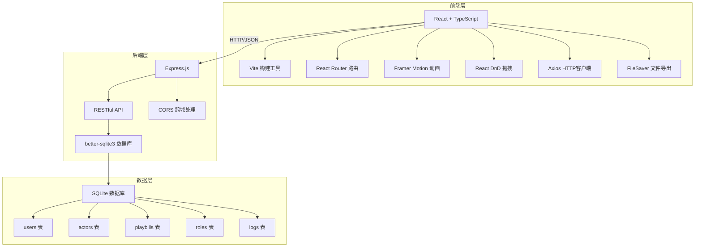
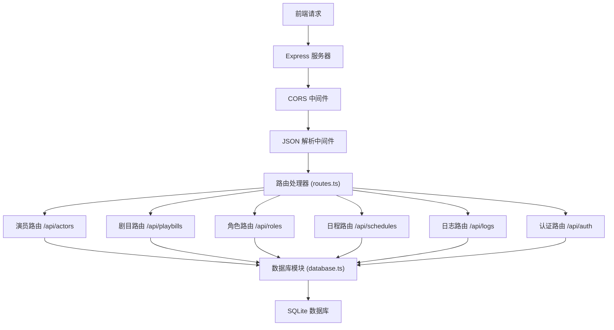
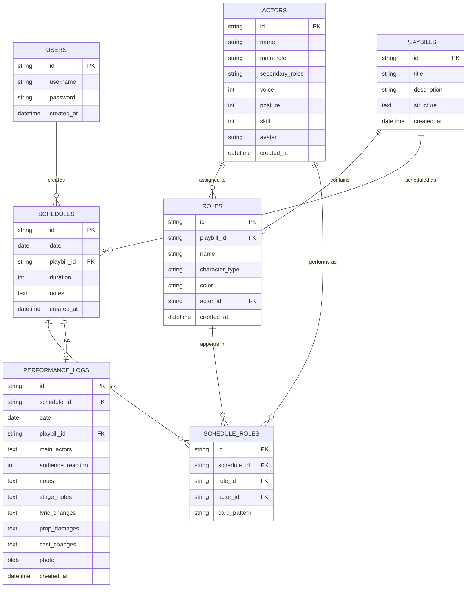

## 1. 架构设计

### 1.1 系统架构图


## 2. 技术栈描述

### 2.1 前端技术
- **框架**: React 18 + TypeScript
- **构建工具**: Vite 5
- **路由**: react-router-dom 6
- **动画**: framer-motion 11
- **拖拽**: react-dnd 16 + react-dnd-html5-backend 16
- **HTTP客户端**: axios 1
- **文件导出**: file-saver 2
- **唯一标识**: uuid 9

### 2.2 后端技术
- **框架**: Express 4
- **数据库**: better-sqlite3 11
- **跨域**: cors 2
- **TypeScript运行**: ts-node 10

### 2.3 初始化方式
- 使用 Vite 初始化 React + TypeScript 项目
- 手动配置 Express 后端服务

## 3. 路由定义

### 3.1 前端路由
| 路由路径 | 页面组件 | 功能说明 |
|---------|---------|---------|
| /login | Login.tsx | 用户登录注册 |
| /dashboard | Dashboard.tsx | 仪表板-演出日历 |
| /playbill | PlaybillEditor.tsx | 剧目编排 |
| /logs | PerformanceLogs.tsx | 表演日志 |
| /poster | PosterGenerator.tsx | 海报生成 |
| * | Dashboard.tsx | 默认重定向到仪表板 |

### 3.2 后端API路由
| HTTP方法 | API路径 | 功能说明 |
|---------|---------|---------|
| POST | /api/auth/register | 用户注册 |
| POST | /api/auth/login | 用户登录 |
| GET | /api/actors | 获取所有演员 |
| POST | /api/actors | 创建演员 |
| PUT | /api/actors/:id | 更新演员信息 |
| DELETE | /api/actors/:id | 删除演员 |
| GET | /api/playbills | 获取所有剧目 |
| POST | /api/playbills | 创建新剧目 |
| PUT | /api/playbills/:id | 更新剧目 |
| DELETE | /api/playbills/:id | 删除剧目 |
| GET | /api/roles | 获取所有角色 |
| POST | /api/roles | 创建角色 |
| PUT | /api/roles/:id | 更新角色分配 |
| DELETE | /api/roles/:id | 删除角色 |
| GET | /api/schedules | 获取演出安排 |
| POST | /api/schedules | 创建演出安排 |
| PUT | /api/schedules/:id | 更新演出安排 |
| DELETE | /api/schedules/:id | 删除演出安排 |
| GET | /api/logs | 获取表演日志 |
| POST | /api/logs | 创建日志 |
| PUT | /api/logs/:id | 更新日志 |
| DELETE | /api/logs/:id | 删除日志 |
| GET | /api/poster/week | 获取下周海报数据 |

## 4. API数据类型定义

```typescript
// 用户类型
interface User {
  id: string;
  username: string;
  password: string;
  createdAt: string;
}

// 演员类型
interface Actor {
  id: string;
  name: string;
  mainRole: '生' | '旦' | '净' | '末' | '丑';
  secondaryRoles: string[];
  voice: number;
  posture: number;
  skill: number;
  avatar: string;
  createdAt: string;
}

// 剧目类型
interface Playbill {
  id: string;
  title: string;
  description: string;
  structure: PlaybillStructure[];
  createdAt: string;
}

interface PlaybillStructure {
  id: string;
  type: 'act' | 'scene' | 'character' | 'sing' | 'action';
  name: string;
  content: string;
  children: PlaybillStructure[];
}

// 角色类型
interface Role {
  id: string;
  playbillId: string;
  name: string;
  characterType: '生' | '旦' | '净' | '末' | '丑';
  actorId: string | null;
  color: string;
}

// 演出安排类型
interface Schedule {
  id: string;
  date: string;
  playbillId: string;
  roles: ScheduleRole[];
  notes: string;
  duration: number;
}

interface ScheduleRole {
  roleId: string;
  actorId: string;
  cardPattern: '龙' | '凤' | '牡丹' | '祥云';
}

// 表演日志类型
interface PerformanceLog {
  id: string;
  scheduleId: string;
  date: string;
  playbillId: string;
  mainActors: string[];
  audienceReaction: 1 | 2 | 3 | 4 | 5;
  notes: string;
  stageNotes: string;
  lyricChanges: string;
  propDamages: string;
  castChanges: string;
  photo: string | null;
  createdAt: string;
}
```

## 5. 服务器架构图



## 6. 数据模型

### 6.1 ER图


### 6.2 DDL语句

```sql
-- 用户表
CREATE TABLE IF NOT EXISTS users (
  id TEXT PRIMARY KEY,
  username TEXT UNIQUE NOT NULL,
  password TEXT NOT NULL,
  created_at DATETIME DEFAULT CURRENT_TIMESTAMP
);

-- 演员表
CREATE TABLE IF NOT EXISTS actors (
  id TEXT PRIMARY KEY,
  name TEXT NOT NULL,
  main_role TEXT NOT NULL CHECK (main_role IN ('生', '旦', '净', '末', '丑')),
  secondary_roles TEXT,
  voice INTEGER NOT NULL CHECK (voice BETWEEN 1 AND 100),
  posture INTEGER NOT NULL CHECK (posture BETWEEN 1 AND 100),
  skill INTEGER NOT NULL CHECK (skill BETWEEN 1 AND 100),
  avatar TEXT,
  created_at DATETIME DEFAULT CURRENT_TIMESTAMP
);

-- 剧目表
CREATE TABLE IF NOT EXISTS playbills (
  id TEXT PRIMARY KEY,
  title TEXT NOT NULL,
  description TEXT,
  structure TEXT,
  created_at DATETIME DEFAULT CURRENT_TIMESTAMP
);

-- 角色表
CREATE TABLE IF NOT EXISTS roles (
  id TEXT PRIMARY KEY,
  playbill_id TEXT NOT NULL,
  name TEXT NOT NULL,
  character_type TEXT NOT NULL CHECK (character_type IN ('生', '旦', '净', '末', '丑')),
  color TEXT,
  actor_id TEXT,
  created_at DATETIME DEFAULT CURRENT_TIMESTAMP,
  FOREIGN KEY (playbill_id) REFERENCES playbills (id),
  FOREIGN KEY (actor_id) REFERENCES actors (id)
);

-- 演出安排表
CREATE TABLE IF NOT EXISTS schedules (
  id TEXT PRIMARY KEY,
  date TEXT NOT NULL,
  playbill_id TEXT NOT NULL,
  duration INTEGER,
  notes TEXT,
  created_at DATETIME DEFAULT CURRENT_TIMESTAMP,
  FOREIGN KEY (playbill_id) REFERENCES playbills (id)
);

-- 演出角色关联表
CREATE TABLE IF NOT EXISTS schedule_roles (
  id TEXT PRIMARY KEY,
  schedule_id TEXT NOT NULL,
  role_id TEXT NOT NULL,
  actor_id TEXT NOT NULL,
  card_pattern TEXT CHECK (card_pattern IN ('龙', '凤', '牡丹', '祥云')),
  FOREIGN KEY (schedule_id) REFERENCES schedules (id),
  FOREIGN KEY (role_id) REFERENCES roles (id),
  FOREIGN KEY (actor_id) REFERENCES actors (id)
);

-- 表演日志表
CREATE TABLE IF NOT EXISTS performance_logs (
  id TEXT PRIMARY KEY,
  schedule_id TEXT,
  date TEXT NOT NULL,
  playbill_id TEXT NOT NULL,
  main_actors TEXT,
  audience_reaction INTEGER CHECK (audience_reaction BETWEEN 1 AND 5),
  notes TEXT,
  stage_notes TEXT,
  lyric_changes TEXT,
  prop_damages TEXT,
  cast_changes TEXT,
  photo BLOB,
  created_at DATETIME DEFAULT CURRENT_TIMESTAMP,
  FOREIGN KEY (schedule_id) REFERENCES schedules (id),
  FOREIGN KEY (playbill_id) REFERENCES playbills (id)
);

-- 创建索引
CREATE INDEX IF NOT EXISTS idx_schedules_date ON schedules (date);
CREATE INDEX IF NOT EXISTS idx_logs_date ON performance_logs (date);
CREATE INDEX IF NOT EXISTS idx_actors_main_role ON actors (main_role);
```

### 6.3 初始化数据

系统初始化时会自动插入30位预设演员数据，包含生、旦、净、末、丑五个行当，每位演员有1-2个副行当，以及嗓音、身段、功法三项能力值（1-100）。

同时预设5部经典戏曲剧目数据，包含完整的剧本结构树和角色信息。
