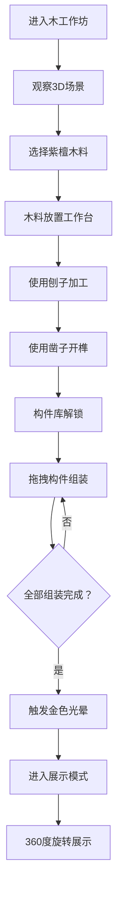

## 1. 产品概述

紫檀木躺椅制作模拟器是一款在浏览器中运行的3D互动体验应用，让用户化身古代木作匠人，在虚拟木工作坊中完成从选料到雕刻的完整躺椅制作流程。

- 面向对传统木工技艺、中国古典家具感兴趣的用户，提供沉浸式的工艺体验
- 通过数字化手段传承和展示中国传统榫卯工艺，具有文化传播价值

## 2. 核心功能

### 2.1 用户角色

| 角色 | 注册方式 | 核心权限 |
|------|----------|----------|
| 匠人用户 | 无需注册，直接访问 | 完整的木料选择、加工、组装、展示体验 |

### 2.2 功能模块

1. **3D木工作坊场景**：沉浸式10x8x5单位3D空间，含工具展示、木工台、可控视角
2. **木料选择系统**：4种紫檀纹理（直纹、水波纹、牛毛纹、金星纹），悬停显示属性
3. **加工工具系统**：刨子（拖拽产生刨花粒子）、凿子（点击形成榫卯凹槽）
4. **构件组装系统**：拖拽座面/扶手/靠背/踏脚构件到组装区，自动吸附
5. **成品展示模式**：360度自动旋转展示，悬停显示构件说明，金色光晕动画

### 2.3 页面详情

| 页面名称 | 模块名称 | 功能描述 |
|----------|----------|----------|
| 主应用页 | 3D视口区（60%） | Three.js渲染的木工作坊，支持鼠标拖拽旋转视角、滚轮缩放 |
| 主应用页 | 左侧木料架（20%） | 4种紫檀木料悬浮展示，悬停放大+属性面板，点击选中到工作台 |
| 主应用页 | 右侧构件库（20%） | 4个可拖拽构件，加工完成后解锁，拖拽到组装区自动吸附 |
| 主应用页 | 底部状态栏 | 步骤提示文字、工具选择按钮（刨子/凿子）、操作控制按钮 |
| 主应用页 | 展示模式层 | 组装完成后触发，躺椅自动旋转，金色光晕扩散效果 |

## 3. 核心流程

用户打开应用 → 进入3D木工作坊场景（可拖拽旋转观察）→ 从左侧木料架悬停查看属性，选择心仪纹理 → 木料自动置于木工台 → 选择刨子工具，在木料表面拖拽产生刨花 → 选择凿子工具，在标记处点击制作榫卯 → 右侧构件库解锁已加工构件 → 拖拽构件到组装区自动吸附 → 全部组装完成触发金色光晕 → 进入展示模式，躺椅360度自动旋转展示，悬停查看构件说明

## 4. 用户界面设计

### 4.1 设计风格

- **主色调**：浅棕色#d2b48c背景，红木色#8b4513按钮，紫檀色#5c2a15构件
- **按钮风格**：圆角4px，悬停# a0522d，按压#6b3410，0.25s平滑过渡
- **字体**：Google Fonts - ZCOOL KuaiLe（古风快乐字体）
- **布局风格**：三栏式布局（左20%/中60%/右20%）+ 底部状态栏
- **图标风格**：线条简洁苍劲的木工工具图标，契合古风匠人意象

### 4.2 页面设计概述

| 页面名称 | 模块名称 | UI元素 |
|----------|----------|--------|
| 主应用页 | 木料架 | 方形木块悬浮，悬停放大1.2倍+淡入属性面板（重量/硬度/韧性） |
| 主应用页 | 3D视口 | 四壁挂满工具模型，地面#e8d5b7刨花纹理，中央4x3木工台带刻度和固定夹 |
| 主应用页 | 构件库 | 4个构件卡片（座面/扶手/靠背/踏脚），未解锁半透明，解锁后可拖拽 |
| 主应用页 | 状态栏 | 当前步骤文字提示，刨子/凿子切换按钮，重置/展示按钮 |
| 主应用页 | 光晕动画 | 组装完成时，半径2单位淡金色光晕从底部扩散至顶部，持续1.5秒 |
| 主应用页 | 加载动画 | 刨花旋转的loading效果，米色螺旋状 |

### 4.3 响应性

- 桌面端优先设计，固定三栏布局
- 交互元素尺寸不小于44x44px，保证点击精度
- 拖拽操作优化：平滑过渡0.25s，吸附时有短暂阴影变化和木材碰撞声反馈

### 4.4 3D场景设计

- **环境与氛围**：暖色调木工作坊，柔和的顶光+补光，营造温馨专注的匠人工作氛围
- **光照设置**：主平行光（暖色，强度1.2）+ 环境光（强度0.4）+ 点光源补光（木工台上方）
- **相机设置**：初始位置(8, 6, 8)，目标点(0, 1, 0)，可绕Y轴0-360度旋转，俯仰角限制15-70度，距离限制4-15单位
- **构图与焦点**：中央木工台为视觉中心，四周工具作为背景装饰，躺椅组装完成后成为新焦点
- **交互与动画**：刨花粒子效果（浅米色螺旋飘落）、构件吸附动画（CSS transform + 阴影）、光晕扩散（GSAP动画）
- **后期处理**：轻微泛光效果，增强木料质感和光晕视觉效果
- **性能要求**：帧率不低于40fps，交互响应延迟低于100ms，拖拽操作流畅

