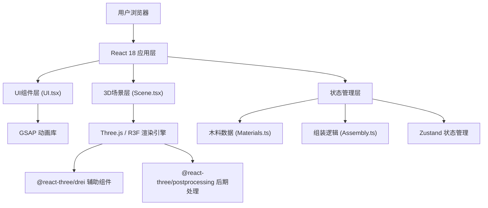

## 1. 架构设计



## 2. 技术描述

- **前端框架**：React@18 + TypeScript@5 + Vite@5
- **3D渲染**：Three.js@0.160 + @react-three/fiber@8 + @react-three/drei@9 + @react-three/postprocessing@2
- **状态管理**：Zustand@4（轻量高效，适合游戏化交互场景）
- **动画库**：GSAP@3（处理光晕、UI过渡等复杂动画）
- **工具库**：uuid@9（构件唯一标识）、tweakpane@4（调试参数面板）
- **构建工具**：Vite@5，配置strictPort: true，端口3000
- **开发规范**：TypeScript严格模式，target ES2020，moduleResolution bundler

## 3. 项目结构

```
src/
├── App.tsx              # 主组件，场景初始化、状态管理、UI集成
├── Scene.tsx            # Three.js场景，工坊模型、控制器、视角设置
├── UI.tsx               # UI控件，木料架、工具箱、构件库、状态栏
├── Materials.ts         # 木料数据管理，纹理/属性定义与操作函数
├── Assembly.ts          # 构件组装逻辑，位置吸附、光晕状态机
└── store.ts             # Zustand全局状态管理（补充）
```

## 4. 核心数据模型

### 4.1 木料数据类型

```typescript
interface WoodMaterial {
  id: string;
  name: string;
  texture: string;     // 纹理类型：straight/wave/oxhair/gold
  color: string;       // 十六进制颜色
  weight: number;      // 重量属性
  hardness: number;    // 硬度属性
  toughness: number;   // 韧性属性
  selected: boolean;
}
```

### 4.2 构件数据类型

```typescript
interface FurnitureComponent {
  id: string;
  name: string;
  type: 'seat' | 'armrest' | 'backrest' | 'footrest';
  processed: boolean;  // 是否已加工完成
  assembled: boolean;  // 是否已组装
  position: [number, number, number];
  targetPosition: [number, number, number];
  color: string;
}
```

### 4.3 应用状态类型

```typescript
interface AppState {
  currentStep: 'select' | 'process' | 'assemble' | 'display';
  selectedTool: 'plane' | 'chisel' | null;
  selectedMaterial: WoodMaterial | null;
  components: FurnitureComponent[];
  assemblyComplete: boolean;
  showHalo: boolean;
  autoRotate: boolean;
}
```

## 5. 核心交互实现

### 5.1 视角控制
- 使用@react-three/drei的OrbitControls
- minPolarAngle: 15° (Math.PI / 12)，maxPolarAngle: 70° (7 * Math.PI / 18)
- minDistance: 4，maxDistance: 15
- enablePan: false，仅允许旋转和缩放

### 5.2 木料选择
- 左侧面板4个悬浮木块，使用CSS :hover放大和属性面板淡入
- 点击后设置selectedMaterial，木料自动出现在木工台坐标(0, 1.2, 0)

### 5.3 加工交互
- 刨子：在木料mesh上监听pointerdown/move/up，拖拽轨迹产生刨花粒子（THREE.Points）
- 凿子：在预制榫卯标记点（BoxHelper）监听click，点击后改变mesh几何形状

### 5.4 构件组装
- 右侧构件库使用HTML5 drag & drop API
- 拖拽到3D视口区域时，进行射线检测确定放置位置
- 距离目标位置<0.5单位时自动吸附，触发阴影变化和音效
- 全部组装后设置assemblyComplete=true，触发GSAP光晕动画

### 5.5 展示模式
- 组装完成后切换autoRotate=true，OrbitControls.autoRotateSpeed=36°/s
- 悬停时设置autoRotate=false，显示构件名称浮层

## 6. 性能优化

- 3D场景使用InstancedMesh渲染重复的工具模型
- 刨花粒子使用BufferGeometry，动态更新位置后调用needsUpdate=true
- UI层与3D层分离，避免不必要的重渲染
- 使用React.memo包裹纯展示组件
- 粒子数量限制在100个以内，超出后复用最早的粒子

