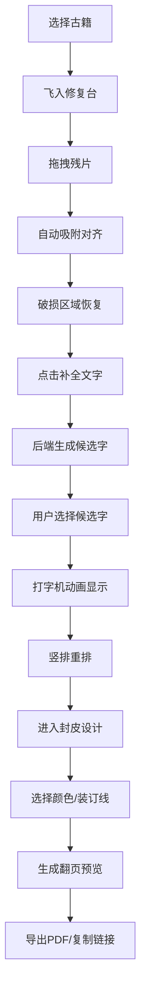

## 1. 产品概述

古籍修复工坊是一个基于浏览器的交互式Web应用，让用户化身古代拓印师，在虚拟工坊中完成古籍残片拼接、文字补全、封皮设计与装订，最终生成可翻页预览的电子古籍并导出分享。

- **目标用户**：文化爱好者、古籍研究者、教育工作者
- **核心价值**：通过数字化互动体验古籍修复的工匠精神，传播中华典籍文化
- **解决问题**：让用户无需专业技能即可体验古籍修复全过程，降低文化传承门槛

## 2. 核心功能

### 2.1 用户角色
| 角色 | 注册方式 | 核心权限 |
|------|----------|----------|
| 拓印师（用户） | 无需注册，直接使用 | 浏览书架、修复古籍、设计封皮、导出分享 |

### 2.2 功能模块
1. **主应用（BookRepairWorkshop）**：书架陈列、修复台管理、翻页预览、全局状态管理
2. **修复台组件（RepairTable）**：残片拖拽拼接、对齐吸附、文字补全请求
3. **书架组件（Bookshelf）**：古籍列表展示、分页加载、选中动画
4. **封皮设计组件（CoverDesigner）**：封皮颜色选择、书名编辑、装订线配置
5. **翻页预览组件（PagePreview）**：3D翻页动画、PDF导出、社交分享

### 2.3 页面详情
| 页面名称 | 模块名称 | 功能描述 |
|----------|----------|----------|
| 主界面 | 书架陈列区 | 三层仿古木书架，每层8本古籍，支持滚动加载更多 |
| 主界面 | 修复台区域 | 显示破损古籍页面，支持残片拖拽拼接、缩放旋转 |
| 主界面 | 元数据面板 | 显示选中古籍的书名、作者、年代、虫蛀等级 |
| 封皮设计面板 | 封皮配置 | 6种传统色彩选择、书名编辑、装订线颜色切换 |
| 翻页预览 | 全屏阅读 | 左右双页3D翻页、页码显示、竖排文字渲染 |
| 翻页预览 | 工具栏 | PDF导出、复制链接、社交分享 |

## 3. 核心流程

### 用户修复古籍主流程
用户从书架选择古籍 → 古籍飞入修复台 → 拖拽残片对齐破损区域 → 系统自动吸附 → 触发文字补全 → 选择候选字 → 竖排重排 → 进入封皮设计 → 选择颜色与装订线 → 生成翻页预览 → 导出PDF/分享链接

## 4. 用户界面设计

### 4.1 设计风格
- **设计方向**：唐宋典籍修复工坊风格，温暖雅致的文化氛围
- **主色调**：木色#8b5a2b、宣纸色#f5f0e8、墨色#3a3a3a
- **点缀色**：淡金#c9a96e、暗红#7b241c
- **按钮样式**：圆角8px，悬停淡金背景+阴影扩散（transition 0.3s）
- **字体**：Noto Serif SC（Google Fonts），宋体用于古籍文字
- **布局风格**：三栏布局（左书架、中修复台、右面板），桌面端为主
- **动效风格**：framer-motion平滑过渡，3D CSS翻页，打字机扫描效果

### 4.2 页面设计概述
| 页面名称 | 模块名称 | UI元素 |
|----------|----------|--------|
| 主界面 | 书架 | 渐变木头纹理、皮革质感书脊、hover放大、点击飞入动画 |
| 主界面 | 修复台 | 青石板台面、宣纸色基底、虚线磨损边缘、残片拖拽约束 |
| 主界面 | 元数据面板 | 卡片式布局、虫蛀等级星标、淡金边框 |
| 封皮设计 | 封皮预览区 | 300x400px预览、实时颜色更新、书名居中显示 |
| 翻页预览 | 双页显示 | 400x600px每页、3D翻转动画、宣纸纹理背景 |
| 翻页预览 | 工具栏 | 半透明悬浮、图标按钮、悬停提示 |

### 4.3 响应式设计
- **桌面端（≥768px）**：三栏布局，书架在左，修复台居中，面板在右
- **移动端（<768px）**：书架折叠为顶部横向滚动条（高度80px），修复台占据全屏，翻页模式缩放至窗口宽度90%
- **触摸优化**：支持手指拖拽残片、滑动翻页，增大点击热区

### 4.4 动画与交互细节
- **页面加载**：书架从左侧滑入（0.5s），修复台从右侧滑入（延时0.2s）
- **古籍选中**：AnimatePresence过渡动画（0.6s），从书架飞入修复台
- **残片交互**：悬停放大1.2倍+半透明轮廓，拖拽时约束在修复台内
- **吸附动画**：距离<20px触发自动吸附，伴随0.3s放大动画
- **破损恢复**：全部对齐后1秒渐变恢复宣纸色
- **文字显示**：逐像素扫描打字机效果（1秒）
- **翻页动画**：3D CSS transform，0.8秒从右向左翻，带笔形阴影和纸张褶皱

## 5. 性能约束
- 翻页动画保持30fps以上
- 残片拖拽响应延迟小于50ms
- 首次加载时间≤3秒
- 内存占用≤200MB
