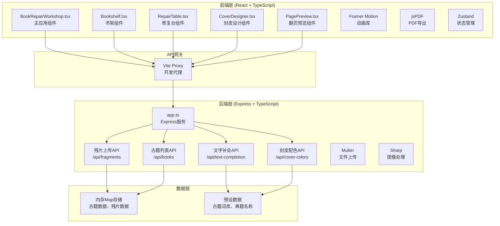
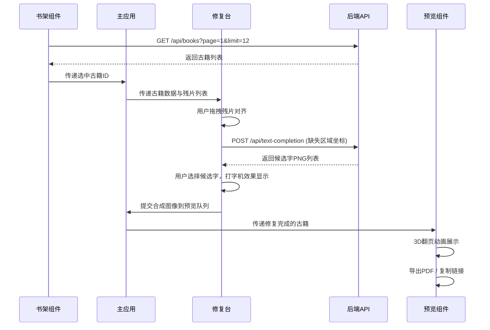
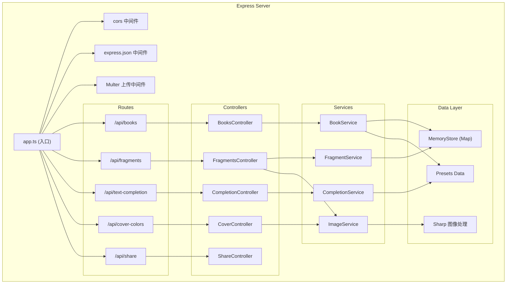
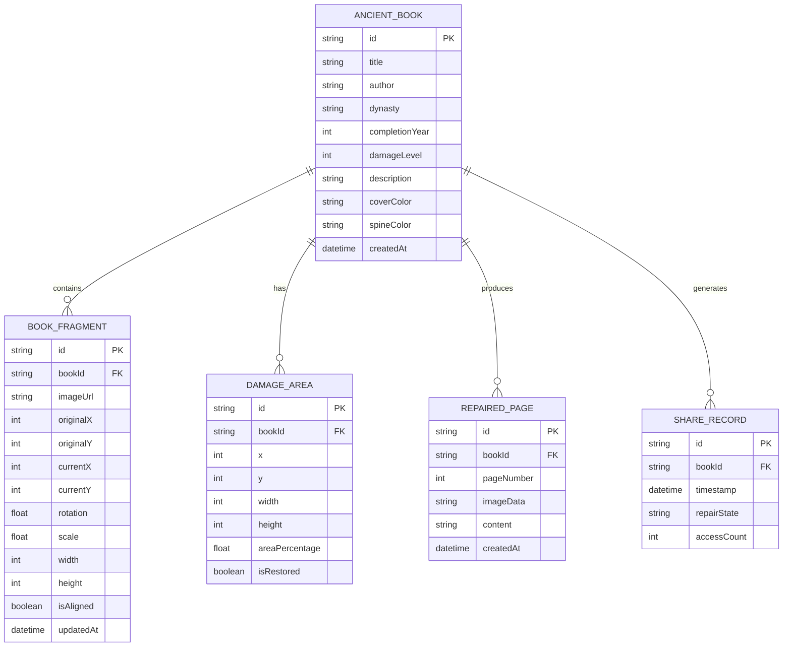

## 1. 架构设计

### 系统分层架构图


### 数据流向图


## 2. 技术描述

### 前端技术栈
- **框架**：React 18 + TypeScript
- **构建工具**：Vite 5 + @vitejs/plugin-react
- **状态管理**：Zustand 4
- **动画库**：Framer Motion 11
- **PDF导出**：jsPDF 2
- **样式方案**：CSS Modules + CSS Variables
- **HTTP客户端**：node-fetch (后端) + Fetch API (前端)
- **唯一标识**：uuid 9

### 后端技术栈
- **框架**：Express 4
- **语言**：TypeScript
- **文件上传**：Multer 1
- **图像处理**：Sharp 0.33
- **跨域处理**：cors 2

### 开发工具
- **包管理器**：npm
- **代码规范**：TypeScript Strict模式
- **启动命令**：`npm run dev` (Vite + Express 并发)

## 3. 项目文件结构

```
auto275/
├── package.json              # 项目依赖与脚本
├── index.html                # 入口HTML
├── vite.config.js            # Vite构建配置
├── tsconfig.json             # TypeScript配置
├── src/
│   ├── client/               # 前端代码
│   │   ├── BookRepairWorkshop.tsx    # 主应用组件
│   │   ├── App.tsx                   # 应用入口
│   │   ├── main.tsx                  # React挂载点
│   │   ├── index.css                 # 全局样式
│   │   ├── components/               # 组件目录
│   │   │   ├── Bookshelf.tsx         # 书架组件
│   │   │   ├── RepairTable.tsx       # 修复台组件
│   │   │   ├── CoverDesigner.tsx     # 封皮设计组件
│   │   │   ├── PagePreview.tsx       # 翻页预览组件
│   │   │   ├── BookSpine.tsx         # 书脊组件
│   │   │   ├── Fragment.tsx          # 残片组件
│   │   │   └── MetadataPanel.tsx     # 元数据面板
│   │   ├── store/                    # 状态管理
│   │   │   └── useWorkshopStore.ts   # 工坊状态store
│   │   ├── hooks/                    # 自定义hooks
│   │   │   ├── useDrag.ts            # 拖拽逻辑
│   │   │   └── useInfiniteScroll.ts  # 无限滚动
│   │   ├── types/                    # 类型定义
│   │   │   └── index.ts              # 共享类型
│   │   └── utils/                    # 工具函数
│   │       ├── api.ts                # API请求封装
│   │       └── animation.ts          # 动画配置
│   └── server/               # 后端代码
│       ├── app.ts                    # Express服务入口
│       ├── routes/                   # 路由
│       │   ├── books.ts              # 古籍相关路由
│       │   ├── fragments.ts          # 残片相关路由
│       │   └── completion.ts         # 文字补全路由
│       ├── controllers/              # 控制器
│       │   ├── booksController.ts
│       │   ├── fragmentsController.ts
│       │   └── completionController.ts
│       ├── services/                 # 业务逻辑
│       │   ├── bookService.ts
│       │   ├── fragmentService.ts
│       │   └── completionService.ts
│       ├── data/                     # 数据层
│       │   ├── store.ts              # 内存Map存储
│       │   └── presets.ts            # 预设数据（典籍、词库）
│       └── types/                    # 后端类型
│           └── index.ts
└── .trae/
    └── documents/            # 项目文档
        ├── PRD-古籍修复工坊.md
        └── 技术架构-古籍修复工坊.md
```

## 4. 路由定义

### 前端路由
| 路由 | 页面/组件 | 功能描述 |
|------|----------|----------|
| / | BookRepairWorkshop | 主应用页面（书架+修复台+面板） |

### 后端API路由
| 路由 | 方法 | 功能描述 |
|------|------|----------|
| /api/books | GET | 分页获取古籍列表 |
| /api/books/:id | GET | 获取单本古籍详情 |
| /api/books/:id/fragments | GET | 获取古籍残片列表 |
| /api/fragments | POST | 上传残片图像 |
| /api/fragments/:id | PUT | 更新残片位置 |
| /api/text-completion | POST | 请求文字补全候选字 |
| /api/cover-colors | GET | 获取封皮配色方案 |
| /api/share/:id | GET | 根据分享ID获取古籍状态 |

## 5. API定义（TypeScript类型）

### 共享类型定义

```typescript
// 古籍元数据
interface AncientBook {
  id: string;
  title: string;
  author: string;
  dynasty: string;
  completionYear: number;
  damageLevel: 1 | 2 | 3 | 4 | 5;
  description: string;
  coverColor: string;
  spineColor: string;
}

// 古籍残片
interface BookFragment {
  id: string;
  bookId: string;
  imageUrl: string;
  originalX: number;
  originalY: number;
  currentX: number;
  currentY: number;
  rotation: number;
  scale: number;
  width: number;
  height: number;
  isAligned: boolean;
}

// 破损区域
interface DamageArea {
  id: string;
  x: number;
  y: number;
  width: number;
  height: number;
  areaPercentage: number;
  isRestored: boolean;
}

// 文字补全请求
interface TextCompletionRequest {
  bookId: string;
  missingAreas: {
    x: number;
    y: number;
    width: number;
    height: number;
    surroundingText: string;
  }[];
}

// 文字补全响应
interface TextCompletionResponse {
  candidates: {
    id: string;
    character: string;
    imageData: string; // base64 PNG
    confidence: number;
  }[][];
}

// 候选字
interface CharacterCandidate {
  id: string;
  character: string;
  imageData: string;
  confidence: number;
}

// 封皮配置
interface CoverConfig {
  color: string;
  title: string;
  bindingColor: string;
}

// 修复完成的页面
interface RepairedPage {
  id: string;
  bookId: string;
  pageNumber: number;
  imageData: string;
  content: string;
}

// 翻页预览状态
interface PreviewState {
  currentPage: number;
  totalPages: number;
  pages: RepairedPage[];
  isFullscreen: boolean;
}

// 分享链接数据
interface ShareData {
  id: string;
  bookId: string;
  timestamp: number;
  repairState: {
    alignedFragments: string[];
    completedCharacters: string[];
    coverConfig: CoverConfig;
  };
}
```

### 请求/响应示例

#### GET /api/books?page=1&limit=12
**响应：**
```json
{
  "data": [
    {
      "id": "book-uuid-1",
      "title": "山海经",
      "author": "佚名",
      "dynasty": "先秦",
      "completionYear": -200,
      "damageLevel": 3,
      "description": "中国最早的地理学著作",
      "coverColor": "#8b5a2b",
      "spineColor": "#6d4c2a"
    }
  ],
  "pagination": {
    "page": 1,
    "limit": 12,
    "total": 100,
    "hasMore": true
  }
}
```

#### POST /api/text-completion
**请求：**
```json
{
  "bookId": "book-uuid-1",
  "missingAreas": [
    {
      "x": 150,
      "y": 200,
      "width": 60,
      "height": 60,
      "surroundingText": "山水"
    }
  ]
}
```

**响应：**
```json
{
  "candidates": [
    [
      {
        "id": "char-1",
        "character": "河",
        "imageData": "data:image/png;base64,...",
        "confidence": 0.92
      },
      {
        "id": "char-2",
        "character": "川",
        "imageData": "data:image/png;base64,...",
        "confidence": 0.78
      }
    ]
  ]
}
```

## 6. 服务器架构图



## 7. 数据模型

### 7.1 数据模型定义



### 7.2 内存存储结构

```typescript
// MemoryStore 数据结构
interface MemoryStore {
  books: Map<string, AncientBook>;
  fragments: Map<string, BookFragment>;
  damageAreas: Map<string, DamageArea[]>;
  repairedPages: Map<string, RepairedPage[]>;
  shareRecords: Map<string, ShareData>;
}

// 初始化数据
const initialBooks: AncientBook[] = [
  { id: '1', title: '山海经', author: '佚名', dynasty: '先秦', completionYear: -200, damageLevel: 3, ... },
  { id: '2', title: '水经注', author: '郦道元', dynasty: '北魏', completionYear: 520, damageLevel: 4, ... },
  // 更多预设古籍...
];

// 预设古籍词库
const ancientTextLibrary = {
  geography: ['山', '水', '河', '川', '湖', '海', '江', '峰', '岭', '谷'],
  history: ['帝', '王', '侯', '将', '相', '国', '家', '民', '兵', '战'],
  philosophy: ['道', '德', '仁', '义', '礼', '智', '信', '善', '恶', '真'],
  literature: ['诗', '书', '礼', '易', '乐', '春秋', '文', '章', '辞', '赋'],
  thousandCharacters: '天地玄黄宇宙洪荒日月盈昃辰宿列张...',
  threeCharacterClassic: '人之初性本善性相近习相远...',
};

// 预设典籍名称（20个）
const presetBookTitles = [
  '山海经', '水经注', '论语', '孟子', '道德经', '庄子', '荀子',
  '史记', '汉书', '后汉书', '三国志', '资治通鉴',
  '诗经', '楚辞', '文选', '玉台新咏',
  '说文解字', '尔雅', '方言', '释名'
];

// 预设封皮颜色（6种传统色彩）
const coverColors = [
  { name: '霞红', value: '#c0392b' },
  { name: '墨绿', value: '#2e7d32' },
  { name: '宝蓝', value: '#1565c0' },
  { name: '金黄', value: '#f9a825' },
  { name: '檀棕', value: '#8d6e63' },
  { name: '玄黑', value: '#212121' },
];

// 预设装订线颜色（3种）
const bindingColors = [
  { name: '月白', value: '#ffffff' },
  { name: '米色', value: '#f5deb3' },
  { name: '朱红', value: '#b71c1c' },
];
```

## 8. 性能优化策略

1. **前端优化**
   - React.memo 包裹频繁渲染的组件（残片、书脊）
   - 使用 transform 而非 top/left 进行拖拽定位，启用 GPU 加速
   - will-change: transform 提示浏览器优化
   - 虚拟滚动处理书架100本古籍
   - 图片懒加载，使用 Sharp 生成合适尺寸

2. **动画优化**
   - Framer Motion 使用 transform-only layout animations
   - 3D 翻页使用 CSS transform + backface-visibility
   - 减少重排重绘，批量更新状态

3. **后端优化**
   - 内存存储避免数据库IO
   - 文字补全预先生成候选字缓存
   - 图像操作使用 Sharp 流式处理
   - 分页查询限制每次返回数量

## 9. 调用关系与数据流说明

### 文件调用关系
1. **BookRepairWorkshop.tsx** → 引入 Bookshelf、RepairTable、MetadataPanel、CoverDesigner、PagePreview
   - 数据流：通过 Props 和 Context 向下传递状态
   - 调用：useWorkshopStore 获取全局状态

2. **Bookshelf.tsx** → 引入 BookSpine、useInfiniteScroll
   - 调用：api.getBooks() 获取古籍列表
   - 输出：onBookSelect 回调传递选中古籍ID

3. **RepairTable.tsx** → 引入 Fragment、useDrag
   - 调用：api.getFragments()、api.updateFragmentPosition()、api.completeText()
   - 输出：onRepairComplete 回调传递修复完成数据

4. **PagePreview.tsx** → 引入 jsPDF
   - 调用：api.getRepairedPages()、api.generateShareLink()
   - 内部：handleExportPDF()、handleCopyLink()

### 核心数据流
```
用户点击书脊 → Bookshelf → dispatch(selectBook) → Store 更新
→ BookRepairWorkshop 检测到 selectedBook 变化 → 渲染 RepairTable
→ RepairTable 加载残片 → 用户拖拽 → 自动吸附检测
→ 全部对齐 → 调用 completeText API → 获取候选字
→ 用户选择 → 打字机效果 → 竖排重排 → onRepairComplete
→ Store 更新 repairedPages → 显示 CoverDesigner
→ 用户配置封皮 → 点击生成预览 → 进入 PagePreview
→ 翻页动画 → 导出PDF/复制链接
```
