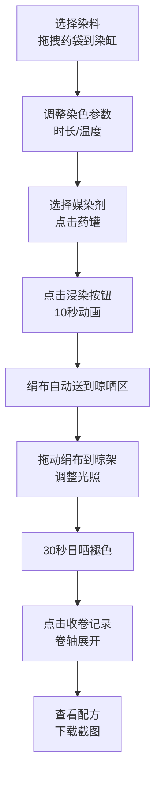

## 1. 产品概述
古代染坊匠人染色过程互动模拟应用，解决传统草木染工艺中颜色调配、媒染剂选择和晾晒结果难以直观预览与记录的问题。
- 目标用户：传统工艺爱好者、草木染学习者、文化传播者
- 产品价值：以数字化方式还原宋代草木染工艺，提供沉浸式的染色过程体验与配方记录功能

## 2. 核心功能

### 2.1 功能模块
1. **染料架模块**：4种天然染料（茜草红、栀子黄、苏木紫、靛蓝），3D悬浮药草袋，拖拽交互
2. **染缸模块**：陶质染缸、水面颜色实时混合、浸染动画、媒染剂反应
3. **绢布染色模块**：素白绢布、时长/温度滑块控制、HSV颜色模拟、10秒浸染动画
4. **媒染剂模块**：3种媒染剂（明矾、绿矾、石灰水），青瓷药罐，点击触发反应动画
5. **晾晒区模块**：木制晾架、5个竹夹位、光照控制、30秒褪色算法
6. **卷轴记录模块**：卷轴展开动画、配方信息展示、HTML截图下载

### 2.2 页面详情
| 页面名称 | 模块名称 | 功能描述 |
|-----------|-------------|---------------------|
| 主界面 | 染料架 | 4种3D悬浮药草袋，悬停显示色值pH，拖拽到染缸 |
| 主界面 | 染缸 | 陶质圆缸，水面颜色渐变，竹制搅拌棒，浸染动画 |
| 主界面 | 绢布控制区 | 素白绢布预览，时长/温度竹节滑块，浸染按钮 |
| 主界面 | 媒染剂区 | 3个青瓷药罐，点击触发媒染反应泡沫动画 |
| 主界面 | 晾晒区 | 木制晾架，5个竹夹，光照强度/角度控制，日晒褪色 |
| 主界面 | 卷轴区 | 白玉轴头卷轴，从右向左展开，配方展示，截图下载 |

## 3. 核心流程
用户从染料架拖拽药草袋到染缸中，调整染色时长与温度，点击媒染剂触发化学反应，点击浸染按钮观看绢布染色动画，染色完成后绢布自动送至晾晒区，用户拖动绢布到晾架竹夹上，调整光照参数观看30秒褪色效果，晾晒完成后点击收卷记录，卷轴展开显示配方并支持下载保存。

## 4. 用户界面设计

### 4.1 设计风格
- **整体风格**：宋代极简美学，温润雅致
- **主背景色**：手工宣纸色 #f5f0e8
- **主色调**：茜草红 #cc2144、栀子黄 #eebb44、苏木紫 #774477、靛蓝 #2a4a6a
- **辅助色**：紫檀色木架 #4a2c1a、酱釉色染缸 #6b4c3b、青瓷色 #a0c4a8、浅青石色 #8aad9a、深木色 #5c3a21、白玉色 #e8e4d9、麻布色 #c4a35a
- **字体**：Google Fonts - Ma Shan Zheng（马善政楷体），搭配系统宋体
- **按钮样式**：圆角8px，木质纹理边框，悬停0.2s缓动缩放，点击涟漪效果
- **交互反馈**：所有可交互元素悬停缩放1.05倍，过渡0.2s ease-out，点击触发同色系涟漪

### 4.2 页面布局
| 区域 | 位置 | UI元素 |
|-----------|-------------|-------------|
| 顶部装饰 | 页面顶部 | 竹制吊帘装饰，半透明下垂效果 |
| 染料架 | 左侧固定宽度 | 紫檀色木架，4个悬浮3D药草袋，垂直排列 |
| 染缸区 | 中央区域 | 陶质染缸（直径3单位），水面渐变色，竹制搅拌棒 |
| 绢布控制区 | 染缸右侧 | 200x150px素白绢布，流苏边缘，竹节纹理滑块 |
| 媒染剂区 | 染缸下方 | 3个青瓷色中药罐，水平排列 |
| 晾晒区 | 右侧区域 | 浅青石色背景，深木色晾架，5个竹夹，光照控制 |
| 卷轴区 | 底部弹出层 | 白玉轴头卷轴，从右向左展开动画 |

### 4.3 动画设计
- **药袋悬停**：上下浮动15px，显示色值与pH范围悬浮层
- **拖拽效果**：药袋跟随鼠标，略微倾斜（±15°）
- **浸染动画**：10秒，绢布缓缓沉入缸中，水面涟漪，颜色渗透扩散，提起滴水效果
- **媒染反应**：3秒泡沫动画，染液色相变化
- **晾晒褪色**：30秒，每秒更新一次，模拟日晒褪色
- **卷轴展开**：从右向左，白玉轴头滚动，内容渐显
- **光照效果**：CSS渐变遮罩模拟日光移动，角度0-180°

### 4.4 响应式设计
- **桌面优先**：1920px为基准设计
- **适配范围**：768px-1920px宽度自适应
- **断点处理**：768px以下改为垂直堆叠布局，拖拽改为点击交互
- **触控优化**：移动端点击区域≥48x48px

## 5. 性能要求
- **拖拽帧率**：≥50fps，使用transform硬件加速
- **染色动画**：25fps，requestAnimationFrame驱动
- **晾晒动画**：1fps，逐秒更新
- **性能优化**：无冗余重排，使用will-change提示，事件委托
