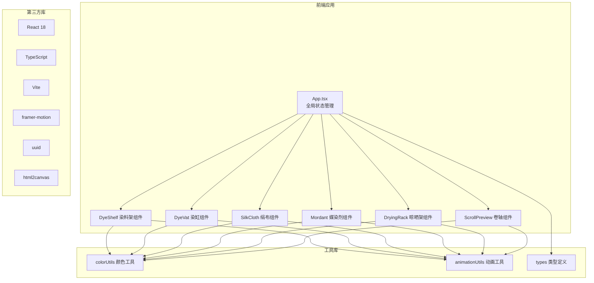

## 1. 架构设计



## 2. 技术栈说明
- **前端框架**：React 18 + TypeScript 5
- **构建工具**：Vite 5 + @vitejs/plugin-react
- **动画库**：framer-motion 11（组件动画、拖拽、过渡）
- **工具库**：uuid（生成唯一ID）、html2canvas（HTML截图下载）
- **样式方案**：CSS Modules + CSS Variables（主题色管理）
- **状态管理**：React useState/useReducer（局部状态）+ Props 传递
- **字体**：Google Fonts - Ma Shan Zheng

## 3. 目录结构
```
project/
├── index.html                 # 入口页面
├── package.json               # 依赖配置
├── vite.config.js             # Vite配置
├── tsconfig.json              # TypeScript配置
└── src/
    ├── App.tsx                # 主应用组件
    ├── main.tsx               # 应用入口
    ├── index.css              # 全局样式与CSS变量
    ├── types/
    │   └── index.ts           # 类型定义
    ├── utils/
    │   ├── colorUtils.ts      # 颜色混合、HSV转换、媒染反应算法
    │   └── animationUtils.ts  # 动画帧管理、缓动函数
    ├── hooks/
    │   ├── useDrag.ts         # 拖拽Hook
    │   ├── useAnimationFrame.ts # requestAnimationFrame Hook
    │   └── useDyeing.ts       # 染色逻辑Hook
    └── components/
        ├── DyeShelf.tsx       # 染料架组件
        ├── DyeBag.tsx         # 药草袋组件
        ├── DyeVat.tsx         # 染缸组件
        ├── SilkCloth.tsx      # 绢布组件
        ├── Mordant.tsx        # 媒染剂组件
        ├── ControlPanel.tsx   # 控制面板（滑块、按钮）
        ├── DryingRack.tsx     # 晾晒架组件
        ├── BambooClip.tsx     # 竹夹组件
        ├── SunControl.tsx     # 光照控制组件
        └── ScrollPreview.tsx  # 卷轴预览组件
```

## 4. 核心数据模型

### 4.1 类型定义
```typescript
// 染料类型
interface Dye {
  id: string;
  name: string;
  color: string;       // 茜草红 #cc2144 等
  phRange: [number, number];
  hsv: [number, number, number];
}

// 媒染剂类型
interface Mordant {
  id: string;
  name: string;
  color: string;       // 青瓷色 #a0c4a8
  effect: (dyeColor: HSV) => HSV;  // 颜色变换函数
}

// 染色参数
interface DyeingParams {
  duration: number;    // 0-60分钟
  temperature: number; // 20-100摄氏度
  mordant: Mordant | null;
  dyes: Dye[];         // 混合染料数组
}

// 绢布状态
interface SilkClothData {
  id: string;
  currentColor: string;
  baseColor: string;
  dyeingProgress: number;  // 0-100
  isDyeing: boolean;
  isDrying: boolean;
  dryingProgress: number;  // 0-100
  position: { x: number; y: number };
  clipIndex: number | null;
}

// 成品记录
interface FinishedRecord {
  id: string;
  finalColor: string;
  dyes: Dye[];
  mordant: Mordant | null;
  temperature: number;
  duration: number;
  lightIntensity: number;
  lightAngle: number;
  timestamp: number;
}

// 光照参数
interface LightParams {
  intensity: number;  // 0-100%
  angle: number;      // 0-180度
}
```

### 4.2 颜色算法
1. **染料混合**：基于HSV空间加权平均，根据各染料用量比例计算
2. **染色深度**：`HSV.v = baseV * (1 + duration/60 * temperature/100)`
3. **媒染反应**：
   - 明矾：`H += 5, S += 15%`（鲜艳正红）
   - 绿矾：`H -= 20, S += 10%, V -= 20%`（暗紫）
   - 石灰水：`H += 30, S -= 10%, V += 10%`（偏黄）
4. **日晒褪色**：每秒 `S -= 0.5%, V += 0.3%`，持续30秒

## 5. 性能优化方案

### 5.1 动画性能
- 使用 `transform: translate3d()` 启用GPU加速
- 拖拽元素设置 `will-change: transform`
- 使用 `requestAnimationFrame` 统一驱动所有动画
- 染色动画采用节流，25fps更新

### 5.2 渲染优化
- 组件拆分，使用 `React.memo` 避免不必要重渲染
- 拖拽状态通过自定义Hook管理，减少重渲染范围
- 颜色计算缓存，相同参数不重复计算

### 5.3 事件优化
- 拖拽使用事件委托，不在每个药袋上绑定事件
- 鼠标移动事件使用节流，避免高频触发

## 6. 动画实现方案

| 动画类型 | 实现方式 | 帧率 |
|---------|---------|------|
| 药袋悬浮 | framer-motion animate | 60fps |
| 拖拽移动 | transform + requestAnimationFrame | ≥50fps |
| 浸染动画 | Canvas/SVG 水面涟漪 + 颜色渐变 | 25fps |
| 媒染泡沫 | CSS animation + framer-motion | 30fps |
| 晾晒褪色 | setInterval 逐秒更新 | 1fps |
| 卷轴展开 | framer-motion layout + clip-path | 60fps |
| 涟漪效果 | CSS伪元素 + scale动画 | 60fps |

## 7. 构建配置
- Vite 基础配置，启用 React 插件
- TypeScript 严格模式，启用 JSX
- package.json 依赖：react、react-dom、typescript、vite、@vitejs/plugin-react、framer-motion、uuid、html2canvas
- 启动脚本：`npm run dev`
