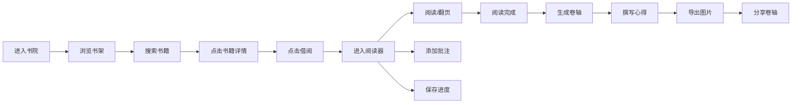

## 1. 产品概述

古籍书院管理系统是一个模拟古代书院的虚拟典籍阅读与管理平台，用户可在其中浏览、借阅古籍，记录阅读批注与心得，并生成精美的读后卷轴进行分享。

- **核心价值**：将现代阅读习惯与传统文化美学相结合，为用户提供沉浸式的古籍阅读体验
- **目标用户**：古典文化爱好者、学生、研究人员
- **市场定位**：文化教育类Web应用，主打沉浸式传统文化体验

## 2. 核心特性

### 2.1 功能模块

| 页面名称 | 模块名称 | 核心功能 |
|---------|---------|---------|
| 书架页面 | 三层书架展示 | 12本古籍网格布局，悬停预览，借阅功能 |
| 书架页面 | 竹简搜索框 | 实时书名过滤，匹配书籍高亮 |
| 阅读器页面 | 古籍翻页效果 | 左右双页布局，卷曲翻页动画，纸张摩擦音效 |
| 阅读器页面 | 批注系统 | 四种颜色高亮标记，段落竖线标识，实时保存 |
| 阅读器页面 | 阅读进度 | 页码显示，进度条，自动保存 |
| 卷轴生成页面 | 读后卷轴 | 竖排批注展示，横排心得，竹制卷轴杆 |
| 卷轴生成页面 | 导出功能 | 一键导出为PNG图片 |

### 2.2 页面详情

| 页面名称 | 模块名称 | 功能描述 |
|---------|---------|---------|
| 书架页面 | 三层书架 | 每层高180px，深褐色材质，木纹纹理，背景宣纸色。书籍120x170px，悬停倾斜15°显示书名作者。借阅后显示红色印章标记。 |
| 书架页面 | 搜索功能 | 竹简造型输入框，左侧毛笔图标，实时过滤，未匹配书籍半透明不可点击。 |
| 阅读器页面 | 翻页动画 | 左右各占50%宽度，中间书脊阴影，0.6s卷曲翻页，CSS动画实现。 |
| 阅读器页面 | 批注面板 | 半透明浮动面板，背景#fff8dc，圆角8px，支持文字输入和4种颜色选择（朱砂红、藤黄、石青、墨黑）。 |
| 阅读器页面 | 进度显示 | 右侧页码，底部进度条，自动保存阅读位置。 |
| 卷轴生成页面 | 卷轴展示 | 宽800px，背景#faf0e6，上下竹制卷轴杆，批注竖排显示带颜色标记线，心得横排楷体。 |
| 卷轴生成页面 | 图片导出 | html2canvas实现PNG导出。 |

## 3. 核心流程

## 4. 用户界面设计

### 4.1 设计风格

**宋代极简美学**
- **主色调**：宣纸白#f5f0e8、墨黑#333333、朱砂红#cc2936、藤黄#f5c542
- **辅助色**：石青#4a90d9、竹黄#8b6914、深褐#4e342e
- **字体**：标题使用"Ma Shan Zheng"（Google Fonts），正文使用楷体
- **交互效果**：所有元素悬停时scale(1.05)放大，0.3s过渡，点击时scale(0.95)反馈
- **材质纹理**：木纹、宣纸质感、竹简造型

### 4.2 页面设计概要

| 页面名称 | 模块名称 | UI元素 |
|---------|---------|--------|
| 书架页面 | 整体布局 | 居中三列网格，三层书架结构，竹简搜索框位于顶部 |
| 书架页面 | 书籍卡片 | 120x170px，各异封面配色，悬停倾斜动画，红色印章标记 |
| 阅读器页面 | 整体布局 | 1200px居中，左右双页，书脊阴影 |
| 阅读器页面 | 翻页动画 | 0.6s卷曲效果，CSS动画实现纸张摩擦感 |
| 阅读器页面 | 批注面板 | 半透明浮动，4种颜色选择，竖线标记 |
| 卷轴生成页面 | 整体布局 | 单一竖栏，纵向卷轴，竹制轴杆，木纹纹理 |

### 4.3 响应式设计

- **桌面端（≥768px）**：三列书架网格，左右双页阅读器，800px宽卷轴
- **移动端（<768px）**：两列书架网格，上下单页阅读器（翻页方向改为从上到下），100%宽卷轴

### 4.4 性能要求

- 书架搜索响应时间 ≤ 100ms
- 翻页动画帧率 ≥ 50fps
- 批注保存API响应时间 ≤ 200ms
