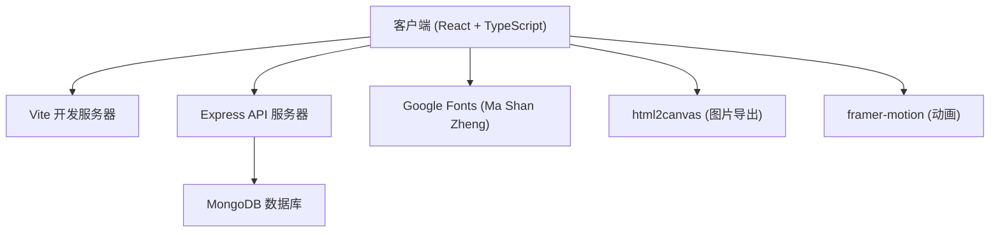
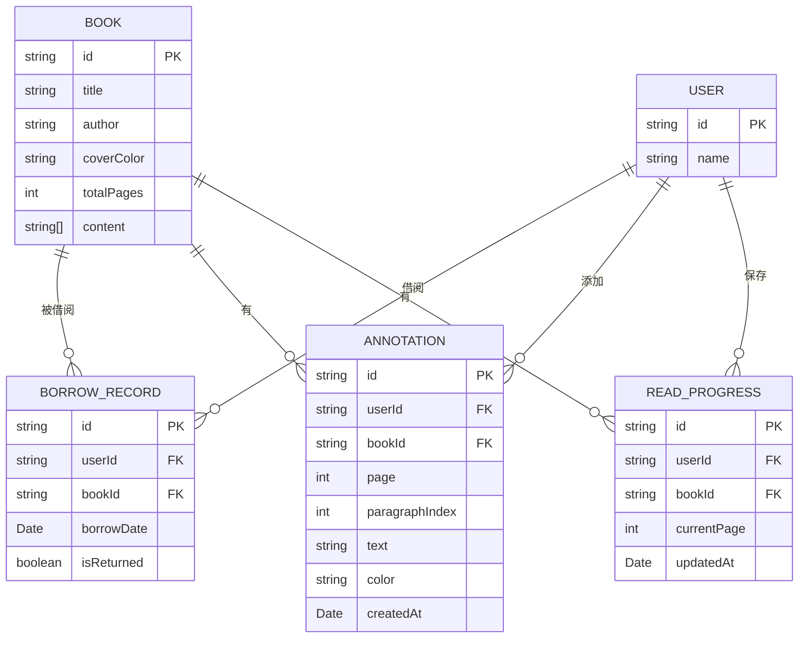

## 1. 架构设计



## 2. 技术选型说明

- **前端框架**：React 18 + TypeScript + Vite
- **动画库**：framer-motion（翻页、悬停等复杂动画）
- **样式方案**：CSS Modules + CSS Variables（主题色管理）
- **后端框架**：Express 4
- **数据库**：MongoDB + Mongoose
- **图片导出**：html2canvas
- **唯一标识**：uuid
- **跨域处理**：cors
- **构建工具**：Vite（host: 0.0.0.0）

## 3. 项目文件结构

```
auto277/
├── package.json
├── index.html
├── vite.config.ts
├── tsconfig.json
├── src/
│   ├── App.tsx              # 主应用，路由和全局状态
│   ├── types.ts             # TypeScript类型定义
│   ├── components/
│   │   ├── BookShelf.tsx    # 书架组件
│   │   ├── BookCard.tsx     # 书籍卡片组件
│   │   ├── Reader.tsx       # 阅读器组件
│   │   ├── AnnotationPanel.tsx  # 批注面板
│   │   └── ScrollGenerator.tsx  # 卷轴生成组件
│   ├── server.ts            # Express服务器
│   ├── models/              # Mongoose数据模型
│   │   ├── Book.ts
│   │   ├── BorrowRecord.ts
│   │   └── Annotation.ts
│   └── styles/              # 全局样式和CSS变量
│       └── theme.css
```

## 4. 路由定义

| 路由路径 | 页面组件 | 功能说明 |
|---------|---------|---------|
| `/` | BookShelf | 书架首页，展示所有可借阅书籍 |
| `/reader/:bookId` | Reader | 阅读器页面，阅读指定书籍 |
| `/scroll/:bookId` | ScrollGenerator | 卷轴生成页面，生成读后卷轴 |

## 5. API 接口定义

### 5.1 获取书籍列表
- **GET** `/api/books`
- **响应**：
```typescript
interface Book {
  _id: string;
  title: string;
  author: string;
  coverColor: string;
  description: string;
  totalPages: number;
  content: string[];  // 每页内容
  isBorrowed?: boolean;
}
```

### 5.2 借阅书籍
- **POST** `/api/borrow`
- **请求体**：
```typescript
interface BorrowRequest {
  bookId: string;
  userId: string;
}
```
- **响应**：
```typescript
interface BorrowResponse {
  success: boolean;
  recordId: string;
  borrowDate: Date;
}
```

### 5.3 保存批注
- **PUT** `/api/annotation`
- **请求体**：
```typescript
interface AnnotationRequest {
  bookId: string;
  userId: string;
  page: number;
  paragraphIndex: number;
  text: string;
  color: '#cc2936' | '#f5c542' | '#4a90d9' | '#333333';
}
```
- **响应**：
```typescript
interface AnnotationResponse {
  success: boolean;
  annotationId: string;
}
```

### 5.4 获取批注列表
- **GET** `/api/annotations/:bookId`
- **响应**：
```typescript
interface Annotation {
  _id: string;
  bookId: string;
  page: number;
  paragraphIndex: number;
  text: string;
  color: string;
  createdAt: Date;
}
```

### 5.5 保存阅读进度
- **PUT** `/api/progress`
- **请求体**：
```typescript
interface ProgressRequest {
  bookId: string;
  userId: string;
  currentPage: number;
}
```

## 6. 数据模型

### 6.1 ER图



### 6.2 Mock数据初始化

由于可能无法连接MongoDB，将提供12本古籍的Mock数据：
- 《论语》- 孔子及其弟子
- 《孟子》- 孟子
- 《大学》- 曾子
- 《中庸》- 子思
- 《道德经》- 老子
- 《庄子》- 庄子
- 《诗经》- 佚名
- 《楚辞》- 屈原
- 《史记》- 司马迁
- 《资治通鉴》- 司马光
- 《唐诗三百首》- 蘅塘退士
- 《宋词三百首》- 朱祖谋

## 7. 服务器架构


## 8. 性能优化策略

1. **书架搜索**：前端实时过滤，使用useMemo缓存结果，响应<100ms
2. **翻页动画**：CSS transform + will-change优化，保证≥50fps
3. **批注保存**：防抖处理+乐观更新，API响应<200ms
4. **图片导出**：html2canvas配置backgroundColor，避免透明背景问题
5. **懒加载**：书籍内容分页加载，避免一次性加载大量文本
