## 1. 产品概述

景泰蓝珐琅器皿制作交互游戏，用户以古代匠人的身份在3D明代工坊中体验掐丝、点蓝、烧蓝、打磨、鎏金五道核心工序，最终制作出精美的景泰蓝瓶。

- 面向传统文化爱好者和手工艺术玩家，提供沉浸式的传统工艺体验
- 传承景泰蓝非物质文化遗产，通过互动游戏形式让用户了解传统工艺

## 2. 核心特性

### 2.1 用户角色

| 角色 | 注册方式 | 核心权限 |
|------|---------|----------|
| 匠人玩家 | 无需注册，直接进入 | 完整体验五道工序，生成工艺图谱分享 |

### 2.2 功能模块

1. **工坊主场景**：3D明代风格工坊环境，紫檀木工作台，铜胎瓶3D模型
2. **掐丝工序**：选择不同粗细铜丝，在瓶身上勾勒纹饰轮廓
3. **点蓝工序**：选取珐琅釉料，为闭合纹饰区域填色
4. **烧蓝工序**：炭火炉烧制，火焰粒子动画，釉面光泽变化
5. **打磨工序**：三种砂纸粒度，圆周拖拽打磨瓶身
6. **鎏金工序**：金泥涂抹，形成金线浮雕效果
7. **成品展示**：360度欣赏成品，生成可分享工艺图谱

### 2.3 页面详情

| 页面名称 | 模块名称 | 功能描述 |
|---------|---------|----------|
| 主工坊 | 3D场景渲染 | Three.js渲染明代工坊，8x6x4房间，青灰方砖地面，暖光照明 |
| 主工坊 | 相机控制 | 鼠标拖拽旋转视角(0-360°水平，15-70°俯仰)，滚轮缩放(1.5-6单位) |
| 掐丝工序 | 铜丝选择 | 0.3mm/0.5mm/0.8mm三种铜丝卷轴，悬停旋转显示丝径 |
| 掐丝工序 | 纹饰绘制 | 拖拽铜丝贴合瓶身曲线，点击确认固定，高亮金色线条+金属音效 |
| 点蓝工序 | 釉料选择 | 12种珐琅釉料色样，悬停放大显示色名 |
| 点蓝工序 | 填色动画 | 点击纹饰区域，釉料扩散动画0.5秒，干湿颜色过渡 |
| 烧蓝工序 | 入炉动画 | 视角切换炭火炉，炉门打开，瓶身移入炉膛 |
| 烧蓝工序 | 火焰动画 | 火焰粒子颜色从暗红→亮橙→炫白，3秒循环 |
| 打磨工序 | 砂纸选择 | 粗/中/细三种砂纸，纹理颜色分别为#a0a0a0/#c0c0c0/#e0e0e0 |
| 打磨工序 | 打磨交互 | 圆周拖拽覆盖10%面积，10次完成全瓶，镜面反射效果 |
| 鎏金工序 | 金泥涂抹 | 青花瓷碟金泥，毛笔蘸取涂抹沟槽，金线浮雕效果 |
| 成品展示 | 3D预览 | 任意角度旋转欣赏细节 |
| 成品展示 | 工艺图谱 | 生成可分享的制作过程图谱 |

## 3. 核心流程

```mermaid
flowchart LR
    A["进入工坊"] --> B["掐丝工序"]
    B --> C["选择铜丝规格"]
    C --> D["拖拽绘制纹饰"]
    D --> E["确认固定铜丝"]
    E --> F{"完成掐丝？"}
    F -->|否| C
    F -->|是| G["点蓝工序"]
    G --> H["选择珐琅釉料"]
    H --> I["点击纹饰填色"]
    I --> J{"全部填完？"}
    J -->|否| H
    J -->|是| K["入炉烧蓝"]
    K --> L["烧蓝动画3秒"]
    L --> M["打磨工序"]
    M --> N["选择砂纸粒度"]
    N --> O["圆周拖拽打磨"]
    O --> P{"打磨完成？"}
    P -->|否| N
    P -->|是| Q["鎏金工序"]
    Q --> R["蘸取金泥涂抹"]
    R --> S{"鎏金完成？"}
    S -->|否| R
    S -->|是| T["成品展示"]
    T --> U["生成工艺图谱"]
```

## 4. 用户界面设计

### 4.1 设计风格

- **主色调**：紫檀木#4a2c1a、黄铜#b8860b、鎏金#ffd700、纯铜#b87333
- **环境色**：青灰砖#5c5c5c、暖光#f5deb3、背景#2c2c2c
- **UI控件**：半透明毛玻璃效果，背景模糊8px，边框#d4a373，圆角8px
- **字体**：标题使用"Ma Shan Zheng"毛笔字体，正文使用"Noto Serif SC"宋体
- **交互反馈**：物理惯性拖拽(0.2秒阻尼)，按钮微震动画(0.5px抖动)，金色六边形粒子特效

### 4.2 页面设计概述

| 页面名称 | 模块名称 | UI元素 |
|---------|---------|---------|
| 主工坊 | 3D场景 | 8x6x4明代工坊，青灰方砖地面，紫檀工作台，青铜灯阵暖光 |
| 主工坊 | 工具架 | 左侧丝架(三卷铜丝)，右侧颜料架(12色釉料)、炭火炉、工具架 |
| 工序UI | 顶部状态栏 | 当前工序名称、进度指示、工序切换按钮 |
| 工序UI | 左侧工具面板 | 当前工序可用材料选择，铜丝/釉料/砂纸/金泥 |
| 工序UI | 底部操作栏 | 确认、撤销、入炉、完成等操作按钮 |
| 成品展示 | 预览界面 | 360度旋转查看，细节放大，工艺图谱生成按钮 |

### 4.3 响应式设计

- **桌面宽屏**：3D场景占80%宽度，UI面板悬浮两侧
- **普通屏幕**：3D场景占满，UI面板缩小悬浮四角
- **触摸优化**：拖拽、双指缩放支持，按钮最小尺寸44x44px

### 4.4 3D场景指引

- **环境**：明代工坊室内，青灰方砖地面，木质梁柱结构
- **灯光**：顶部偏右青铜灯阵，暖黄色环境光#f5deb3，柔和阴影
- **相机**：OrbitControls，minDistance=1.5, maxDistance=6，minPolarAngle=15°, maxPolarAngle=70°
- **核心元素**：中央紫檀工作台，台上铜胎瓶，左侧丝架，右侧炭火炉和颜料架
- **动画**：炭火炉火焰粒子循环，铜丝卷轴悬停旋转，釉料样悬浮微动
- **后处理**：Bloom光晕效果，环境光遮蔽，温暖色调映射
- **性能**：单模型面数<2000三角形，目标60fps，加载<3秒
