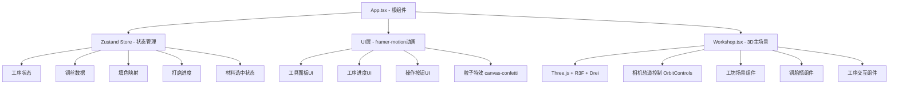

## 1. 架构设计



## 2. 技术描述

- **前端框架**：React 18 + TypeScript
- **构建工具**：Vite 5，build目标es2020
- **3D渲染**：three @^0.160.0 + @react-three/fiber @^8.15.0 + @react-three/drei @^9.92.0
- **UI动画**：framer-motion @^10.16.0
- **状态管理**：zustand @^4.4.0
- **粒子特效**：canvas-confetti @^1.9.0
- **唯一ID**：uuid @^9.0.0
- **路径别名**：@ 指向 src 目录

## 3. 目录结构

```
├── src/
│   ├── types.ts          # 类型定义
│   ├── store.ts          # Zustand状态管理
│   ├── App.tsx           # 根组件
│   ├── components/
│   │   ├── Workshop.tsx          # 3D主场景
│   │   ├── WorkshopScene.tsx     # 工坊场景
│   │   ├── Vessel.tsx            # 铜胎瓶组件
│   │   ├── CopperWireSpool.tsx   # 铜丝卷轴
│   │   ├── EnamelPalette.tsx     # 珐琅釉料架
│   │   ├── Furnace.tsx           # 炭火炉
│   │   ├── Sandpaper.tsx         # 砂纸组件
│   │   ├── GoldPaste.tsx         # 金泥组件
│   │   ├── ProcessPanel.tsx      # 工序面板UI
│   │   ├── ToolPanel.tsx         # 工具面板UI
│   │   └── ActionBar.tsx         # 操作栏UI
│   └── utils/
│       ├── audio.ts      # 音效工具
│       └── particles.ts  # 粒子特效
├── index.html
├── package.json
├── vite.config.js
└── tsconfig.json
```

## 4. 类型定义 (src/types.ts)

```typescript
export enum CloisonneProcess {
  FILIGREE = 'filigree',    // 掐丝
  ENAMEL = 'enamel',        // 点蓝
  FIRING = 'firing',        // 烧蓝
  POLISHING = 'polishing',  // 打磨
  GILDING = 'gilding',      // 鎏金
  FINISHED = 'finished'     // 完成
}

export interface CopperWire {
  id: string;
  diameter: number; // 0.3, 0.5, 0.8 mm
  color: string;    // #b8860b
  spoolPosition: [number, number, number];
}

export interface EnamelColor {
  id: string;
  name: string;     // 天青、松绿等
  color: string;    // 十六进制颜色
  wetColor: string; // 湿态颜色(深15%)
  position: [number, number, number];
}

export interface FiligreeWire {
  id: string;
  wireId: string;
  points: [number, number, number][]; // 3D路径点
  confirmed: boolean;
  highlighted: boolean;
}

export interface EnamelFill {
  regionId: string;
  colorId: string;
  fillProgress: number; // 0-1
  isWet: boolean;
}

export interface Sandpaper {
  id: string;
  grit: 'coarse' | 'medium' | 'fine';
  color: string;  // #a0a0a0, #c0c0c0, #e0e0e0
  position: [number, number, number];
}

export interface VesselState {
  baseColor: string;          // 初始纯铜色 #b87333
  filigreeWires: FiligreeWire[];
  enamelFills: EnamelFill[];
  polishProgress: number;     // 0-100
  isFired: boolean;
  gildingProgress: number;    // 0-100
  mirrorReflection: number;   // 0-1
}
```

## 5. 状态管理 (src/store.ts)

Zustand store 管理：
- 当前工序阶段 currentProcess
- 选中的铜丝/釉料/砂纸/金泥
- 铜胎瓶状态 vesselState
- 铜丝列表 copperWires
- 珐琅色列表 enamelColors
- 砂纸列表 sandpapers
- 工序切换actions
- 材料选中actions
- 状态更新actions

## 6. 性能优化

- 3D模型面数控制在2000三角形以内
- 使用InstancedMesh渲染重复元素(丝架、釉料瓶)
- 按需加载工序组件，避免一次性加载
- requestAnimationFrame 优化动画循环
- 粒子特效使用对象池复用
- 使用useMemo/useCallback减少重渲染
