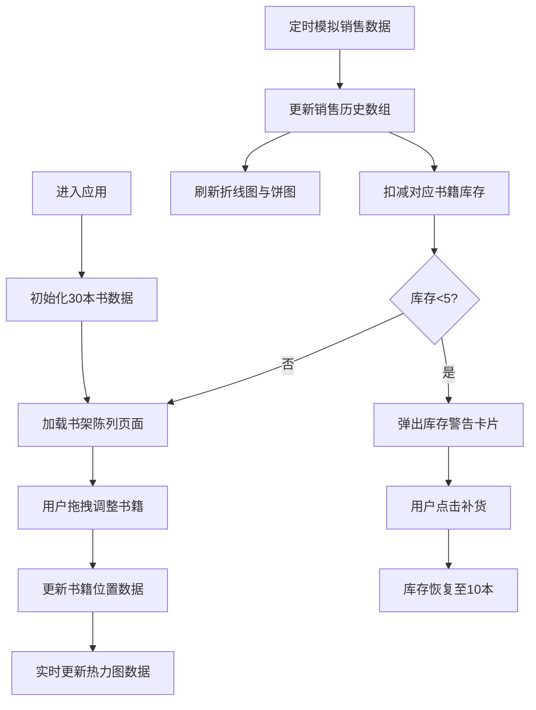

## 1. 产品概述

本产品是一款基于浏览器的古代书坊书籍陈列与销售优化互动应用，模拟宋代临安府书坊掌柜的经营场景。用户可通过拖拽调整书架书籍布局、查看实时销售数据和热力图，动态调整陈列策略与折扣，以提升经营效率。

- **核心价值**：通过可视化交互方式，让用户体验古代书坊经营的决策过程
- **目标用户**：对历史文化感兴趣、喜欢模拟经营类应用的用户
- **市场定位**：文化教育类互动应用，兼具娱乐性与知识性

## 2. 核心功能

### 2.1 用户角色

| 角色 | 注册方式 | 核心权限 |
|------|----------|----------|
| 书坊掌柜 | 无需注册，直接使用 | 调整书籍陈列、查看销售数据、处理库存预警、模拟经营决策 |

### 2.2 功能模块

1. **书架陈列页**：6行5列网格书架、拖拽交换书籍位置、平滑动画效果
2. **销售仪表盘页**：销售额折线图、分类销售额饼图、实时销售热力图
3. **库存预警页**：低库存警告卡片、一键补货功能、动画弹入淡出效果

### 2.3 页面详情

| 页面名称 | 模块名称 | 功能描述 |
|----------|----------|----------|
| 书架陈列页 | 书架网格 | 30本书6行5列展示，随机颜色封面，支持拖拽交换 |
| 书架陈列页 | 拖拽交互 | 拖拽时目标格子高亮金色，交换时0.3秒平滑过渡动画 |
| 销售仪表盘页 | 销售额折线图 | 当日每半小时数据点，recharts LineChart实现 |
| 销售仪表盘页 | 分类饼图 | 经、史、子、集四类销售额占比，PieChart实现 |
| 销售仪表盘页 | 销售热力图 | 5行5列网格，热度从浅蓝到深红渐变，每10秒更新 |
| 库存预警页 | 警告卡片 | 库存低于5本时弹出，深红背景，0.5秒缩放弹入 |
| 库存预警页 | 补货按钮 | 点击后库存恢复至10本，卡片0.3秒淡出消失 |

## 3. 核心流程

## 4. 用户界面设计

### 4.1 设计风格

- **主色调**：米黄色 #f5e6c8（仿古书卷风格）
- **辅助色**：深棕色 #5d4037（书架边框）、浅金色 #ffd54f（拖拽高亮）
- **宋代流行色系**：天青 #51a8b8、海棠红 #db5a6b、秋香黄 #c8a951、石绿 #6b8e23、檀色 #b36d61、宝蓝 #1e90ff、豆绿 #a0c4a8、象牙白 #fffff0
- **字体**：思源宋体（Google Fonts引入）
- **按钮样式**：圆角3px，仿古卷轴边框效果
- **布局风格**：卡片式布局，仿古卷轴装饰元素，轻微阴影效果
- **图标风格**：古风线条图标，使用emoji辅助表达

### 4.2 页面设计概述

| 页面名称 | 模块名称 | UI元素 |
|----------|----------|--------|
| 书架陈列页 | 顶部导航 | Tab切换（书架陈列/销售仪表盘/库存预警），仿古卷轴样式 |
| 书架陈列页 | 书架网格 | 6x5网格，深棕色边框，每格轻微阴影（0 2px 4px rgba(0,0,0,0.1)），30本随机颜色封面书籍 |
| 书架陈列页 | 书籍卡片 | 随机宋代流行色封面，书名使用思源宋体，悬停时轻微上浮 |
| 销售仪表盘页 | 折线图 | 海棠红线条 #db5a6b，平滑曲线，X轴时间标签，Y轴销售额 |
| 销售仪表盘页 | 饼图 | 四类颜色对应：经书（天青）、史书（海棠红）、子书（秋香黄）、集书（石绿） |
| 销售仪表盘页 | 热力图 | 5x5网格，3px圆角，颜色从浅蓝 #e0f7fa 到深红 #ff5252 渐变 |
| 库存预警页 | 警告卡片 | 深红背景 #d32f2f，白色文字 #fff，0.5秒缩放弹入，0.3秒淡出 |
| 库存预警页 | 补货按钮 | 浅金色背景，深棕色文字，悬停效果，点击反馈 |

### 4.3 响应式设计

- **桌面端**（>768px）：书架5列布局，仪表盘双列展示图表
- **平板端**（≤768px）：书架改为4列布局，图表单列堆叠展示
- **触控优化**：拖拽区域扩大至48x48px，按钮最小高度44px，支持触摸滑动操作
- **自适应缩放**：使用CSS clamp()实现字体和间距的响应式缩放

### 4.4 动效设计

- **页面加载**：分阶段渐入动画，导航栏→标题→内容区域，总时长0.8秒
- **拖拽交换**：framer-motion实现0.3秒平滑过渡，目标格子金色高亮
- **警告卡片**：0.5秒缩放弹入（scale从0到1），0.3秒淡出（opacity从1到0）
- **按钮交互**：hover时轻微放大1.05倍，active时缩小0.95倍
- **数据更新**：热力图颜色过渡使用CSS transition（0.5秒），数值变化时数字滚动动画
