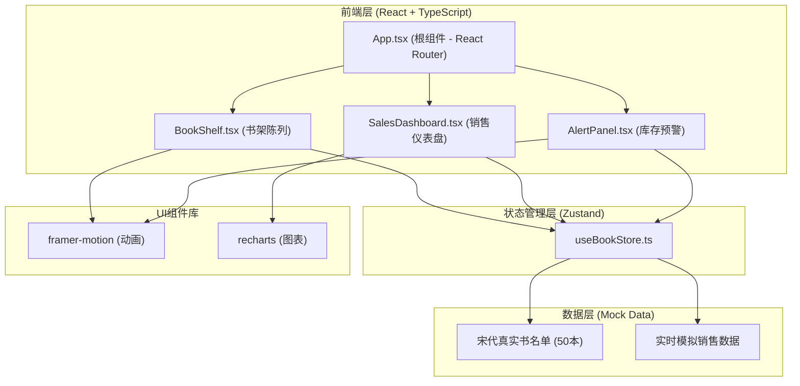
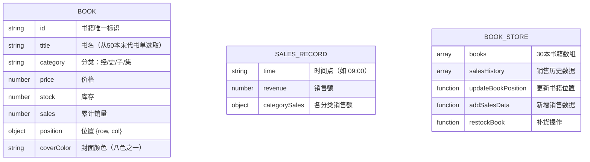

## 1. 架构设计



## 2. 技术描述

- **前端框架**：React@18 + TypeScript@5 + Vite@5
- **构建工具**：Vite@5，@vitejs/plugin-react@4
- **状态管理**：Zustand@4（轻量、高性能状态管理）
- **路由管理**：React Router@6
- **动画库**：framer-motion@11（拖拽动画、平滑过渡）
- **图表库**：recharts@2（折线图、饼图）
- **样式方案**：CSS Modules + CSS Variables（仿古主题）
- **代码分割**：React.lazy() + Suspense 实现路由级代码分割
- **性能优化**：useMemo、useCallback、React.memo 避免不必要重渲染

### 依赖清单

```json
{
  "react": "^18.2.0",
  "react-dom": "^18.2.0",
  "react-router-dom": "^6.22.0",
  "typescript": "^5.3.0",
  "vite": "^5.1.0",
  "@vitejs/plugin-react": "^4.2.0",
  "framer-motion": "^11.0.0",
  "zustand": "^4.5.0",
  "recharts": "^2.12.0"
}
```

## 3. 路由定义

| 路由 | 页面组件 | 功能描述 |
|------|----------|----------|
| /shelf | BookShelf | 书架陈列页，6x5网格拖拽布局 |
| /dashboard | SalesDashboard | 销售仪表盘，折线图+饼图+热力图 |
| /alerts | AlertPanel | 库存预警页，低库存警告卡片 |

默认路由重定向至 `/shelf`。

## 4. 数据模型

### 4.1 数据模型定义



### 4.2 TypeScript 类型定义

```typescript
type Category = '经' | '史' | '子' | '集';

interface Book {
  id: string;
  title: string;
  category: Category;
  price: number;
  stock: number;
  sales: number;
  position: { row: number; col: number };
  coverColor: string;
}

interface SalesRecord {
  time: string;
  revenue: number;
  categorySales: Record<Category, number>;
}

interface BookStore {
  books: Book[];
  salesHistory: SalesRecord[];
  updateBookPosition: (bookId: string, newPosition: { row: number; col: number }) => void;
  addSalesData: (record: SalesRecord) => void;
  restockBook: (bookId: string) => void;
}
```

### 4.3 宋代书名单（50本）

```
《东京梦华录》《梦溪笔谈》《资治通鉴》《太平广记》《册府元龟》
《文苑英华》《太平御览》《新唐书》《旧五代史》《新五代史》
《宋史》《通志》《通典》《文献通考》《玉海》
《困学纪闻》《容斋随笔》《老学庵笔记》《武林旧事》《都城纪胜》
《西湖老人繁胜录》《四朝闻见录》《鹤林玉露》《夷坚志》《青琐高议》
《涑水记闻》《归田录》《龙川别志》《邵氏闻见录》《默记》
《挥麈录》《清波杂志》《后山谈丛》《六一诗话》《沧浪诗话》
《彦周诗话》《石林诗话》《岁时广记》《事物纪原》《格物粗谈》
《鸡肋编》《陶朱新录》《睽车志》《投辖录》《玉照新志》
《清尊录》《摭青杂说》《乐善录》《善诱文》《自警编》
```

## 5. 文件结构与调用关系

```
src/
├── App.tsx                  # 根组件，React Router路由分发
├── main.tsx                 # 应用入口
├── index.css                # 全局样式，CSS变量定义
├── components/
│   ├── BookShelf.tsx        # 书架陈列组件
│   │   └── 调用：useBookStore.books / updateBookPosition()
│   ├── SalesDashboard.tsx   # 销售仪表盘组件
│   │   └── 调用：useBookStore.salesHistory / addSalesData()
│   └── AlertPanel.tsx       # 库存预警组件
│       └── 调用：useBookStore.books / restockBook()
├── store/
│   └── useBookStore.ts      # Zustand状态管理
│       └── 提供：books / salesHistory / 三个操作方法
├── utils/
│   ├── bookData.ts          # 50本宋代书名单、宋代流行色
│   └── helpers.ts           # 工具函数（随机生成、位置计算）
└── types/
    └── index.ts             # TypeScript类型定义

数据流方向：
组件调用store方法 → store更新状态 → 订阅组件自动重渲染
```

## 6. 性能优化方案

### 6.1 初始加载性能

- **代码分割**：使用 React.lazy() 对三个Tab页进行路由级代码分割
- **懒加载**：Suspense 包裹路由组件，展示加载骨架屏
- **资源优化**：Google Fonts 使用 `display=swap` 避免阻塞渲染
- **目标**：初始加载时间 ≤ 2秒

### 6.2 运行时性能

- **拖拽性能**：framer-motion 使用 `drag` 属性，GPU加速，保持60fps
- **热力图更新**：每10秒更新一次，使用 CSS transition 平滑过渡，FPS ≥ 50
- **拖拽响应**：拖拽交换响应延迟 ≤ 100ms
- **避免重渲染**：使用 React.memo 包裹书籍卡片组件，useMemo 缓存计算结果
- **状态选择**：Zustand 使用 selector 精确订阅，避免全量重渲染

### 6.3 响应式实现

```css
/* 桌面端 */
.bookshelf-grid {
  display: grid;
  grid-template-columns: repeat(5, 1fr);
  gap: 12px;
}

/* 平板端 */
@media (max-width: 768px) {
  .bookshelf-grid {
    grid-template-columns: repeat(4, 1fr);
    gap: 8px;
  }
}
```

## 7. 启动脚本

```bash
# 安装依赖
npm install

# 启动开发服务器
npm run dev

# 生产构建
npm run build
```

Vite 配置：`base: './'`，支持相对路径部署。
