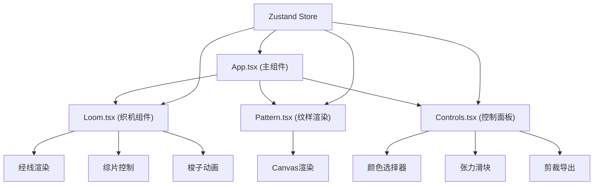

## 1. 架构设计



## 2. 技术描述

- **前端框架**：React@18 + TypeScript@5 + Vite@5
- **状态管理**：Zustand
- **动画库**：framer-motion@11
- **UI工具**：file-saver@2，uuid@9
- **构建工具**：Vite
- **初始化方式**：vite-init（react-ts模板）

## 3. 文件结构

```
d:\Solocoder\VersionFast\tasks\auto280\
├── package.json
├── index.html
├── vite.config.js
├── tsconfig.json
├── .trae/
│   └── documents/
│       ├── prd.md
│       └── tech-architecture.md
└── src/
    ├── App.tsx (主组件，织机布局和状态管理)
    ├── Loom.tsx (织机组件：框架、综片、梭子动画)
    ├── Pattern.tsx (纹样渲染组件)
    ├── Controls.tsx (控制面板：颜色选择、张力调节)
    ├── store/
    │   └── useLoomStore.ts (Zustand状态管理)
    ├── hooks/
    │   ├── useShuttleAnimation.ts (梭子动画hook)
    │   └── useAudio.ts (音频播放hook)
    ├── utils/
    │   ├── exportImage.ts (图片导出工具)
    │   └── colors.ts (颜色定义)
    └── types/
        └── index.ts (类型定义)
```

## 4. 状态管理设计

### 4.1 Zustand Store

```typescript
interface LoomState {
  // 经线
  warpThreads: WarpThread[];
  tension: number; // 1-10
  
  // 纬线
  weftColors: string[][]; // 20x30颜色网格
  selectedColor: string | null;
  
  // 综片
  heddles: boolean[]; // 6个综片状态
  
  // 织锦
  wovenRows: WovenRow[];
  currentRow: number;
  maxRows: number;
  
  // 梭子
  shuttlePosition: number;
  shuttleColor: string | null;
  isWeaving: boolean;
  
  // UI状态
  showPreview: boolean;
  previewImage: string | null;
  colorPickerPosition: { row: number; col: number } | null;
}
```

## 5. 核心组件定义

### 5.1 App.tsx

- 主布局容器，响应式布局控制
- 集成Loom、Pattern、Controls组件
- 管理全局拖拽状态

### 5.2 Loom.tsx

- 织机木架SVG渲染
- 经线（竖线）渲染，密度20px一条
- 6个综片按钮，弹簧动画
- 梭子橄榄形SVG，滑动动画
- 拖放区域处理

### 5.3 Pattern.tsx

- Canvas绘制织锦纹样
- 逐像素填充纬线颜色
- 自动滚动机制
- 织物质感噪点

### 5.4 Controls.tsx

- 20x30颜色样本网格
- 颜色选择器弹窗（10种预设色）
- 张力滑块（竹青色#8baa9a）
- 剪裁按钮（圆形银色，剪刀图标）
- 浮动预览面板

## 6. 性能优化策略

1. **动画性能**：使用requestAnimationFrame驱动梭子动画，避免重排重绘
2. **Canvas渲染**：使用离屏Canvas缓存已织区域，仅增量绘制新行
3. **状态更新**：Zustand选择性订阅，避免不必要重渲染
4. **拖拽优化**：使用pointer事件，debounce处理高频事件
5. **图片导出**：使用原生Canvas toBlob而非html2canvas，提升导出速度

## 7. 类型定义

```typescript
interface WarpThread {
  id: string;
  x: number;
  lifted: boolean;
  tension: number;
}

interface WovenRow {
  id: string;
  colors: string[];
  heddlePattern: boolean[];
  timestamp: number;
}

interface ColorPreset {
  name: string;
  value: string;
}
```
