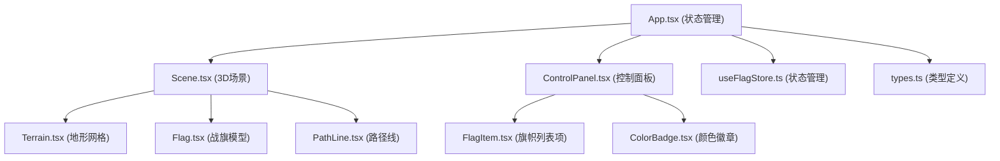

## 1. 架构设计



**数据流说明**：
1. `App.tsx` 作为根组件，通过 `useFlagStore` 管理全局状态（旗帜列表、路径数据）
2. `Scene.tsx` 接收旗帜数组渲染3D场景，点击地面时通过回调向 `App.tsx` 传递坐标，`App.tsx` 调用 store 添加新旗帜
3. `ControlPanel.tsx` 从 store 获取旗帜列表，用户操作（删除、生成路径、重置）通过 store 方法更新状态
4. 状态变更后，`Scene.tsx` 和 `ControlPanel.tsx` 自动重新渲染对应内容

**调用关系**：
- `App.tsx` → 导入并渲染 `Scene.tsx`、`ControlPanel.tsx`
- `Scene.tsx` → 导入 `Terrain.tsx`、`Flag.tsx`、`PathLine.tsx`，接收 `onGroundClick` 回调
- `ControlPanel.tsx` → 导入 `FlagItem.tsx`、`ColorBadge.tsx`，调用 store 方法
- 所有组件 → 共享 `types.ts` 类型定义和 `useFlagStore.ts` 状态

## 2. 技术描述
- **前端框架**：React@18 + TypeScript@5 + Vite@5
- **3D渲染**：three@0.160 + @react-three/fiber@8 + @react-three/drei@9
- **动画库**：framer-motion@10
- **状态管理**：zustand@4
- **工具库**：uuid@9
- **初始化工具**：vite-init（react-ts模板）
- **后端**：无（纯前端应用）
- **数据库**：无（内存状态管理）

## 3. 目录结构

```
src/
├── main.tsx              # React入口文件
├── App.tsx               # 根组件，状态协调
├── types.ts              # 全局类型定义
├── store/
│   └── useFlagStore.ts   # Zustand状态管理
├── scene/
│   ├── Scene.tsx         # 3D场景主组件
│   ├── Terrain.tsx       # 地形网格组件
│   ├── Flag.tsx          # 战旗模型组件
│   └── PathLine.tsx      # 路径线组件
├── components/
│   ├── ControlPanel.tsx  # 控制面板组件
│   ├── FlagItem.tsx      # 旗帜列表项组件
│   └── ColorBadge.tsx    # 颜色徽章组件
├── utils/
│   ├── colors.ts         # 军旗颜色配置
│   └── terrain.ts        # 地形高度计算工具
└── styles/
    └── index.css         # 全局样式
```

## 4. 类型定义

```typescript
// types.ts
export interface FlagData {
  id: string;
  position: [number, number, number]; // x, y, z
  color: string;
  index: number;
}

export interface PathData {
  id: string;
  startFlagId: string;
  endFlagId: string;
  points: [number, number, number][];
}

export type FlagColor = 
  | '#c0392b' // 赤红
  | '#f1c40f' // 明黄
  | '#27ae60' // 墨绿
  | '#2c3e50' // 玄青
  | '#ecf0f1' // 素白
  | '#2d2d2d' // 缁黑
  | '#8e44ad' // 降紫
  | '#2980b9'; // 藏蓝
```

## 5. 数据模型

### 5.1 Store 状态定义

```typescript
// useFlagStore.ts
interface FlagStore {
  flags: FlagData[];
  paths: PathData[];
  selectedFlags: string[]; // 选中的旗帜ID数组（最多2个）
  addFlag: (position: [number, number, number]) => void;
  removeFlag: (id: string) => void;
  toggleSelectFlag: (id: string) => void;
  generatePath: () => void;
  reset: () => void;
}
```

## 6. 核心组件说明

### 6.1 Scene.tsx
- **职责**：3D场景主容器，管理相机、光照、控制器
- **Props**：
  - `flags: FlagData[]` - 旗帜数据数组
  - `paths: PathData[]` - 路径数据数组
  - `onGroundClick: (position: [number, number, number]) => void` - 地面点击回调
- **关键实现**：
  - 使用 `OrbitControls` 实现视角控制
  - 使用 `Raycaster` 检测地面点击
  - 遍历 `flags` 渲染多个 `Flag` 组件
  - 遍历 `paths` 渲染多个 `PathLine` 组件

### 6.2 Terrain.tsx
- **职责**：渲染20x20网格地形
- **实现**：
  - 使用 `PlaneGeometry` 创建平面，分段20x20
  - 顶点Y坐标随机偏移0-1单位模拟起伏
  - 计算法线支持光照
  - 材质使用 `MeshStandardMaterial`，颜色 #6b8e23

### 6.3 Flag.tsx
- **职责**：渲染单个战旗模型，实现飘动动画
- **Props**：
  - `position: [number, number, number]` - 位置
  - `color: string` - 旗面颜色
  - `index: number` - 序号
  - `onRemove?: () => void` - 删除回调
- **关键实现**：
  - 旗杆：`CylinderGeometry`，高度2单位
  - 旗面：自定义 `ShaderMaterial`，顶点着色器实现风力飘动效果
  - 风力参数：`useFrame` 中更新 `time` uniform，正弦变化0.2-0.6
  - 入场动画：framer-motion 3D 实现弹出和展开效果

### 6.4 PathLine.tsx
- **职责**：渲染行军路径，实现流动动画
- **Props**：
  - `points: [number, number, number][]` - 路径点数组
- **关键实现**：
  - 使用 `CatmullRomCurve3` 创建平滑曲线
  - `TubeGeometry` 创建管状路径，半径0.05
  - 材质使用透明效果，颜色淡蓝色
  - 虚线流动效果：纹理偏移动画或自定义着色器

### 6.5 ControlPanel.tsx
- **职责**：左侧控制面板，管理旗帜列表和操作
- **Props**：
  - `flags: FlagData[]` - 旗帜列表
  - `selectedFlags: string[]` - 选中的旗帜ID
  - `onSelectFlag: (id: string) => void` - 选择旗帜回调
  - `onRemoveFlag: (id: string) => void` - 删除旗帜回调
  - `onGeneratePath: () => void` - 生成路径回调
  - `onReset: () => void` - 重置回调
- **响应式**：使用媒体查询，<768px时转为底部抽屉

## 7. 性能优化策略

1. **旗帜飘动**：使用顶点着色器在GPU端计算，避免CPU逐帧更新顶点
2. **地形复用**：地形几何体仅创建一次，使用 `useMemo` 缓存
3. **实例化渲染**：旗帜数量较多时考虑使用 `InstancedMesh`（当前15面上限可暂不使用）
4. **路径计算优化**：曲线采样点控制在50-100个，避免过多计算
5. **状态最小化**：使用 Zustand 选择性订阅，避免不必要的重渲染
6. **材质复用**：相同颜色的旗帜复用材质实例

## 8. 依赖清单

```json
{
  "dependencies": {
    "react": "^18.2.0",
    "react-dom": "^18.2.0",
    "three": "^0.160.0",
    "@react-three/fiber": "^8.15.0",
    "@react-three/drei": "^9.92.0",
    "framer-motion": "^10.16.0",
    "zustand": "^4.4.0",
    "uuid": "^9.0.0"
  },
  "devDependencies": {
    "typescript": "^5.3.0",
    "vite": "^5.0.0",
    "@vitejs/plugin-react": "^4.2.0",
    "@types/three": "^0.160.0",
    "@types/react": "^18.2.0",
    "@types/react-dom": "^18.2.0",
    "@types/uuid": "^9.0.0"
  }
}
```
