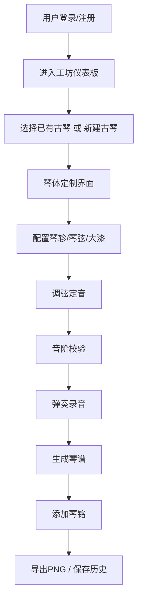

## 1. 产品概述

虚拟古琴工坊是一款数字化斫琴工艺Web应用，解决传统斫琴工艺中音色调试与材料搭配难以远程协作和数字化记录的问题。用户可在线定制古琴、调校琴弦、弹奏录音并生成带有琴铭的电子琴谱。

- **核心价值**：将传统斫琴工艺数字化，实现远程协作、精确音色调试和永久化记录
- **目标用户**：古琴爱好者、斫琴师、音乐教育者、传统文化研究者

## 2. 核心功能

### 2.1 用户角色

| 角色 | 注册方式 | 核心权限 |
|------|----------|----------|
| 普通用户 | 邮箱/用户名注册 | 定制古琴、调弦弹奏、生成琴谱、导出分享 |
| 管理员 | 后台认证 | 用户管理、系统配置、数据统计 |

### 2.2 功能模块

1. **用户认证模块**：注册、登录、个人中心
2. **工坊仪表板**：3D场景风格的古琴展示区
3. **琴体定制界面**：3D琴体可视化、琴轸材质/琴弦/大漆配置
4. **调弦定音系统**：琴轸旋转调弦、实时音高指示、音阶校验
5. **弹奏录音模块**：键盘模拟拨弦、音符实时可视化、录音控制
6. **琴谱生成导出**：减字谱SVG渲染、琴铭叠加、PNG导出、历史记录

### 2.3 页面详情

| 页面名称 | 模块名称 | 功能描述 |
|---------|----------|---------|
| 登录/注册页 | 用户认证 | 表单验证、密码加密、状态保持 |
| 工坊仪表板 | 古琴卡片网格 | 3D场景背景、卡片悬停效果、翻转动画 |
| 琴体定制页 | 3D琴体可视化 | 拖拽旋转、滚轮缩放、琴轸拖动调整 |
| 琴体定制页 | 属性配置面板 | 琴轸材质、琴弦套件、大漆颜色选择 |
| 调弦定音页 | 音高调节 | 琴轸旋转滑条、实时音高指示、音频反馈 |
| 弹奏录音页 | 键盘弹奏 | 按键映射、拨弦动画、泛音波纹效果 |
| 弹奏录音页 | 乐谱可视化 | 五线谱/减字谱切换、音符标注、录音控制 |
| 琴谱生成页 | 琴谱导出 | SVG减字谱、琴铭叠加、PNG导出、参数存档 |
| 个人中心 | 历史记录 | 琴谱列表、搜索、按日期排序 |

## 3. 核心流程

## 4. 用户界面设计

### 4.1 设计风格

宋代文人美学风格，追求雅致、含蓄、古朴的视觉体验：

- **主色调**：深木色 `#3e2723`、洒金宣纸色 `#f5e6c8`、朱砂红 `#ff4500` 点缀
- **字体**：标题使用 Ma Shan Zheng（马善政楷体），正文使用 Noto Serif SC（思源宋体）
- **按钮风格**：朱砂红渐变（`#ff4500` → `#d32f2f`），圆角8px，hover变为纯色
- **面板风格**：圆角矩形（radius 8px），轻阴影，半透明磨砂玻璃效果（`backdrop-filter: blur(8px)`）
- **动画缓动**：统一使用 `cubic-bezier(0.4, 0, 0.2, 1)`，持续时间0.3s-0.8s

### 4.2 页面设计概览

| 页面名称 | 模块名称 | UI元素 |
|---------|----------|--------|
| 工坊仪表板 | 导航条 | 歇山顶屋檐造型、竹帘装饰、深木色背景 |
| 工坊仪表板 | 古琴卡片 | 240x320px、洒金宣纸色、金箔点缀、悬停浮起12px、Canvas木纹、翻转动画0.5s |
| 琴体定制页 | 3D场景 | 300度视角、紫檀色琴身、鼠标拖拽旋转、滚轮缩放 |
| 琴体定制页 | 琴轸模型 | 7个圆柱形、可独立拖动调整长度、材质切换音效动画 |
| 琴体定制页 | 属性面板 | 三栏布局、材质4选1、琴弦3选1、大漆6选1、颜色渐变0.8s |
| 调弦定音页 | 音高滑条 | -45°至+45°范围、琴轸跟随旋转、实时半音阶指示 |
| 弹奏录音页 | 琴谱区域 | 五线谱/减字谱切换、红色音符圆点、音量对应大小 |
| 琴谱生成页 | 琴谱长卷 | 800x1200px、米黄色背景、回纹边框、楷体琴铭 |

### 4.3 响应式设计

- **桌面端（>1024px）**：工坊场景左60%，配置面板右40%
- **平板端（768-1024px）**：上下布局，场景在上配置在下
- **手机端（<768px）**：配置面板以抽屉形式从左侧滑出

### 4.4 3D场景设计

- **环境背景**：深木色 `#3e2723`，营造古朴工坊氛围
- **光照设置**：主光源为暖黄色平行光，辅以环境光柔和阴影
- **相机设置**：初始距离3单位，视角300度，支持OrbitControls拖拽旋转
- **琴体模型**：尺寸2.0x0.3单位，紫檀色 `#4a2c1a`，琴面弧度可调
- **性能要求**：稳定30fps以上，使用InstancedMesh优化琴轸渲染

## 5. 性能要求

- **3D渲染帧率**：稳定30fps以上
- **声音响应延迟**：小于50ms
- **动画流畅度**：所有动画60fps
- **首屏加载**：3秒内完成
