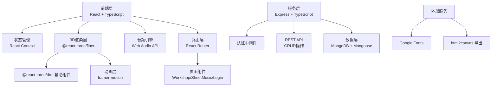
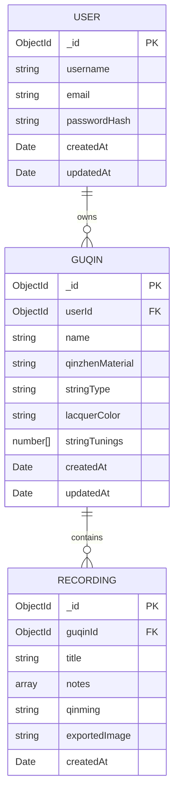

## 1. 架构设计



## 2. 技术选型

| 层级 | 技术栈 | 版本 | 用途 |
|------|--------|------|------|
| 前端框架 | React | ^18.2.0 | UI构建 |
| 语言 | TypeScript | ^5.0.0 | 类型安全 |
| 构建工具 | Vite | ^5.0.0 | 开发构建 |
| 3D渲染 | @react-three/fiber | ^8.15.0 | Three.js React封装 |
| 3D辅助 | @react-three/drei | ^9.88.0 | 3D场景辅助组件 |
| 动画 | framer-motion | ^10.16.0 | React动画库 |
| 后端 | Express | ^4.18.0 | API服务 |
| 数据库 | MongoDB + Mongoose | ^7.5.0 | 数据持久化 |
| 音频 | Web Audio API | 原生 | 声音合成与播放 |
| 导出 | html2canvas | ^1.4.1 | PNG截图导出 |
| 文件保存 | file-saver | ^2.0.5 | 客户端文件下载 |

## 3. 目录结构

```
src/
├── client/
│   ├── App.tsx              # 主应用入口
│   ├── main.tsx             # React挂载点
│   ├── context/
│   │   └── AppContext.tsx   # 全局状态管理
│   ├── components/
│   │   ├── Workshop.tsx     # 工坊3D场景
│   │   ├── SheetMusic.tsx   # 琴谱生成
│   │   ├── GuqinCard.tsx    # 古琴卡片
│   │   ├── ConfigPanel.tsx  # 属性配置面板
│   │   ├── TuningSlider.tsx # 调弦滑条
│   │   ├── PianoRoll.tsx    # 乐谱可视化
│   │   ├── Login.tsx        # 登录注册
│   │   └── UserCenter.tsx   # 个人中心
│   ├── hooks/
│   │   ├── useAudio.ts      # 音频Hook
│   │   └── useGuqin.ts      # 古琴操作Hook
│   ├── types/
│   │   └── index.ts         # 类型定义
│   ├── utils/
│   │   ├── audio.ts         # 音频工具
│   │   ├── musicTheory.ts   # 乐理工具
│   │   └── jianzipu.ts      # 减字谱渲染
│   └── styles/
│       └── global.css       # 全局样式
└── server/
    ├── app.ts               # Express入口
    ├── routes/
    │   ├── auth.ts          # 认证路由
    │   └── guqin.ts         # 古琴数据路由
    ├── models/
    │   ├── User.ts          # 用户模型
    │   └── Guqin.ts         # 古琴模型
    └── middleware/
        └── auth.ts          # 认证中间件
```

## 4. 路由定义

| 路由路径 | 页面组件 | 权限要求 | 功能 |
|---------|----------|----------|------|
| `/login` | Login | 公开 | 用户登录注册 |
| `/` | Workshop | 需要登录 | 工坊仪表板 |
| `/guqin/new` | Workshop | 需要登录 | 新建古琴定制 |
| `/guqin/:id` | Workshop | 需要登录 | 古琴定制/调弦/弹奏 |
| `/guqin/:id/sheet` | SheetMusic | 需要登录 | 琴谱生成预览 |
| `/profile` | UserCenter | 需要登录 | 个人中心历史记录 |

## 5. API 定义

### 5.1 认证接口

```typescript
// POST /api/auth/register
interface RegisterRequest {
  username: string;
  email: string;
  password: string;
}

interface AuthResponse {
  token: string;
  user: { id: string; username: string; email: string };
}

// POST /api/auth/login
interface LoginRequest {
  email: string;
  password: string;
}
```

### 5.2 古琴数据接口

```typescript
// GET /api/guqins - 获取用户古琴列表
interface GuqinListItem {
  id: string;
  name: string;
  stringCount: number;
  toneTags: string[];
  finishDate: string;
  thumbnail: string;
}

// GET /api/guqins/:id - 获取古琴详情
interface GuqinDetail {
  id: string;
  name: string;
  userId: string;
  qinzhenMaterial: 'jade' | 'bone' | 'wood' | 'copper';
  stringType: 'taigu' | 'zhongqing' | 'xihe';
  lacquerColor: string;
  stringTunings: number[];
  recordings: Recording[];
  createdAt: string;
  updatedAt: string;
}

interface Recording {
  id: string;
  title: string;
  notes: Note[];
  qinming: string;
  exportedImage?: string;
  createdAt: string;
}

interface Note {
  string: number;
  pitch: number;
  velocity: number;
  startTime: number;
  duration: number;
}

// POST /api/guqins - 创建古琴
// PUT /api/guqins/:id - 更新古琴
// DELETE /api/guqins/:id - 删除古琴
```

## 6. 数据模型

### 6.1 ER图



### 6.2 Mongoose 模型

```typescript
// User Model
const UserSchema = new Schema({
  username: { type: String, required: true, unique: true },
  email: { type: String, required: true, unique: true },
  passwordHash: { type: String, required: true },
}, { timestamps: true });

// Guqin Model
const GuqinSchema = new Schema({
  userId: { type: Schema.Types.ObjectId, ref: 'User', required: true },
  name: { type: String, required: true },
  qinzhenMaterial: { 
    type: String, 
    enum: ['jade', 'bone', 'wood', 'copper'],
    default: 'wood'
  },
  stringType: {
    type: String,
    enum: ['taigu', 'zhongqing', 'xihe'],
    default: 'zhongqing'
  },
  lacquerColor: { type: String, default: '#4a2c1a' },
  stringTunings: { type: [Number], default: [0, 0, 0, 0, 0, 0, 0] },
  recordings: [{
    title: String,
    notes: [{
      string: Number,
      pitch: Number,
      velocity: Number,
      startTime: Number,
      duration: Number
    }],
    qinming: String,
    exportedImage: String,
    createdAt: { type: Date, default: Date.now }
  }]
}, { timestamps: true });
```

## 7. 性能优化策略

### 7.1 3D渲染优化
- 使用 `InstancedMesh` 渲染7个琴轸，减少Draw Call
- 琴体模型使用低多边形几何体
- 材质预编译，避免运行时编译
- 合理设置像素比（`pixelRatio: Math.min(window.devicePixelRatio, 2)`）

### 7.2 音频优化
- 复用 `AudioContext` 实例
- 预创建振荡器节点池
- 使用 `requestAnimationFrame` 同步音频与视觉
- 音量淡入淡出避免爆音

### 7.3 前端优化
- 代码分割（React.lazy + Suspense）
- 3D场景按需加载
- 图片懒加载
- 使用 `useMemo` / `useCallback` 减少重渲染

## 8. 核心常量配置

```typescript
// 古琴琴弦基础频率（Hz） - 正调
export const STRING_BASE_FREQUENCIES = [
  65.41,  // C4 - 一弦
  73.42,  // D4 - 二弦
  82.41,  // E4 - 三弦
  98.00,  // G4 - 四弦
  110.00, // A4 - 五弦
  130.81, // C5 - 六弦
  146.83  // D5 - 七弦
];

// 琴弦张力系数
export const STRING_TENSION = {
  taigu: 1.15,    // 太古 - 最紧
  zhongqing: 1.0, // 中清
  xihe: 0.85      // 细和 - 最松
};

// 琴轸材质颜色
export const QINZHEN_COLORS = {
  jade: '#a0c4c8',
  bone: '#f5deb3',
  wood: '#8b4513',
  copper: '#b87333'
};

// 大漆颜色选项
export const LACQUER_COLORS = [
  { name: '栗壳色', value: '#5c3a21' },
  { name: '朱砂色', value: '#ff4500' },
  { name: '黑漆色', value: '#0a0a0a' },
  { name: '鹿角霜', value: '#d2b48c' },
  { name: '紫檀色', value: '#4a2c1a' },
  { name: '洒金', value: '#d4a373' }
];

// 键盘映射
export const KEYBOARD_MAP: Record<string, number> = {
  'a': 0, 's': 1, 'd': 2, 'f': 3,
  'j': 4, 'k': 5, 'l': 6
};
```
