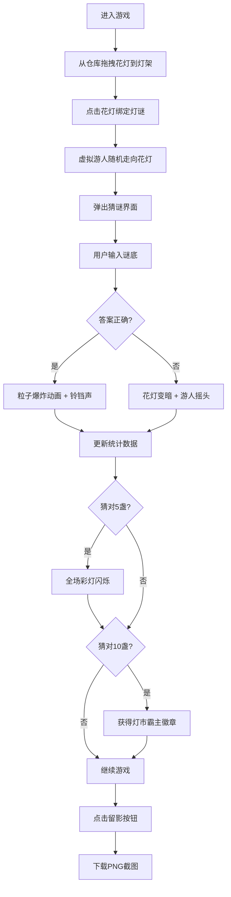

## 1. 产品概述

基于浏览器的虚拟古代灯市猜灯谜互动游戏，用户扮演元宵节灯市摊主，可挑选悬挂花灯、撰写灯谜，与虚拟游人进行猜谜互动，最终生成灯市夜景留影。

- 核心玩法：花灯悬挂 → 灯谜绑定 → 猜谜交互 → 成就解锁 → 截图分享
- 目标用户：喜欢传统文化、休闲益智类游戏的Web用户

## 2. 核心功能

### 2.1 用户角色

| 角色 | 参与方式 | 核心权限 |
|------|----------|----------|
| 摊主（用户） | 直接进入游戏 | 选择悬挂花灯、绑定灯谜、输入谜底、触发截图 |
| 虚拟游人 | 系统自动生成 | 随机选择花灯、触发猜谜、动画反馈 |

### 2.2 功能模块

1. **主游戏界面**：古风夜市场景、灯架横梁、花灯卡槽、仓库区
2. **花灯系统**：3种样式花灯选择、拖拽悬挂、悬垂动画、摇晃动画
3. **灯谜系统**：预设题库、手动输入、卷轴式展示
4. **猜谜交互**：虚拟游人AI、谜底输入、答案比对、粒子爆炸效果
5. **成就系统**：猜谜统计、连击记录、全场彩灯闪烁、"灯市霸主"徽章
6. **截图系统**：一键留影、PNG下载

### 2.3 页面详情

| 页面名称 | 模块名称 | 功能描述 |
|-----------|-------------|---------------------|
| 主游戏页 | 装饰性飞檐 | 顶部黑色剪影装饰，高度80px |
| 主游戏页 | 侧边红灯笼 | 左右各6盏，呼吸动画 |
| 主游戏页 | 灯架横梁 | 深棕色木质，6个卡槽，金线连接 |
| 主游戏页 | 花灯展示 | 悬垂动画、摇晃动画、点击编辑 |
| 主游戏页 | 灯谜卷轴 | 仿古卷轴样式，展示谜面 |
| 主游戏页 | 仓库区 | 竹席底纹，3种花灯选择，拖拽交互 |
| 主游戏页 | 灯谜编辑器 | 半透明面板，题库选择/手动输入 |
| 主游戏页 | 猜谜弹窗 | 谜面展示、输入框、提交按钮 |
| 主游戏页 | 统计面板 | 右上角显示猜中/总数、连击记录 |
| 主游戏页 | 徽章展示 | 左上角"灯市霸主"徽章 |
| 主游戏页 | 留影按钮 | 右下角圆形按钮，截图下载 |

## 3. 核心流程

用户进入游戏后，从底部仓库拖拽花灯到灯架卡槽悬挂，点击花灯绑定灯谜。虚拟游人随机走向花灯触发猜谜，用户输入谜底，系统判断正误并播放对应动画。累计猜对5盏触发全场闪烁，猜对10盏获得徽章。点击留影按钮下载截图。

## 4. 用户界面设计

### 4.1 设计风格

- **主色调**：深蓝夜空 #1a1a2e，深棕木质 #5c3a21，金色点缀 #d4a373
- **花灯颜色**：圆形无骨灯 #ff6b6b，走马灯 #feca57，纱灯 #48dbfb
- **按钮样式**：圆角12px，阴影模糊8px，悬停抬起（translateY -4px）
- **字体**：Google Fonts Ma Shan Zheng（毛笔书法风格）
- **布局**：固定宽度居中布局，灯架800px居中
- **动画风格**：framer-motion驱动，悬垂0.8s ease-out，摇晃±5度2秒周期

### 4.2 页面设计概述

| 页面名称 | 模块名称 | UI元素 |
|-----------|-------------|-------------|
| 主游戏页 | 顶部装饰 | 飞檐剪影（#000，80px高），两侧红灯笼（#e74c3c，呼吸动画） |
| 主游戏页 | 灯架区域 | 横梁（#5c3a21，800x20px），6个卡槽，金线连接（#d4a373） |
| 主游戏页 | 花灯展示 | 80x120px，悬垂动画，摇晃动画，悬停效果 |
| 主游戏页 | 灯谜卷轴 | 宽120px高40px，铜色卷轴杆（#b8860b），宣纸色卷面（#f5f0e8） |
| 主游戏页 | 仓库区 | 竹席底纹（#e8dcc8，150px高），三格花灯，毛边纸标签 |
| 主游戏页 | 编辑器弹窗 | 半透明（#2d3436），圆角12px，题库列表/输入框 |
| 主游戏页 | 统计面板 | 右上角，白色文字，显示当前进度 |
| 主游戏页 | 徽章 | 左上角，金色圆形（50px），篆体"霸"字 |
| 主游戏页 | 留影按钮 | 右下角圆形（#e17055），悬停放大1.1倍 |

### 4.3 响应性

- 桌面端优先，固定宽度800px灯架居中展示
- 移动端自适应缩放，保持核心交互区域可见
- 拖拽操作在移动端兼容触摸事件

### 4.4 性能优化

- 粒子爆炸粒子数≤50个
- 花灯摇晃使用will-change优化
- 整体帧率≥60fps，长任务≤50ms
- framer-motion硬件加速动画
