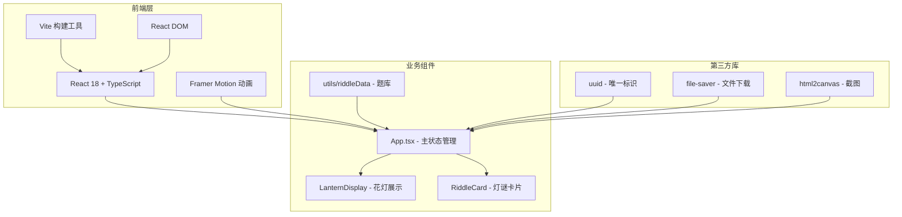

## 1. 架构设计



## 2. 技术描述

- **前端框架**：React@18 + TypeScript@5
- **构建工具**：Vite@5 + @vitejs/plugin-react@4
- **动画库**：framer-motion@11
- **工具库**：uuid@9、file-saver@2、html2canvas@1
- **样式方案**：CSS-in-JS with framer-motion + 全局CSS变量
- **音频方案**：Web Audio API 生成铃铛音效

## 3. 目录结构

```
.
├── package.json
├── index.html
├── vite.config.js
├── tsconfig.json
└── src/
    ├── App.tsx              # 主组件，状态管理、游戏逻辑
    ├── components/
    │   ├── LanternDisplay.tsx  # 花灯展示组件
    │   └── RiddleCard.tsx      # 灯谜卡片组件
    └── utils/
        └── riddleData.ts       # 灯谜题库
```

## 4. 类型定义

```typescript
// 花灯类型
type LanternType = 'round' | 'walking' | 'silk';

interface Lantern {
  id: string;
  type: LanternType;
  slotIndex: number | null;
  riddle: Riddle | null;
  isSwinging: boolean;
  isExploding: boolean;
  isDimming: boolean;
}

// 灯谜类型
interface Riddle {
  id: string;
  question: string;
  answer: string;
  difficulty: 'easy' | 'medium' | 'hard';
  theme: string;
}

// 游戏状态
interface GameState {
  lanterns: Lantern[];
  draggedLantern: LanternType | null;
  activeLanternId: string | null;
  showRiddleEditor: boolean;
  showGuessModal: boolean;
  currentGuessLanternId: string | null;
  guessInput: string;
  stats: {
    correct: number;
    total: number;
    maxStreak: number;
    currentStreak: number;
  };
  hasBadge: boolean;
  isFlashing: boolean;
  visitor: {
    position: { x: number; y: number };
    targetSlot: number | null;
    isThinking: boolean;
  };
}
```

## 5. 核心模块说明

### 5.1 App.tsx - 主组件

**职责**：
- 管理全局游戏状态（useState / useReducer）
- 处理拖拽交互（拖拽开始、拖拽结束、放置）
- 猜谜逻辑（答案比对、动画触发、统计更新）
- 虚拟游人AI（随机移动、停顿、触发猜谜）
- 成就系统（全场闪烁、徽章解锁）
- 截图功能（html2canvas + file-saver）

**关键状态**：
- `lanterns`：花灯数组，6个卡槽位
- `stats`：猜谜统计数据
- `visitor`：游人位置和状态
- 各种弹窗开关状态

### 5.2 LanternDisplay.tsx - 花灯展示组件

**Props**：
```typescript
interface LanternDisplayProps {
  lantern: Lantern;
  slotIndex: number;
  onClick: () => void;
}
```

**功能**：
- 渲染不同类型花灯的SVG/样式
- 悬垂动画（framer-motion，0.8s ease-out）
- 摇晃动画（±5度，2秒周期，infinite）
- 粒子爆炸效果（30个金色圆点，扩散半径150px，0.5s）
- 变暗效果（filter: brightness(0.3)，2秒）
- 灯谜卷轴展示

### 5.3 RiddleCard.tsx - 灯谜卡片组件

**Props**：
```typescript
interface RiddleCardProps {
  riddle: Riddle | null;
  mode: 'display' | 'editor' | 'guess';
  onSubmit?: (answer: string) => void;
  onClose?: () => void;
}
```

**功能**：
- `display`模式：卷轴式展示谜面
- `editor`模式：题库列表 + 手动输入框（20字限制）
- `guess`模式：谜面展示 + 输入框 + 提交按钮
- 表单验证

### 5.4 riddleData.ts - 灯谜题库

```typescript
export const riddleLibrary: Riddle[] = [
  {
    id: '1',
    question: '什么东西越洗越脏？',
    answer: '水',
    difficulty: 'easy',
    theme: '日常'
  },
  // ... 更多灯谜，至少15条
];
```

**分类**：
- 难度：简单/中等/困难
- 主题：日常、自然、文字、动物等

## 6. 动画实现方案

| 动画效果 | 实现方式 | 性能优化 |
|----------|----------|----------|
| 花灯悬垂 | framer-motion animate，y从-200到0，0.8s ease-out | transform 硬件加速 |
| 花灯摇晃 | framer-motion animate，rotate ±5度，2秒周期，easeInOut | will-change: transform |
| 粒子爆炸 | motion.div 数组，30个元素，scale从0到3，opacity从1到0 | 粒子数限制≤50，结束后卸载 |
| 按钮悬停 | whileHover: { scale: 1.1, y: -4 } | 不触发重排 |
| 呼吸动画 | framer-motion，opacity 0.7-1.0，0.3秒周期 | 仅opacity变化 |
| 游人移动 | framer-motion animate，x/y坐标变化 | 按需更新 |

## 7. 性能优化策略

1. **粒子池化**：爆炸粒子复用DOM节点，避免频繁创建销毁
2. **CSS优化**：动画仅使用transform和opacity属性，避免重排重绘
3. **will-change**：花灯摇晃元素添加`will-change: transform`提示浏览器优化
4. **状态隔离**：使用React.memo避免不必要的重渲染
5. **帧率监控**：长任务控制在50ms以内，使用Chrome DevTools Performance检测
6. **懒加载**：非关键动画延迟到页面加载完成后启动
