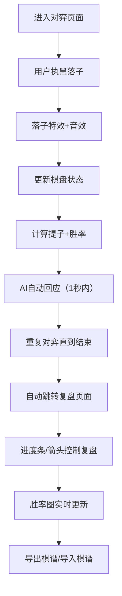

## 1. 产品概述

本产品是一款基于浏览器的围棋对弈与复盘互动应用，模拟古代棋院场景，让用户体验职业棋手的对弈过程。用户可与AI对弈，享受水墨涟漪落子特效，对局结束后通过进度条复盘每一步并查看胜率变化，最终生成可打印的棋谱卷轴。

- 目标用户：围棋爱好者、学习者、职业棋手
- 市场价值：提供沉浸式围棋对弈体验，结合传统美学与现代交互技术

## 2. 核心功能

### 2.1 用户角色

| 角色 | 注册方式 | 核心权限 |
|------|----------|----------|
| 普通用户 | 无需注册，直接使用 | 对弈、复盘、棋谱导入导出 |

### 2.2 功能模块

1. **对弈页面**：19x19棋盘、AI对手、落子特效、提子动画、计时显示、操作工具栏
2. **复盘页面**：棋盘重放、进度条控制、胜率折线图、棋谱导入导出

### 2.3 页面详情

| 页面名称 | 模块名称 | 功能描述 |
|---------|----------|----------|
| 对弈页面 | 棋盘组件 | 19x19格棋盘，星位标记，坐标标注，落子水墨涟漪动画，落子顺序数字标记 |
| 对弈页面 | 提子动画 | 被提棋子闪烁3次后消失，提子计数池显示双方提子数 |
| 对弈页面 | 工具栏 | 悔棋、认输、申请和棋三个操作按钮 |
| 对弈页面 | 计时器 | 右上角显示对局时长，精确到秒 |
| 复盘页面 | 棋盘控制 | 支持0.5x-2x缩放，拖动查看 |
| 复盘页面 | 复盘面板 | 进度条拖动、左右箭头逐手进退、胜率折线图实时展示 |
| 复盘页面 | 棋谱管理 | 导出棋谱为JSON文件、导入JSON/SGF棋谱文件重放 |
| 全局 | 音效反馈 | 落子短促木棋声（200Hz正弦波，100ms，音量0.5） |

## 3. 核心流程

用户进入对弈页面，执黑先行与AI对弈，每步落子触发水墨涟漪和落子音效。对局结束后自动跳转至复盘页面，可通过进度条或箭头逐手查看，胜率折线图同步更新。支持导出棋谱或导入已有棋谱重放。

## 4. 用户界面设计

### 4.1 设计风格

- 主色调：浅米色#f5f0e8（宣纸色）、深棕色#4a3c31（棋盘色）、淡金色#c9a86a（棋格线）、朱红色#c0392b（强调色）、深红色#8b0000（计时文字）
- 字体：Ma Shan Zheng（毛笔书法字体）作为标题，楷体作为正文
- 按钮风格：半透明宣纸色背景，朱红色边框，圆角8px，悬停上移5px
- 整体风格：唐代棋院风格，古色古香，竹帘纹理装饰

### 4.2 页面设计概述

| 页面名称 | 模块名称 | UI元素 |
|---------|----------|--------|
| 对弈页面 | 棋盘区域 | 深棕色棋盘，淡金色棋格线，古铜色包边，红色星位标记，竹帘垂幔装饰，水墨涟漪动画 |
| 对弈页面 | 提子计数池 | 黑方黑色半透明#00000080，白方白色半透明#ffffff80，位于棋盘边缘 |
| 对弈页面 | 计时显示 | 右上角，楷体24px，深红色#8b0000，格式时:分:秒 |
| 对弈页面 | 左侧工具栏 | 三个按钮垂直排列，半透明宣纸色，朱红边框，悬停效果 |
| 复盘页面 | 左侧棋盘 | 占60%宽度，可缩放拖动，棋盘支持0.5x-2x缩放 |
| 复盘页面 | 右侧面板 | 占40%宽度，宣纸色#faf0e6背景，进度条+胜率图+操作按钮 |

### 4.3 响应式

- 桌面端（>768px）：对弈页面棋盘居中，左右浮动工具栏；复盘页面左右布局
- 移动端（≤768px）：自动切换为上下布局，棋盘和复盘面板各占50%高度且可滚动

### 4.4 动画效果

- 落子涟漪：以落子点为圆心，半径0→30px，透明度0.6→0，持续0.6s
- 提子闪烁：被提棋子闪烁3次，每次0.2s，透明度1→0渐变
- 按钮悬停：背景不透明度升至1，按钮上移5px，过渡0.2s
- 页面切换：使用framer-motion实现平滑过渡

## 5. 性能约束

- 帧率：对弈模式下不低于45fps（落子涟漪和提子闪烁动画高峰期）
- 绘制速度：100手以内胜率折线图50ms内完成绘制
- 浏览器支持：Chrome 110+
- AI响应：落子时机不超过1秒
