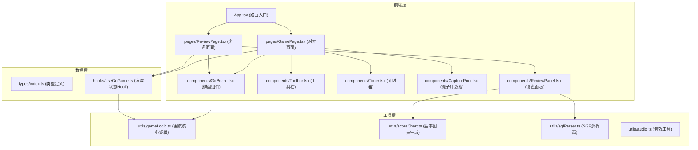

## 1. 架构设计



## 2. 技术描述

- 前端框架：React@18 + TypeScript@5
- 构建工具：Vite@5 + @vitejs/plugin-react@4
- 路由管理：react-router-dom@6
- 动画库：framer-motion@11
- 其他依赖：uuid@9、file-saver@2
- 样式方案：CSS Modules + CSS变量
- 无后端、无数据库，所有数据在前端内存中管理

## 3. 路由定义

| 路由 | 页面 | 用途 |
|------|------|------|
| / | GamePage | 对弈页面，默认首页 |
| /review | ReviewPage | 复盘页面，对局结束后自动跳转 |

## 4. 数据模型

### 4.1 核心类型定义

```typescript
// types/index.ts
export type StoneColor = 'black' | 'white' | null;

export interface Position {
  x: number;  // 0-18 列 (A-T)
  y: number;  // 0-18 行 (1-19)
}

export interface Move {
  position: Position;
  color: StoneColor;
  moveNumber: number;
  winRate: number;  // 当前方胜率 0-100
  capturedStones: Position[];  // 被提子位置
}

export interface GameState {
  board: StoneColor[][];  // 19x19 棋盘
  currentPlayer: StoneColor;
  moveHistory: Move[];
  captures: { black: number; white: number };
  isGameOver: boolean;
  winner: StoneColor;
  startTime: number;
  lastMoveTime: number;
}

export interface GameRecord {
  version: string;
  date: string;
  moves: Move[];
  captures: { black: number; white: number };
  winner: StoneColor;
  totalTime: number;
}
```

### 4.2 数据流向

1. **对弈流程数据流**：
   - 用户点击棋盘 → GoBoard组件触发onPlace回调 → useGoGame Hook调用gameLogic.placeStone() → 更新GameState → 重新渲染棋盘
   - gameLogic返回新棋盘状态、提子列表、胜率估算 → 存入moveHistory
   - AI回合：setTimeout 1秒内调用gameLogic.getAIMove() → 自动落子

2. **复盘流程数据流**：
   - ReviewPanel接收moveHistory数组 → 用户拖动进度条 → 设置currentMoveIndex → GoBoard显示对应步数的棋盘状态
   - scoreChart接收每步winRate数组 → 插值平滑生成Canvas折线图数据 → ReviewPanel渲染图表

3. **棋谱导入导出**：
   - 导出：GameRecord序列化为JSON → file-saver触发下载
   - 导入：JSON.parse或sgfParser解析 → 重构moveHistory → useGoGame加载棋局

## 5. 文件结构与调用关系

```
src/
├── App.tsx                 # 路由入口，使用React-Router
├── main.tsx               # React渲染入口
├── index.css              # 全局样式、CSS变量、动画
├── types/
│   └── index.ts           # 所有类型定义
├── pages/
│   ├── GamePage.tsx       # 对弈页面，组合GoBoard/Toolbar/Timer
│   └── ReviewPage.tsx     # 复盘页面，组合GoBoard/ReviewPanel
├── components/
│   ├── GoBoard.tsx        # 棋盘组件，props: boardState, currentMove, onPlace
│   ├── ReviewPanel.tsx    # 复盘面板，props: moveHistory, onMoveChange
│   ├── Toolbar.tsx        # 工具栏，props: onUndo, onResign, onDraw
│   ├── Timer.tsx          # 计时器，props: startTime, isRunning
│   ├── CapturePool.tsx    # 提子计数池，props: captures
│   └── WinRateChart.tsx   # 胜率折线图，props: winRates, currentIndex
├── utils/
│   ├── gameLogic.ts       # 围棋核心：提子、眼位、禁着点、MCTS胜率
│   ├── scoreChart.ts      # 胜率数据插值平滑，生成Canvas路径
│   ├── sgfParser.ts       # SGF格式棋谱解析
│   └── audio.ts           # Web Audio API音效生成
└── hooks/
    └── useGoGame.ts       # 游戏状态管理Hook
```

**调用关系**：
- App.tsx → GamePage.tsx / ReviewPage.tsx
- GamePage.tsx → useGoGame.ts → gameLogic.ts
- ReviewPage.tsx → useGoGame.ts → gameLogic.ts / sgfParser.ts
- GoBoard.tsx ← 接收board/moveHistory，↑ 触发onPlace
- ReviewPanel.tsx ← 接收moveHistory，↑ 触发onMoveChange → WinRateChart.tsx → scoreChart.ts

## 6. 性能优化策略

1. **棋盘渲染优化**：
   - 使用CSS Grid布局而非绝对定位，减少重排
   - 棋子使用CSS变量控制位置，仅更新变化的棋子
   - 落子涟漪使用transform: scale()动画，触发GPU加速

2. **胜率图绘制优化**：
   - Canvas 2D直接绘制，避免SVG/DOM开销
   - 100手以内数据预计算，缓存插值结果
   - 鼠标悬停使用离屏Canvas命中检测

3. **动画性能**：
   - 提子闪烁使用opacity动画，不触发layout
   - will-change: transform, opacity 提示浏览器优化
   - requestAnimationFrame统一调度动画帧

4. **状态更新**：
   - useCallback/useMemo优化组件重渲染
   - 棋盘状态使用不可变更新，便于时间旅行复盘
   - AI计算使用setTimeout分片，避免阻塞主线程

## 7. 依赖清单

```json
{
  "dependencies": {
    "react": "^18.2.0",
    "react-dom": "^18.2.0",
    "react-router-dom": "^6.22.0",
    "framer-motion": "^11.0.0",
    "uuid": "^9.0.0",
    "file-saver": "^2.0.5"
  },
  "devDependencies": {
    "@types/react": "^18.2.0",
    "@types/react-dom": "^18.2.0",
    "@types/uuid": "^9.0.0",
    "@types/file-saver": "^2.0.7",
    "typescript": "^5.3.0",
    "vite": "^5.0.0",
    "@vitejs/plugin-react": "^4.2.0"
  }
}
```
