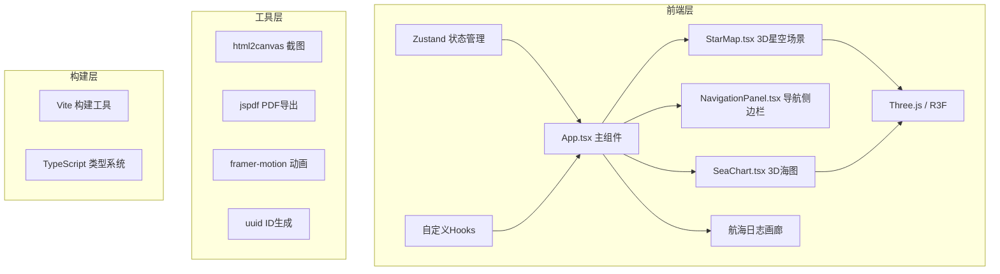

## 1. 架构设计



## 2. 技术描述

- **前端框架**：React@18 + TypeScript@5
- **3D渲染**：Three.js + @react-three/fiber + @react-three/drei
- **状态管理**：Zustand
- **动画库**：framer-motion
- **构建工具**：Vite@5 + @vitejs/plugin-react
- **截图工具**：html2canvas
- **PDF导出**：jspdf
- **工具库**：uuid、file-saver
- **CSS方案**：原生CSS变量 + Tailwind CSS

## 3. 目录结构

```
├── src/
│   ├── components/
│   │   ├── StarMap.tsx          # 3D星空场景
│   │   ├── NavigationPanel.tsx  # 导航侧边栏
│   │   ├── SeaChart.tsx         # 3D海图
│   │   ├── Lighthouse.tsx       # 灯塔组件
│   │   ├── TreasureShip.tsx     # 宝船模型
│   │   ├── Compass.tsx          # 罗盘组件
│   │   ├── StarBoard.tsx        # 牵星板组件
│   │   ├── Gallery.tsx          # 截图画廊
│   │   └── FloatingButton.tsx   # 移动端浮动按钮
│   ├── hooks/
│   │   ├── useStarObservation.ts # 恒星观测计算
│   │   ├── useNavigation.ts      # 导航计算
│   │   ├── useScreenshot.ts      # 截图功能
│   │   └── usePDFExport.ts       # PDF导出
│   ├── store/
│   │   └── useNavigationStore.ts # 全局状态管理
│   ├── types/
│   │   └── index.ts              # 类型定义
│   ├── utils/
│   │   ├── starData.ts           # 恒星数据
│   │   ├── mathUtils.ts          # 数学计算工具
│   │   └── constants.ts          # 常量配置
│   ├── App.tsx                   # 主组件
│   ├── main.tsx                  # 入口文件
│   └── index.css                 # 全局样式
├── index.html
├── vite.config.ts
├── tsconfig.json
└── package.json
```

## 4. 数据模型

### 4.1 类型定义

```typescript
// 星体类型
interface Star {
  id: string;
  name: string;
  chineseName: string;
  ra: number;        // 赤经 (度)
  dec: number;       // 赤纬 (度)
  magnitude: number; // 星等
  color: string;
  position: [number, number, number]; // 3D位置
}

// 航标灯塔
interface Waypoint {
  id: string;
  position: [number, number, number];
  name: string;
  createdAt: number;
}

// 舰队状态
interface FleetState {
  position: [number, number, number];
  rotation: [number, number, number];
  speed: number;
  currentWaypointIndex: number;
  isMoving: boolean;
}

// 观测状态
interface ObservationState {
  selectedStar: Star | null;
  altitude: number;      // 高度角 0-90°
  azimuth: number;       // 方位角 0-360°
  cameraDistance: number;// 相机距离 5-30
  cameraAzimuth: number; // 相机方位角
  cameraPolar: number;   // 相机俯仰角 0-60°
}

// 航海日志截图
interface LogEntry {
  id: string;
  dataUrl: string;
  timestamp: number;
  description: string;
}

// 全局状态
interface NavigationStore {
  // 状态
  viewMode: 'sky' | 'sea';
  observation: ObservationState;
  waypoints: Waypoint[];
  fleet: FleetState;
  logEntries: LogEntry[];
  sidebarOpen: boolean;
  passedWaypoints: Set<string>;
  
  // 操作
  setViewMode: (mode: 'sky' | 'sea') => void;
  updateObservation: (obs: Partial<ObservationState>) => void;
  selectStar: (star: Star | null) => void;
  addWaypoint: (position: [number, number, number]) => void;
  removeWaypoint: (id: string) => void;
  updateWaypoint: (id: string, position: [number, number, number]) => void;
  startFleet: () => void;
  stopFleet: () => void;
  updateFleetPosition: (pos: [number, number, number]) => void;
  addLogEntry: (dataUrl: string, description: string) => void;
  removeLogEntry: (id: string) => void;
  toggleSidebar: () => void;
  clearAll: () => void;
}
```

## 5. 核心常量配置

```typescript
// 3D场景常量
export const SCENE_CONSTANTS = {
  HEMISPHERE_RADIUS: 50,
  SKY_ROTATION_SPEED: 0.001,
  STAR_COUNT: 5000,
  BRIGHT_STAR_COUNT: 30,
  OCEAN_SIZE: 100,
  MIN_CAMERA_DISTANCE: 5,
  MAX_CAMERA_DISTANCE: 30,
  MIN_POLAR_ANGLE: 0,
  MAX_POLAR_ANGLE: Math.PI / 3, // 60°
}

// 导航常量
export const NAVIGATION_CONSTANTS = {
  FLEET_SPEED: 0.5,            // 单位/秒
  WAVE_AMPLITUDE: 0.05,        // 海浪振幅
  WAVE_PERIOD: 2,              // 海浪周期
  LIGHTHOUSE_HEIGHT: 0.5,
  LIGHTHOUSE_RADIUS: 0.15,
  LIGHT_BLINK_PERIOD: 0.8,     // 秒
  MAX_WAYPOINTS: 10,
  MAX_LOG_ENTRIES: 20,
}

// UI常量
export const UI_CONSTANTS = {
  SIDEBAR_WIDTH: '25%',
  SIDEBAR_MIN_WIDTH: 320,
  GALLERY_HEIGHT: 120,
  THUMBNAIL_WIDTH: 180,
  THUMBNAIL_HEIGHT: 120,
  THUMBNAIL_RADIUS: 6,
  MOBILE_BREAKPOINT: 768,
}

// 颜色常量
export const COLORS = {
  PRIMARY: '#0b1628',
  SECONDARY: '#0a2a3a',
  ACCENT: '#ffd54f',
  ACCENT_LIGHT: '#ffe082',
  CARD_BG: '#1a2a4a80',
  CARD_HOVER: '#2a3a6a80',
  TEXT: '#f5f0e8',
  SUCCESS: '#66bb6a',
  DANGER: '#e53935',
  ROUTE: '#4fc3f7',
  DEEP_BLUE: '#1a3a5c',
}
```

## 6. 性能优化策略

1. **3D渲染优化**：
   - 星空粒子使用BufferGeometry批量渲染，减少draw call
   - 灯塔使用InstancedMesh合并渲染
   - 动画使用requestAnimationFrame，避免重排重绘
   - 材质使用transparent=false减少混合开销

2. **React性能优化**：
   - 使用memo包装非频繁更新组件
   - 使用useMemo/useCallback缓存计算结果和回调
   - Zustand使用selector避免不必要重渲染

3. **动画优化**：
   - framer-motion使用transform属性动画，启用GPU加速
   - 3D动画使用Three.js的useFrame钩子，控制更新频率
   - 滚动事件使用throttle节流

4. **加载优化**：
   - 动态导入大型库（html2canvas、jspdf）
   - 3D模型使用低面数简化版本
   - 首屏优先加载核心场景，后台加载次要资源
