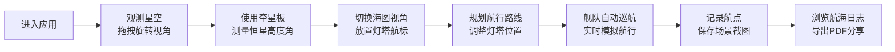

## 1. 产品概述

本应用是一款基于浏览器的古代星盘航海导航交互可视化工具，让用户扮演郑和船队的领航员，通过星盘和牵星板观测恒星、借助罗盘确定航向，在3D海图上规划并模拟舰队航行路线，最终生成可分享的航海日志卷轴截图。

- **核心目的**：通过沉浸式3D交互体验，还原古代航海天文学的魅力，让用户学习天文导航知识
- **目标用户**：历史爱好者、天文爱好者、教育工作者及学生
- **市场价值**：融合教育与娱乐的交互式科普应用，展现中国古代航海技术的辉煌成就

## 2. 核心功能

### 2.1 用户角色
| 角色 | 注册方式 | 核心权限 |
|------|---------|----------|
| 领航员用户 | 无需注册，直接使用 | 观测星空、规划航线、模拟航行、生成航海日志 |

### 2.2 功能模块
1. **3D星空观测模块**：旋转的海天半球、5000+颗恒星背景、30颗可见亮星、日月天体
2. **导航控制面板**：牵星板高度角测量、罗盘方位指针、航速风向指示、航点规划
3. **3D海图导航模块**：海洋平面、宝船舰队模型、灯塔航标、规划路线显示
4. **航海日志模块**：截图记录、画廊展示、PDF导出分享

### 2.3 页面详情
| 页面名称 | 模块名称 | 功能描述 |
|---------|---------|----------|
| 主界面 | 3D星空场景 | 鼠标拖拽旋转视角（0-360°方位，0-60°俯仰），滚轮缩放（5-30单位），触控手势支持 |
| 主界面 | 导航侧边栏 | 显示当前观测恒星名称与高度角（0-90°，精度0.5°），牵星板刻度条，罗盘指针，舰队状态 |
| 主界面 | 3D海图平面 | 点击放置灯塔航标（最多10个），拖拽调整位置，发光虚线连接路线 |
| 主界面 | 舰队航行模拟 | 宝船沿规划路线自动巡航（0.5单位/秒），船身海浪起伏，已通过路径变绿 |
| 主界面 | 航海日志画廊 | 截图保存（最多20张），横向滚动展示，悬停放大，一键导出PDF |

## 3. 核心流程

用户进入应用后，首先看到3D星空场景和导航侧边栏。通过拖拽旋转星空视角，使用牵星板观测恒星高度角，确定当前纬度。然后切换到海图视角，点击海面放置灯塔航标规划航线。舰队自动沿路线航行，途中可随时点击记录航点保存截图。航行完成后，可将所有截图导出为PDF格式的航海日志。

## 4. 用户界面设计

### 4.1 设计风格
- **主色调**：深海蓝 #0b1628 为主背景，金色 #ffd54f 为描边和强调色
- **辅助色**：海洋蓝 #0a2a3a、暗蓝卡片 #1a2a4a80、米白文字 #f5f0e8
- **按钮样式**：半透明深色圆角卡片，悬停背景变为 #2a3a6a80，点击缩放至0.95倍
- **字体**：Google Fonts - Ma Shan Zheng（展示字体）、Noto Sans SC（正文字体）
- **布局风格**：左侧3D场景75%，右侧侧边栏25%（最小320px），底部画廊120px高
- **图标风格**：中国古代航海元素，简约线描风格

### 4.2 页面设计概述
| 页面名称 | 模块名称 | UI元素 |
|---------|---------|--------|
| 主界面 | 3D星空场景 | 海天半球渐变、5000+闪烁星点、30颗亮星标注、日月天体、拖拽旋转动画 |
| 主界面 | 导航侧边栏 | 牵星板垂直刻度条（深蓝到明黄渐变）、金色指针、恒星中文名、罗盘360°刻度、航速风向仪表、航点规划按钮 |
| 主界面 | 3D海图平面 | 蓝绿色海面、白色灯塔（黄色闪烁光）、发光虚线路线（流动动画）、明代宝船模型（棕红船身、白帆、红旗） |
| 主界面 | 航海日志画廊 | 横向滚动卡片（180x120px，圆角6px）、悬停放大1.1倍（0.2s）、PDF导出按钮、删除按钮 |

### 4.3 响应式设计
- **桌面端**：左侧3D场景75%，右侧侧边栏25%固定显示
- **平板端**：侧边栏可折叠，底部画廊保持120px高度
- **移动端**（<768px）：侧边栏自动隐藏为右下角浮动按钮，点击抽屉式滑出；触控手势支持双指缩放、单指旋转
- **触控优化**：所有交互元素最小触控区域44x44px，手势操作有即时视觉反馈

### 4.4 3D场景设计指引
- **环境氛围**：夜间海面星空，东方地平线微红渐变到天顶深蓝，海面有微弱反光
- **光照设置**：环境光0.3强度，方向光模拟月光（冷白色0.8强度），灯塔点光源（黄色闪烁）
- **相机设置**：透视相机，初始距离15单位，限制俯仰角0-60°，方位角0-360°
- **构图元素**：海天分界线为视觉锚点，北极星位于天顶附近作为参考
- **交互动画**：星空缓慢自转（0.1°/s），恒星轻微闪烁，海浪起伏动画，舰队航行尾迹
- **后处理效果**：轻微泛光（Bloom）增强星光效果，色彩分级营造复古氛围
- **性能预算**：星空粒子5000个使用BufferGeometry，灯塔数量限制10个，帧率目标45+fps
