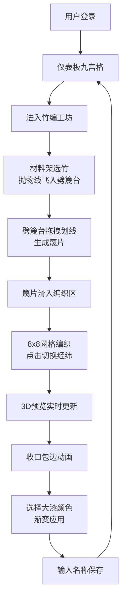

## 1. 产品概述

虚拟古代竹编工坊是一款模拟传统竹编工艺的全栈Web应用，解决传统竹编工艺中复杂编织图案的数字化模拟与个性化定制难以实现的问题。用户通过选竹、劈篾、编织、收口和上漆等工序，可制作出竹篮、竹席、竹篓等不同器物。

- 主要用途：传统竹编工艺的数字化传承与创新，让用户体验竹编制作的完整流程
- 目标用户：竹编工艺爱好者、文化创意从业者、传统手工艺学习者
- 市场价值：推动传统工艺数字化转型，降低竹编学习门槛，支持个性化定制

## 2. 核心功能

### 2.1 用户角色
| 角色 | 注册方式 | 核心权限 |
|------|----------|----------|
| 普通用户 | 用户名密码注册 | 制作器物、保存作品、查看传习录 |

### 2.2 功能模块
1. **用户认证模块**：注册、登录、登出
2. **仪表板模块**：九宫格展示已完成器物、进入工坊编辑
3. **竹编工坊模块**：材料架、劈篾台、编织网格、3D预览、收口、上漆
4. **传习录模块**：制作步骤时间线、状态回溯
5. **数据管理模块**：器物增删改查、作品持久化

### 2.3 页面详情
| 页面名称 | 模块名称 | 功能描述 |
|----------|----------|----------|
| 登录页 | 认证模块 | 用户输入用户名密码登录，支持新用户注册 |
| 仪表板 | 展示模块 | 九宫格展示已完成器物卡片，支持点击进入编辑，茅草棚顶导航条，竹编灯笼装饰 |
| 工坊页 | 核心制作模块 | 材料架选竹、劈篾台划线劈竹、编织网格交互、3D实时预览、收口动画、上漆调色、器物保存 |
| 传习录 | 历史记录模块 | 可折叠侧边面板，时间线展示制作步骤，点击回溯编织状态 |

## 3. 核心流程

用户登录后进入仪表板，点击"开始制作"或已有器物进入工坊。从材料架选取竹材（抛物线飞入动画）→ 在劈篾台拖拽划线劈开竹材生成篾片 → 篾片滑入编织区 → 在8x8网格点击切换经纬位置 → 右侧3D窗口实时预览编织效果 → 点击收口生成包边动画 → 选择大漆颜色应用渐变 → 输入名称描述保存 → 器物返回仪表板九宫格。

## 4. 用户界面设计

### 4.1 设计风格
- **设计主题**：唐宋时期江南水乡工坊风格，水墨写意美学
- **主色调**：竹木色系 #d4c5a9（背景）、#c4a35a（篾片亮色）、#6b7b3a（竹青）
- **辅助色**：#5c2e1f（紫竹）、#b8860b（金竹）、#8b6351（斑竹）、#7b4a2b（藤条）
- **大漆色**：#c23b22（朱红）、#1a1a1a（漆黑）、#d4af37（金漆）、#f5f5dc（瓷白）、#2c3e50（黛蓝）、#7a4a3c（赭石）
- **按钮样式**：圆角矩形（border-radius: 8px），背景#6b7b3a，文字#f5e6c8，悬停渐变#4a5c2e
- **字体**：Google Fonts "Ma Shan Zheng" 书法字体用于标题，系统字体用于正文
- **布局风格**：工坊场景布局，顶部茅草棚造型导航条，左右悬挂竹编灯笼，背景宣纸颗粒纹理
- **图标风格**：写意竹枝图标，水墨风格器物缩略图

### 4.2 页面设计概述
| 页面名称 | 模块名称 | UI元素 |
|----------|----------|--------|
| 登录页 | 认证模块 | 竹木色背景，居中卡片，书法标题，圆角输入框，过渡动画 |
| 仪表板 | 九宫格 | 茅草棚顶导航条，竹编灯笼装饰，200x200px麻布色格子，水墨器物图，悬停上浮12px显示名称时间，宣纸颗粒背景 |
| 工坊页 | 材料架 | 左侧垂直材料架，60x60px写意竹枝图标，悬停微颤飘落竹叶动画，选中后抛物线0.6s飞入劈篾台 |
| 工坊页 | 劈篾台 | 右侧劈篾操作区，3px#6d4c41划线，拖拽交互，生成1-5条篾片，篾片Y轴旋转90度滑入编织区（0.5s） |
| 工坊页 | 编织区 | 8x8方形网格（每格35x35px），网格线#a08060透明度0.5，点击切换深浅色，0.3s过渡 |
| 工坊页 | 3D预览 | 300x300px WebGL窗口，二维图案映射到三维模型，鼠标拖拽旋转Y轴0-360度 |
| 工坊页 | 收口上漆 | 收口按钮触发1.5s藤条绕圈动画，6色大漆色盘，点击渐变0.8s ease-in-out |
| 传习录 | 侧边面板 | 可折叠滑出（0.3s，280px宽），时间线步骤记录，40x40px圆角缩略图，点击回溯状态 |

### 4.3 响应式设计
- **桌面优先**：主布局三栏式（材料架+编织区+3D预览）
- **断点768px**：仪表板九宫格变为两列，工坊布局改为垂直堆叠
- **移动端优化**：所有点击区域≥48x48px，触控反馈优化
- **交互反馈**：所有操作100ms内响应，transition: 0.3s ease统一过渡

### 4.4 3D场景指导
- **环境**：暖色调古风场景，柔和漫反射光模拟室内工坊光照
- **光照**：AmbientLight + DirectionalLight，色温偏暖黄，阴影柔和
- **相机**：PerspectiveCamera，初始距离1.5倍模型高度，fov=45
- **模型**：竹篮（圆柱+提手）、竹席（扁平圆柱）、竹篓（圆台形）基础几何体
- **交互**：OrbitControls，限制仅绕Y轴旋转（0-360度），禁用缩放平移
- **材质**：MeshStandardMaterial，map纹理动态更新为编织图案
- **性能**：限制三角形数量，帧率≥30FPS，材质更新优化
