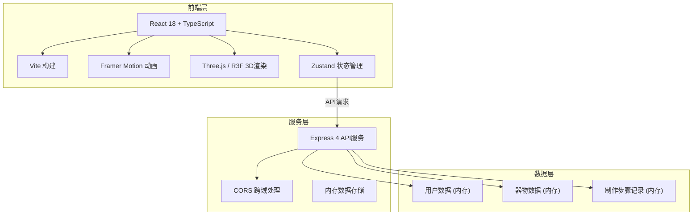
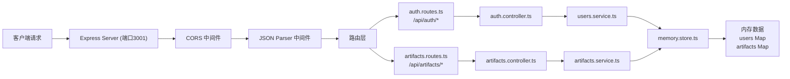
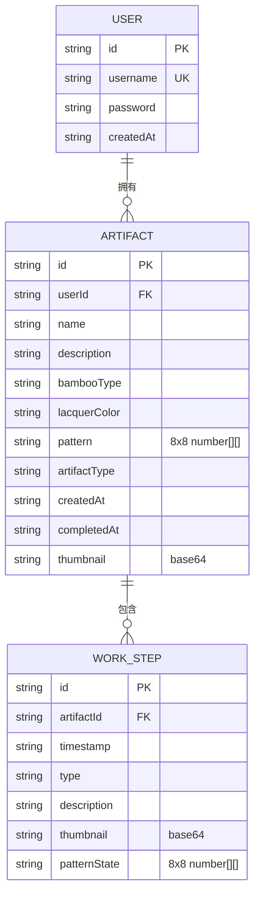

## 1. 架构设计



## 2. 技术描述

- **前端框架**：React 18 + TypeScript
- **构建工具**：Vite 5
- **后端框架**：Express 4
- **状态管理**：Zustand
- **动画库**：Framer Motion
- **3D渲染**：Three.js + @react-three/fiber + @react-three/drei
- **UI样式**：CSS Modules + CSS Variables（不使用Tailwind，按用户要求精细控制样式）
- **数据存储**：内存存储（开发阶段），uuid生成唯一标识
- **HTTP客户端**：Fetch API
- **文件导出**：file-saver

## 3. 路由定义

| 路由 | 页面组件 | 功能 |
|------|----------|------|
| `/login` | Login.tsx | 用户登录/注册页面 |
| `/dashboard` | Dashboard.tsx | 仪表板，九宫格展示器物 |
| `/workshop` | BambooWorkshop.tsx | 竹编工坊核心制作页面 |
| `/` | App.tsx | 根路由，根据认证状态重定向 |

## 4. API定义

```typescript
// 类型定义
interface User {
  id: string;
  username: string;
  password: string;
  createdAt: string;
}

interface Artifact {
  id: string;
  userId: string;
  name: string;
  description: string;
  bambooType: 'qing' | 'zi' | 'jin' | 'ban';
  lacquerColor: string;
  pattern: number[][]; // 8x8编织图案矩阵
  artifactType: 'basket' | 'mat' | 'basketry';
  steps: WorkStep[];
  createdAt: string;
  completedAt: string;
  thumbnail: string; // base64缩略图
}

interface WorkStep {
  id: string;
  timestamp: string;
  type: 'select_bamboo' | 'split' | 'weave' | 'trim' | 'lacquer';
  description: string;
  thumbnail: string;
  patternState: number[][];
}

// 请求/响应
// POST /api/auth/register
interface RegisterRequest { username: string; password: string; }
interface AuthResponse { success: boolean; user: Omit<User, 'password'>; token: string; }

// POST /api/auth/login
interface LoginRequest { username: string; password: string; }
// 响应: AuthResponse

// GET /api/artifacts?userId={id}
interface ArtifactsResponse { artifacts: Artifact[]; }

// POST /api/artifacts
interface CreateArtifactRequest {
  userId: string;
  name: string;
  description: string;
  bambooType: string;
  lacquerColor: string;
  pattern: number[][];
  artifactType: string;
  steps: WorkStep[];
  thumbnail: string;
}
interface ArtifactResponse { artifact: Artifact; }

// GET /api/artifacts/:id
// 响应: ArtifactResponse

// PUT /api/artifacts/:id
// 请求: Partial<CreateArtifactRequest>
// 响应: ArtifactResponse

// DELETE /api/artifacts/:id
interface DeleteResponse { success: boolean; }
```

## 5. 服务器架构图



## 6. 数据模型

### 6.1 数据模型定义



### 6.2 目录结构

```
├── package.json
├── index.html
├── vite.config.js
├── tsconfig.json
├── src/
│   ├── App.tsx                 # 主组件，路由+全局状态
│   ├── main.tsx                # 入口文件
│   ├── index.css               # 全局样式+CSS变量
│   ├── components/
│   │   ├── Login.tsx           # 登录注册组件
│   │   ├── Dashboard.tsx       # 仪表板九宫格
│   │   ├── BambooWorkshop.tsx  # 核心工坊组件
│   │   ├── MaterialShelf.tsx   # 材料架子组件
│   │   ├── SplittingTable.tsx  # 劈篾台子组件
│   │   ├── WeavingGrid.tsx     # 编织网格子组件
│   │   ├── Preview3D.tsx       # 3D预览子组件
│   │   ├── LacquerPanel.tsx    # 上漆面板子组件
│   │   ├── Chuanxilu.tsx       # 传习录子组件
│   │   └── Navigation.tsx      # 茅草棚顶导航
│   ├── store/
│   │   └── useWorkshopStore.ts # 工坊状态管理
│   ├── types/
│   │   └── index.ts            # TypeScript类型定义
│   └── utils/
│       ├── api.ts              # API请求封装
│       ├── patternUtils.ts     # 编织图案工具函数
│       └── canvasUtils.ts      # Canvas绘图工具
├── server/
│   ├── index.ts                # Express服务器入口
│   ├── routes/
│   │   ├── auth.routes.ts      # 认证路由
│   │   └── artifacts.routes.ts # 器物路由
│   ├── controllers/
│   │   ├── auth.controller.ts  # 认证控制器
│   │   └── artifacts.controller.ts # 器物控制器
│   ├── services/
│   │   ├── users.service.ts    # 用户服务
│   │   └── artifacts.service.ts # 器物服务
│   └── store/
│       └── memory.store.ts     # 内存数据存储
```

### 6.3 状态管理设计

使用Zustand管理工坊状态：

```typescript
interface WorkshopState {
  // 认证
  user: User | null;
  setUser: (user: User | null) => void;
  
  // 当前器物
  currentArtifact: Partial<Artifact> | null;
  bambooType: BambooType | null;
  lacquerColor: string;
  pattern: number[][];
  steps: WorkStep[];
  
  // 操作状态
  isSplitting: boolean;
  isWeaving: boolean;
  isTrimming: boolean;
  trimProgress: number;
  
  // 操作方法
  selectBamboo: (type: BambooType) => void;
  startSplitting: () => void;
  completeSplitting: (strips: number) => void;
  toggleWeaveCell: (row: number, col: number) => void;
  startTrim: () => void;
  setLacquerColor: (color: string) => void;
  addStep: (step: Omit<WorkStep, 'id' | 'timestamp'>) => void;
  revertToStep: (stepIndex: number) => void;
  saveArtifact: (name: string, desc: string) => Promise<void>;
  resetWorkshop: () => void;
}
```

## 7. 性能优化策略

1. **交互响应**：所有点击/拖拽操作使用React状态立即更新，100ms内反馈
2. **3D性能**：
   - 限制网格细分数量，保持低多边形
   - 材质贴图更新使用debounce，避免频繁重绘
   - 使用InstancedMesh处理重复元素
3. **内存管理**：
   - Three.js资源手动dispose
   - Canvas绘图及时释放
   - Zustand状态避免不必要的引用
4. **动画优化**：
   - CSS transforms优先，避免layout thrashing
   - Framer Motion使用will-change提示
   - 大数据量动画使用requestAnimationFrame
5. **响应式**：：使用content-visibility优化长列表渲染
