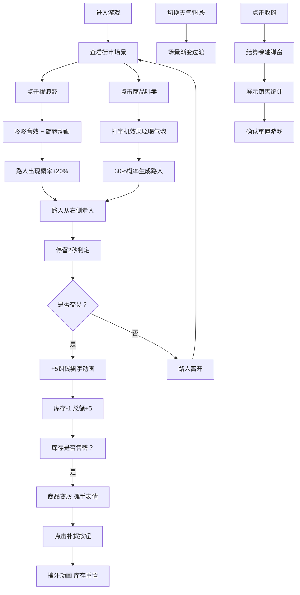

## 1. 产品概述
长安货郎是一款基于浏览器的古风场景互动应用，用户扮演走街串巷的货郎，在虚拟长安街头通过摇动拨浪鼓、吆喝叫卖展示商品，与路人互动达成交易。应用通过动态天气、昼夜变化营造沉浸式古风街市氛围。
- 核心价值：通过趣味互动体验古代市井生活，融合视觉、听觉多感官反馈
- 目标用户：对古风文化、互动小游戏感兴趣的休闲用户

## 2. 核心特性

### 2.1 用户角色
| 角色 | 注册方式 | 核心权限 |
|------|----------|----------|
| 玩家 | 无需注册 | 完整游戏体验，包含叫卖、交易、环境控制等所有功能 |

### 2.2 功能模块
1. **主场景模块**：古风街市场景渲染，包含天气粒子效果、昼夜切换、店铺背景
2. **货郎角色模块**：拨浪鼓摇动动画、吆喝语音反馈、角色表情动作
3. **推车商品模块**：6种商品网格展示、悬浮动画、叫卖气泡、库存管理
4. **路人交易模块**：路人生成与行走动画、停留交易判定、铜钱飘字动画
5. **环境控制模块**：天气与时段滑块控制、场景渐变过渡效果
6. **结算面板模块**：销售统计、结算卷轴、重置游戏状态

### 2.3 页面详情
| 页面名称 | 模块名称 | 功能描述 |
|----------|----------|----------|
| 主游戏页面 | 古风街景 | 青石板街道、店铺招牌、飞檐装饰、动态光线效果 |
| 主游戏页面 | 货郎与推车 | 中央木质独轮车、竹编伞盖、6件商品网格展示 |
| 主游戏页面 | 环境控制 | 底部天气滑块（晴/雨/雪）、时段滑块（清晨/正午/黄昏/夜晚） |
| 主游戏页面 | 状态显示 | 右上角商品库存、右下角铜钱总额、补货/收摊按钮 |
| 结算弹窗 | 结算面板 | 仿古卷轴样式、展示卖出件数和总额、确认重置 |

## 3. 核心流程
用户进入游戏后，首先看到古风街市场景。货郎站在推车旁，车上展示6种商品。用户可以点击拨浪鼓吸引路人，或点击商品进行叫卖。叫卖后有概率出现路人，路人停留则自动完成交易，铜钱增加。用户可通过底部滑块切换天气和时段，观察场景变化。点击收摊按钮弹出结算面板，展示今日销售成绩，确认后重置游戏。

## 4. 用户界面设计

### 4.1 设计风格
- 主色调：赭石#8B4513、土黄#D2B48C、靛青#4B0082，灵感源自《清明上河图》
- 按钮风格：仿红木材质#8B0000，按下时有凹陷浮雕效果，圆角4px
- 字体：Ma Shan Zheng（马善政毛笔字体）展示古风韵味
- 布局：中央焦点式布局，货郎推车位于视觉中心，顶部飞檐装饰，底部控制栏
- 纹理效果：麻布纹理背景、木纹渐变、竹编半透明效果、宣纸质感

### 4.2 页面设计概览
| 页面名称 | 模块名称 | UI元素 |
|----------|----------|--------|
| 主游戏页面 | 街景背景 | #8B7D6B青石板街道、渐变天空、店铺招牌错落、CSS绘制飞檐 |
| 主游戏页面 | 货郎推车 | 木制独轮车（木纹渐变）、车轮旋转动画、竹编伞盖#D4A373、阴影花斑 |
| 主游戏页面 | 商品网格 | 2行3列布局、悬浮弹起放大1.15倍、售罄变灰不可点击 |
| 主游戏页面 | 控制滑块 | 底部横向排列、天气图标/时段图标指示、滑动过渡0.8s |
| 主游戏页面 | 状态显示 | 右上角库存标签、右下角铜钱计数+动画、红木色按钮 |
| 结算弹窗 | 结算面板 | 仿古半透明卷轴#F5E6C8、卷轴展开动画、销售数据展示 |

### 4.3 响应式设计
- 桌面端（≥768px）：完整街景展示，推车100%尺寸，飞檐装饰完整
- 移动端（<768px）：街景自动缩放，推车尺寸调整为75%，屋檐收起为横向菜单，底部控制栏变为两行
- 触摸优化：点击区域扩大至48x48px，移除hover依赖，触摸反馈使用active状态

### 4.4 动画与动效
- 拨浪鼓：单次360度旋转，0.5s，ease-out，红绳飘动
- 商品悬浮：向上10px + 放大1.15倍，0.2s
- 场景过渡：天气切换0.8s渐变，时段切换1.2s色温变化
- 铜钱飘字：+5向上飘散，1.5s消失
- 雨滴粒子：Canvas实现，每帧最多60粒子，手机端30粒子
- 雪花：白色半透明圆形缓降
- 路灯光晕：夜晚自动点亮，呼吸动画
