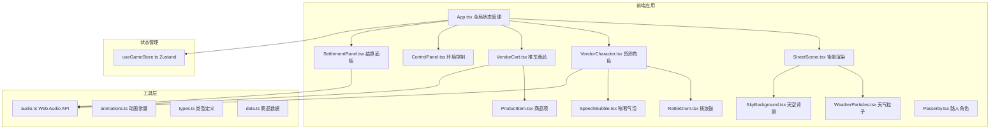

## 1. 架构设计



## 2. 技术描述
- 前端：React@18 + TypeScript@5 + Vite@5
- 动画：framer-motion@11 + CSS Keyframes
- 状态管理：zustand@4
- 图标：lucide-react
- 粒子效果：Canvas 2D API
- 音频：Web Audio API
- 构建工具：Vite，含@vitejs/plugin-react
- 路径别名：@ 指向 src 目录
- 初始化工具：npm init vite-init@latest

## 3. 目录结构
```
src/
├── components/
│   ├── StreetScene/
│   │   ├── StreetScene.tsx      # 街景主组件
│   │   ├── WeatherParticles.tsx # 雨雪粒子Canvas
│   │   └── SkyBackground.tsx    # 天空渐变背景
│   ├── Vendor/
│   │   ├── VendorCharacter.tsx  # 货郎角色
│   │   ├── RattleDrum.tsx       # 拨浪鼓组件
│   │   └── SpeechBubble.tsx     # 吆喝气泡
│   ├── Cart/
│   │   ├── VendorCart.tsx       # 推车主组件
│   │   └── ProductItem.tsx      # 单个商品
│   ├── UI/
│   │   ├── ControlPanel.tsx     # 天气时段控制
│   │   ├── SettlementPanel.tsx  # 结算面板
│   │   ├── CoinDisplay.tsx      # 铜钱显示
│   │   └── StockDisplay.tsx     # 库存显示
│   └── Passerby/
│       └── Passerby.tsx         # 路人角色
├── store/
│   └── useGameStore.ts          # Zustand状态管理
├── hooks/
│   ├── useAudio.ts              # 音频Hook
│   └── useAnimation.ts          # 动画Hook
├── utils/
│   ├── audio.ts                 # Web Audio工具
│   └── animations.ts            # 动画配置
├── data/
│   └── products.ts              # 商品数据
├── types/
│   └── index.ts                 # 类型定义
├── App.tsx
├── main.tsx
└── index.css
```

## 4. 数据模型

### 4.1 类型定义
```typescript
// 商品类型
interface Product {
  id: string;
  name: string;
  icon: string;
  price: number;
  stock: number;
  maxStock: number;
  catchphrases: string[];
}

// 天气类型
type WeatherType = 'sunny' | 'rainy' | 'snowy';

// 时段类型
type TimeOfDay = 'dawn' | 'noon' | 'dusk' | 'night';

// 游戏状态
interface GameState {
  coins: number;
  totalSold: number;
  weather: WeatherType;
  timeOfDay: TimeOfDay;
  products: Product[];
  isRattling: boolean;
  currentPhrase: string | null;
  showSettlement: boolean;
  passersby: Passerby[];
  floatingCoins: FloatingCoin[];
}

// 路人
interface Passerby {
  id: string;
  x: number;
  y: number;
  state: 'walking' | 'stopped' | 'leaving';
  targetProductId: string | null;
}

// 飘字铜钱
interface FloatingCoin {
  id: string;
  x: number;
  y: number;
  value: number;
}
```

## 5. 状态管理与数据流向

### 5.1 Zustand Store
```typescript
// 核心动作
- setWeather(weather: WeatherType): void
- setTimeOfDay(time: TimeOfDay): void
- rattleDrum(): void
- sellProduct(productId: string): void
- restockProducts(): void
- addPasserby(): void
- showSettlementPanel(): void
- resetGame(): void
```

### 5.2 数据流向
1. **用户交互 → 状态更新**：点击事件触发store动作，更新游戏状态
2. **状态 → 组件渲染**：各组件订阅store状态，React响应式更新UI
3. **父→子数据传递**：App向子组件传递props（天气、时段、商品等）
4. **子→父事件冒泡**：子组件通过回调或store动作通知状态变更
5. **动画数据**：framer-motion使用组件内状态驱动动画

## 6. 性能优化
- 粒子系统使用Canvas 2D，requestAnimationFrame驱动，每帧最多60粒子
- 移动端粒子数量减半至30
- 使用React.memo避免不必要重渲染
- 动画使用transform和opacity属性，确保GPU加速
- 状态管理使用zustand选择性订阅，减少重渲染
- 资源预加载：字体、音频上下文提前初始化
