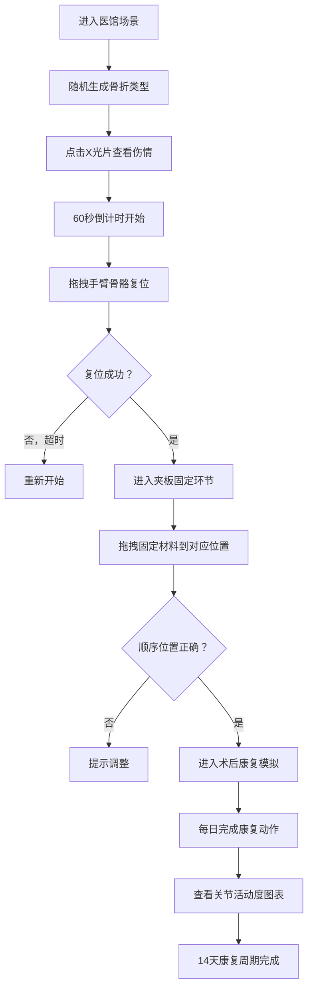

## 1. 产品概述

中医正骨手法模拟互动游戏应用，通过浏览器端的虚拟交互，帮助学习者直观理解和练习传统正骨医术的完整流程，解决传统正骨教学中难以直观模拟和重复练习的痛点。

- 核心价值：将抽象的中医正骨理论转化为可交互的虚拟操作，降低学习门槛
- 目标用户：中医学生、骨伤科医师、传统医学爱好者

## 2. 核心功能

### 2.1 用户角色
| 角色 | 注册方式 | 核心权限 |
|------|----------|----------|
| 学习者 | 无需注册，直接使用 | 完整体验正骨全流程，查看复位效果和康复进度 |

### 2.2 功能模块
1. **医馆主场景**：明式医馆环境展示，包含药柜、诊床、虚拟患者手臂模型
2. **X光片诊断**：三种骨折类型的SVG模拟X光片，显示骨裂形态和错位方向
3. **手法复位交互**：拖拽骨骼旋转对齐，实时角度检测，复位成功提示
4. **夹板固定环节**：拖拽四种固定材料到正确位置，顺序和位置校验
5. **术后康复模拟**：14天康复日历，每日康复动作训练，轨迹匹配算法，关节活动度图表

### 2.3 页面详情
| 页面名称 | 模块名称 | 功能描述 |
|---------|----------|----------|
| 主场景页 | 医馆环境 | 明式医馆渲染，药柜、诊床展示，呼吸式动画效果 |
| 主场景页 | 手臂模型 | 三段骨骼（上臂、前臂、手掌），关节标记，拖拽交互 |
| 主场景页 | X光片面板 | 点击查看骨折详情，骨裂线和错位标注 |
| 主场景页 | 倒计时进度条 | 60秒复位倒计时，剩余10秒红色闪烁 |
| 夹板固定页 | 材料拖拽区 | 柳木夹板、竹片夹板、透气纱布、棉垫四种材料 |
| 夹板固定页 | 手臂固定区 | 四个固定位置（前臂上下各一、手腕处、肘部） |
| 夹板固定页 | 粒子特效 | 棉絮飘散、纱布舒展动画 |
| 康复日历页 | 日历面板 | 14天恢复周期，每日康复任务 |
| 康复日历页 | 康复训练区 | 半透明圆形区域，鼠标拖拽完成动作轨迹 |
| 康复日历页 | 数据图表 | 折线图展示7天关节活动度变化 |

## 3. 核心流程

用户进入医馆主场景 → 系统随机生成骨折类型 → 点击X光片查看伤情 → 60秒内拖拽手臂骨骼复位 → 复位成功进入夹板固定 → 拖拽材料到正确位置 → 固定完成进入康复日历 → 每日完成康复动作 → 查看恢复进度

## 4. 用户界面设计

### 4.1 设计风格
- **主色调**：米白(#f5f0e6)、深褐(#5d4037)、朱红(#e74c3c)点缀
- **整体风格**：水墨画风格，雅致传统
- **按钮样式**：圆角矩形，深褐色边框，米白背景，悬停放大1.05倍
- **字体**：主标题使用书法风格字体，正文使用清晰易读的衬线字体
- **布局风格**：中心对称布局，医馆场景居中，功能面板环绕四周
- **视觉层次**：CSS渐变和锐利阴影营造景深感

### 4.2 页面设计概述
| 页面名称 | 模块名称 | UI元素 |
|---------|----------|--------|
| 主场景页 | 医馆背景 | 青砖墙(#8b9a8b)CSS渐变，木色药柜(#a67c52)，竹编诊床纹理 |
| 主场景页 | 手臂模型 | 半透明淡黄色骨骼(#e6d5b8)，红色关节圆点(#c0392b)，呼吸式动画 |
| 主场景页 | X光片 | SVG模拟，深红色骨裂虚线(#8b0000)，红色错位箭头 |
| 主场景页 | 进度条 | 顶部绿色进度条，剩余10秒变红闪烁 |
| 夹板固定页 | 材料区 | 药柜抽屉式展示，四种材料图标 |
| 夹板固定页 | 固定区 | 手臂轮廓，四个高亮固定位置 |
| 康复日历页 | 日历面板 | 14天格子，已完成日期绿色标记 |
| 康复日历页 | 康复区 | 半透明圆形区域，轨迹引导线 |
| 康复日历页 | 折线图 | 7天关节活动度数据曲线 |

### 4.3 响应式
- 桌面端优先，最小分辨率1280x720
- 移动端康复区圆形半径缩小至120px（桌面端200px）
- 触摸优化，支持触摸拖拽操作

### 4.4 动画与交互
- 诊床及模型呼吸式动画：间隔2秒，scale 1.0-1.01
- 可交互元素悬停：放大1.05倍，0.2s缓动过渡
- 复位成功：绿色对勾动画，"咔哒"音效
- 夹板放置：0.3秒放置动画，粒子特效
- 所有动画帧率不低于45fps，响应延迟不超过100ms
