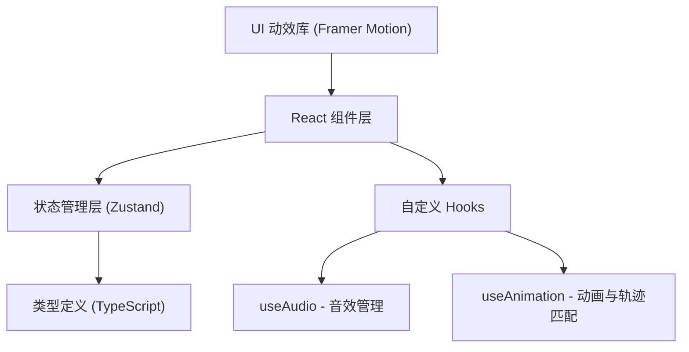

## 1. 架构设计



## 2. 技术描述

- **前端框架**：React 18 + TypeScript 5
- **构建工具**：Vite 5
- **状态管理**：Zustand 4
- **动画库**：Framer Motion 11
- **音效**：Web Audio API 原生实现
- **图表**：原生 SVG 实现折线图
- **无后端**：纯前端应用，所有数据本地生成和存储

## 3. 目录结构

```
├── src/
│   ├── types.ts          # 类型定义
│   ├── store.ts          # 全局状态管理
│   ├── App.tsx           # 主应用组件
│   ├── hooks/
│   │   ├── useAudio.ts   # 音效Hook
│   │   └── useAnimation.ts # 动画Hook
│   └── components/       # UI组件
├── index.html            # 入口HTML
├── vite.config.js        # Vite配置
├── tsconfig.json         # TypeScript配置
└── package.json          # 项目依赖
```

## 4. 核心模块说明

### 4.1 状态管理 (store.ts)
使用Zustand管理全局状态：
- 当前骨折类型
- 复位进度（角度误差、是否成功）
- 固定材料列表及放置状态
- 康复日历数据（每日完成状态、关节活动度）
- 游戏阶段（诊断/复位/固定/康复）

### 4.2 类型定义 (types.ts)
- `FractureType` 枚举：桡骨远端骨折、肱骨干骨折、尺骨鹰嘴骨折
- `BoneJoint` 接口：骨骼关节角度、位置数据
- `RehabilitationAction` 接口：康复动作类型、轨迹参数
- `FixationMaterial` 接口：固定材料类型、位置要求

### 4.3 自定义 Hooks

**useAudio.ts**：
- 使用 Web Audio API 生成骨头摩擦音效（低频噪声调制）
- 复位成功"咔哒"音效（短脉冲）
- 固定放置音效（柔和中音）
- 康复完成音效（上升音阶）

**useAnimation.ts**：
- 骨骼拖拽旋转算法（基于鼠标位置计算关节角度）
- 复位角度匹配检测（误差小于5度判定成功）
- 夹板放置粒子效果（Canvas实现）
- 康复轨迹匹配算法（路径相似度计算，80%以上判定成功）

## 5. 性能优化

- 骨骼拖拽使用 requestAnimationFrame，确保60fps
- 粒子效果对象池复用，避免频繁GC
- 状态更新使用Zustand selectors，减少不必要重渲染
- SVG元素使用 transform 而非 top/left，提升渲染性能
- 康复轨迹计算使用 Web Workers 避免阻塞主线程

## 6. 数据模型

### 6.1 骨折类型数据
```typescript
enum FractureType {
  RADIAL_DISTAL = 'radial_distal',
  HUMERAL_SHAFT = 'humeral_shaft',
  OLECRANON = 'olecranon'
}
```

### 6.2 骨骼关节数据结构
```typescript
interface BoneJoint {
  id: string;
  name: string;
  currentAngle: number;
  targetAngle: number;
  position: { x: number; y: number };
  length: number;
}
```

### 6.3 康复动作接口
```typescript
interface RehabilitationAction {
  day: number;
  name: string;
  trajectoryType: 'circle' | 'line' | 'wave';
  requiredMatch: number;
  description: string;
}
```

## 7. 启动方式

```bash
npm install
npm run dev
```

浏览器自动打开 `http://localhost:5173` 即可体验。
