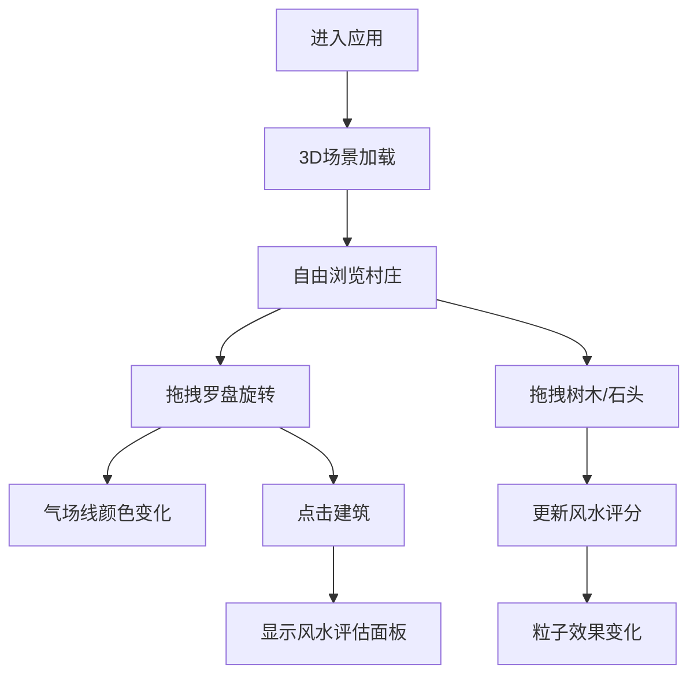

## 1. 产品概述

本应用是一个基于浏览器的古代罗盘定向与风水堪舆交互可视化应用，让用户体验风水师的角色，在3D村庄模型中使用罗盘测量建筑和地形的方位朝向，结合八卦和五行理论调整布局，实时观察风水气场变化。

- 主要用途：教育娱乐、风水文化展示、交互式3D可视化体验
- 目标用户：对风水文化感兴趣的用户、教育机构、文化传播者
- 市场价值：将传统风水文化与现代3D技术结合，提供沉浸式的交互体验

## 2. 核心功能

### 2.1 功能模块

1. **3D场景模块**：徽派风格村庄（房屋、小桥、溪流、树木），青石板地面，水墨渐变天空盒
2. **罗盘交互模块**：可拖拽旋转的3D罗盘，显示八卦符号和二十四山向刻度，中央指北针
3. **风水评估模块**：点击建筑弹出风水评估面板，显示朝向、卦象、五行属性和气运影响
4. **地形编辑模块**：可拖拽移动树木和石头，调整后更新整体风水评分
5. **气场粒子系统**：根据评分显示金色粒子（>70分）或灰白色紊流粒子（<40分），与罗盘联动

### 2.3 页面详情

| 页面名称 | 模块名称 | 功能描述 |
|-----------|-------------|---------------------|
| 主页面 | 3D场景渲染 | 渲染徽派村庄、地形、罗盘，支持视角旋转缩放 |
| 主页面 | 罗盘交互 | 拖拽罗盘外环旋转，角度四舍五入到15度，实时显示气场流动线 |
| 主页面 | 建筑评估 | 点击建筑弹出风水评估面板，随罗盘旋转实时刷新数据 |
| 主页面 | 地形编辑 | 拖拽树木石头，实时更新整体风水评分 |
| 主页面 | 气场粒子 | 动态粒子系统，根据评分显示不同效果，与罗盘联动 |
| 主页面 | UI界面 | 卷轴状评分面板、竹简装饰、操作提示栏 |

## 3. 核心流程

用户进入应用 → 查看3D村庄场景 → 拖拽罗盘测量方位 → 观察气场流动和颜色变化 → 点击建筑查看风水评估 → 拖拽调整地形物件 → 观察评分和粒子效果变化

## 4. 用户界面设计

### 4.1 设计风格

- **主色调**：宣纸色 #f5e6c8（背景）、深棕色 #4e342e（竹简）、木色 #6d4c41（卷轴轴心）、金色 #d4af37（气场线）
- **字体**：Ma Shan Zheng（标题/装饰）、隶书（正文/提示）
- **布局**：左右竹简装饰条（40px宽）、顶部卷轴导航、底部操作提示栏
- **交互反馈**：悬停放大1.05倍+金色描边、点击弹性动画（stiffness 180, damping 12）
- **动画**：气场流动（0.5单位/秒）、渐隐效果（0.6秒）、粒子螺旋/紊流运动

### 4.2 页面设计概述

| 页面名称 | 模块名称 | UI Elements |
|-----------|-------------|-------------|
| 主页面 | 3D场景 | 水墨天空、青石板地面、徽派建筑、小桥溪流、可交互罗盘 |
| 主页面 | 风水评估