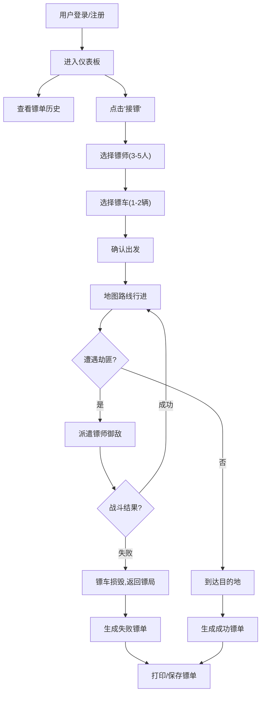

## 1. 产品概述

古代镖局走镖模拟系统，通过数字化方式重现清代镖局的运营场景，解决传统镖局在人员调配、路线规划和意外状况处理中依赖口头传信和经验判断、效率低下且难以模拟复盘的问题。

- 核心目标：为用户提供沉浸式的古代镖局走镖体验，包含人员调度、路线规划、劫匪事件应对等完整业务流程
- 目标用户：历史文化爱好者、模拟经营游戏玩家、需要团队协作训练的用户
- 市场价值：将传统文化与现代游戏化技术结合，创造独特的教育娱乐体验

## 2. 核心功能

### 2.1 用户角色

| 角色 | 注册方式 | 核心权限 |
|------|----------|----------|
| 普通用户 | 用户名密码注册登录 | 走镖任务编排、路线模拟、历史记录查看、数据统计分析 |

### 2.2 功能模块

1. **仪表板首页**：镖单历史卷轴列表、走镖成功率统计图表、镖师排行榜
2. **走镖编排页**：镖师选择、镖车配置、队伍组建与确认出发
3. **走镖模拟页**：2D俯视地图路线动画、劫匪随机事件、镖师御敌交互
4. **走镖结果页**：Canvas绘制镖单卷轴、蜡封展示、打印/截图功能

### 2.3 页面详情

| 页面名称 | 模块名称 | 功能描述 |
|---------|---------|----------|
| 仪表板首页 | 飞檐导航栏 | 飞檐翘角造型导航、"镖"字红灯笼摇摆动画、用户状态显示 |
| 仪表板首页 | 镖单卷轴列表 | 仿古纸色卡片、焦痕边缘渐变、悬停上浮阴影效果 |
| 仪表板首页 | 数据统计图表 | 7天走镖成功率柱状图、木纹背景、金橙渐变柱子 |
| 仪表板首页 | 镖师排行榜 | 按完成次数排序、金银铜色背景标注前三名 |
| 走镖编排页 | 镖师列表 | 圆形水墨风头像、武功值/经验值展示、悬停放大抖动动画 |
| 走镖编排页 | 镖车配置 | 独轮车/双轮车选择、不同颜色区分、点击回弹动画 |
| 走镖编排页 | 队伍组建 | 3-5名镖师和1-2辆镖车的组合校验、确认出发按钮 |
| 走镖模拟页 | 2D路线地图 | 手绘风格山川城镇节点、CSS路径动画、镖队沿路线行进 |
| 走镖模拟页 | 劫匪事件系统 | 5-15秒随机触发、红色旗帜闪烁动画、镖师派遗交互 |
| 走镖模拟页 | 御敌战斗 | 镖师挥刀动画、成功/失败判定、镖车损毁逻辑 |
| 走镖结果页 | 镖单卷轴 | Canvas绘制仿古卷轴、两端红色蜡封、"镖"字刻印 |
| 走镖结果页 | 分享功能 | 浏览器打印、PNG截图导出、完整走镖信息展示 |

## 3. 核心流程

用户注册登录后进入镖局后院仪表板，查看历史镖单记录和数据统计。点击"接镖"进入走镖编排页面，选择3-5名镖师和1-2辆镖车组成队伍，确认后出发。镖队在2D地图上沿规划路线自动行进，途中随机遭遇劫匪事件，用户需派遣镖师御敌。成功到达目的地则生成带蜡封的镖单卷轴，可打印或保存。

## 4. 界面设计

### 4.1 设计风格

- 主色调：深木色#3e2723、砖红色#8d6e63
- 辅助色：仿古纸色#F5DEB3、金色#FFD700、橙色#FF8C00
- 按钮风格：圆角12px、纸纹纹理背景、按压下沉效果(scale:0.95)
- 字体：Ma Shan Zheng(标题)、Noto Serif SC(正文)
- 布局风格：清代宣纸与木质调性、卡片式布局、飞檐翘角装饰元素
- 动画风格：灯笼摇摆、卡片上浮、头像抖动、旗帜闪烁，过渡动画0.3-0.5s

### 4.2 页面设计概览

| 页面名称 | 模块名称 | UI元素 |
|---------|---------|--------|
| 仪表板首页 | 飞檐导航栏 | 飞檐翘角CSS造型、左右红灯笼摇摆动画(10px,3s周期)、深木色背景 |
| 仪表板首页 | 镖单卷轴卡片 | 300x120px、仿古纸色#F5DEB3、焦痕边缘渐变、悬停上浮10px、深棕阴影#5D4037 |
| 仪表板首页 | 统计图表 | Chart.js柱状图、木纹背景#8D6E63、金到橙渐变柱子、悬停变金色 |
| 走镖编排页 | 镖师头像 | 圆形水墨风、武功值3-9、悬停放大1.1倍+0.3s抖动 |
| 走镖编排页 | 镖车选择 | 独轮车#8B4513、双轮车#A0522D、点击回弹动画 |
| 走镖模拟页 | 地图节点 | 50x50px圆形、灰白底#F5F5DC、黑色边框、路线粗线#4E342E |
| 走镖模拟页 | 劫匪事件 | 红色旗帜图标、0.8s渐亮闪烁动画 |
| 走镖结果页 | 卷轴Canvas | 两端圆形蜡封(直径40px,红色,"镖"字)、完整镖单信息 |

### 4.3 响应式设计

- 桌面端(1366px+)：卷轴卡片横向排列、左右分栏布局
- 平板端(768px+)：卷轴卡片纵向堆叠、上下分栏布局
- 触摸优化：增大点击热区、优化移动端动画性能

### 4.4 性能要求

- 镖队行进动画帧率≥30FPS
- 劫匪事件响应时间≤100ms
- 页面加载时间≤2s
- 内存占用≤200MB
