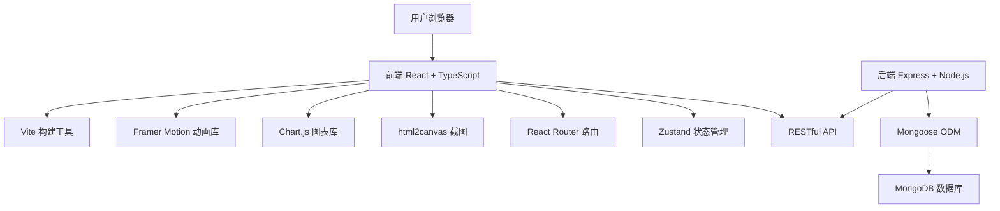
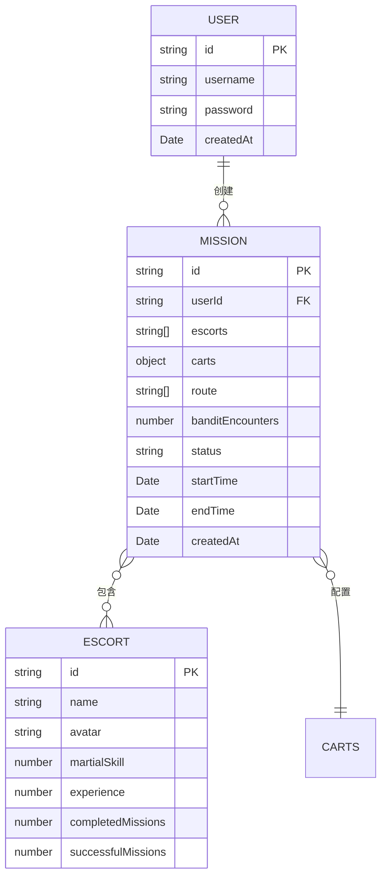

## 1. 架构设计



## 2. 技术描述

- **前端框架**：React@18 + TypeScript@5
- **构建工具**：Vite@5 + @vitejs/plugin-react
- **样式方案**：TailwindCSS@3 + CSS Variables + 自定义动画
- **状态管理**：Zustand@4
- **路由管理**：React Router Dom@6
- **动画库**：Framer Motion@11
- **图表库**：Chart.js@4 + react-chartjs-2@5
- **截图工具**：html2canvas@1
- **后端框架**：Express@4
- **数据库**：MongoDB + Mongoose@8
- **跨域处理**：cors@2
- **ID生成**：uuid@9
- **UI图标**：lucide-react@0

## 3. 路由定义

| 路由路径 | 页面组件 | 功能说明 |
|---------|---------|----------|
| `/` | Dashboard | 仪表板首页，展示镖单历史和数据统计 |
| `/mission` | Mission | 走镖编排和行进模拟页面 |
| `/result/:id` | Result | 走镖结果展示和镖单打印页面 |
| `/login` | Login | 用户登录页面 |
| `/register` | Register | 用户注册页面 |

## 4. API 定义

### 4.1 类型定义

```typescript
// 用户类型
interface User {
  id: string;
  username: string;
  password: string;
  createdAt: Date;
}

// 镖师类型
interface Escort {
  id: string;
  name: string;
  avatar: string;
  martialSkill: number; // 3-9
  experience: number;
  completedMissions: number;
  successfulMissions: number;
}

// 镖车类型
interface Cart {
  id: string;
  type: 'single' | 'double'; // 独轮车/双轮车
  color: string;
  capacity: number;
}

// 镖单类型
interface Mission {
  id: string;
  userId: string;
  escorts: string[]; // 镖师ID列表
  carts: { type: 'single' | 'double'; count: number }[];
  route: string[]; // 节点ID列表
  banditEncounters: number;
  status: 'pending' | 'in-progress' | 'success' | 'failed';
  startTime: Date;
  endTime?: Date;
  createdAt: Date;
}

// 地图节点类型
interface MapNode {
  id: string;
  name: string;
  x: number;
  y: number;
  type: 'town' | 'mountain' | 'river';
}
```

### 4.2 API 接口

| 方法 | 路径 | 请求体 | 响应体 | 功能说明 |
|------|------|--------|--------|----------|
| POST | `/api/auth/register` | `{ username, password }` | `{ user, token }` | 用户注册 |
| POST | `/api/auth/login` | `{ username, password }` | `{ user, token }` | 用户登录 |
| GET | `/api/escorts` | - | `Escort[]` | 获取所有镖师列表 |
| GET | `/api/missions` | - | `Mission[]` | 获取用户镖单列表 |
| GET | `/api/missions/:id` | - | `Mission` | 获取单个镖单详情 |
| POST | `/api/missions` | `{ escorts, carts, route }` | `Mission` | 创建新镖单 |
| PUT | `/api/missions/:id` | `{ status, banditEncounters, endTime }` | `Mission` | 更新镖单状态 |
| GET | `/api/map/nodes` | - | `MapNode[]` | 获取地图节点数据 |
| GET | `/api/stats/success-rate` | - | `{ date, rate }[]` | 获取7天成功率数据 |
| GET | `/api/stats/escort-ranking` | - | `Escort[]` | 获取镖师排行榜 |

### 4.3 服务端架构


## 5. 数据模型

### 5.1 ER图



### 5.2 初始化数据

应用启动时自动初始化以下数据：
- 10名预设镖师（姓名、随机武功值3-9、头像）
- 8-10个地图节点（城镇、山川）
- 3-5条示例历史镖单

## 6. 项目结构

```
.
├── package.json
├── index.html
├── vite.config.js
├── tsconfig.json
├── tailwind.config.js
├── postcss.config.js
├── public/
│   └── assets/
│       └── paper-texture.svg
├── src/
│   ├── main.tsx
│   ├── App.tsx
│   ├── index.css
│   ├── types/
│   │   └── index.ts
│   ├── store/
│   │   └── useStore.ts
│   ├── utils/
│   │   ├── animation.ts
│   │   └── helpers.ts
│   ├── hooks/
│   │   ├── useAnimationFrame.ts
│   │   └── useBanditEvent.ts
│   ├── components/
│   │   ├── Layout.tsx
│   │   ├── Lantern.tsx
│   │   ├── EscortCard.tsx
│   │   ├── CartSelector.tsx
│   │   ├── MissionCard.tsx
│   │   ├── MapCanvas.tsx
│   │   ├── BanditEvent.tsx
│   │   ├── ScrollCanvas.tsx
│   │   └── StatsChart.tsx
│   ├── pages/
│   │   ├── Dashboard.tsx
│   │   ├── Mission.tsx
│   │   ├── Result.tsx
│   │   ├── Login.tsx
│   │   └── Register.tsx
│   └── server/
│       ├── index.js
│       ├── db.js
│       ├── models/
│       │   ├── User.js
│       │   ├── Escort.js
│       │   └── Mission.js
│       ├── routes/
│       │   ├── auth.js
│       │   ├── escorts.js
│       │   ├── missions.js
│       │   ├── map.js
│       │   └── stats.js
│       ├── controllers/
│       │   ├── authController.js
│       │   ├── escortController.js
│       │   ├── missionController.js
│       │   ├── mapController.js
│       │   └── statsController.js
│       ├── middleware/
│       │   └── auth.js
│       └── data/
│           └── seed.js
└── .trae/
    └── documents/
        ├── PRD.md
        └── Technical_Architecture.md
```

## 7. 关键技术实现要点

### 7.1 动画性能优化
- 使用 CSS transforms 和 opacity 属性实现高性能动画
- 使用 `will-change` 提升动画元素渲染层级
- 镖队行进使用 `requestAnimationFrame` 确保 30+ FPS
- 复杂动画使用 Framer Motion 的 GPU 加速属性

### 7.2 Canvas 卷轴绘制
- 使用 Canvas 2D API 绘制仿古卷轴纹理
- 蜡封使用径向渐变和阴影效果模拟立体感
- "镖"字使用 Ma Shan Zheng 字体配合金属质感渐变

### 7.3 劫匪事件系统
- 使用 `setTimeout` 配合随机间隔 (5-15s) 触发事件
- 事件响应使用 React 状态更新，确保 ≤100ms 响应
- 战斗结果基于镖师武功值加权随机算法

### 7.4 响应式布局
- 使用 TailwindCSS 断点系统实现自适应
- 桌面端 `@media (min-width: 1366px)` 横向排列
- 平板端 `@media (min-width: 768px)` 纵向堆叠
