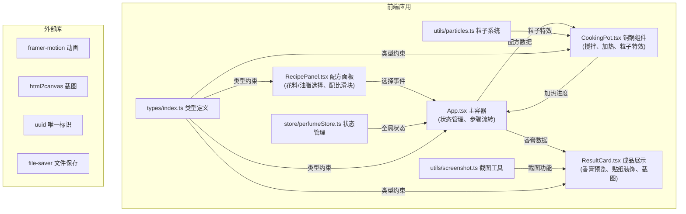

## 1. 架构设计



## 2. 技术描述

- **前端框架**：React@18 + TypeScript@5 + Vite@5
- **状态管理**：zustand（集中管理调香状态、步骤、配方数据）
- **动画库**：framer-motion（页面过渡、卷轴展开、贴纸动画）
- **粒子系统**：Canvas 2D API（蒸汽粒子、液体粒子、花瓣粒子）
- **截图功能**：html2canvas + file-saver（生成PNG并下载）
- **UI样式**：CSS Modules + CSS 变量（主题色管理）
- **构建工具**：Vite@5 + @vitejs/plugin-react

## 3. 数据流向

1. **选料阶段**：用户在 `RecipePanel` 点击花料/油脂 → 触发 `onSelect` 回调 → `App.tsx` 更新 `selectedFlower` / `selectedOil` 状态
2. **配比阶段**：用户拖动滑块 → `onRatioChange` 回调 → 更新 `flowerOilRatio` / `fixativeAmount` → 实时计算 `thickness` / `transparency`
3. **搅拌加热**：`CookingPot` 接收配方数据 → 启动搅拌/加热动画 → 每帧更新 `heatingProgress` → 完成后通知 `App` 进入下一步
4. **冷却阶段**：3秒动画 → `onCoolingComplete` → 更新 `balmState` 为 `solid`
5. **装饰阶段**：`ResultCard` 接收香膏数据 → 渲染香膏预览 → 贴纸拖拽事件更新 `stickers` 数组
6. **截图阶段**：点击保存 → `html2canvas` 捕获卷轴元素 → `file-saver` 触发下载

## 4. 核心类型定义

```typescript
// types/index.ts
export type FlowerType = 'osmanthus' | 'rose' | 'jasmine' | 'plum';
export type OilType = 'olive' | 'coconut' | 'almond' | 'jojoba';
export type StickerType = 'cloud' | 'crane' | 'peony' | 'wave' | 'meander' | 'lotus';
export type StepType = 'select' | 'mix' | 'heat' | 'cool' | 'decorate' | 'complete';

export interface Flower {
  id: FlowerType;
  name: string;
  color: string;
}

export interface Oil {
  id: OilType;
  name: string;
  color: string;
}

export interface Sticker {
  id: string;
  type: StickerType;
  x: number;
  y: number;
  rotation: number;
  scale: number;
}

export interface PerfumeState {
  currentStep: StepType;
  selectedFlower: FlowerType | null;
  selectedOil: OilType | null;
  flowerOilRatio: number; // 1-5
  fixativeAmount: number; // 0-20
  thickness: number; // 0-1
  transparency: number; // 0-1
  heatingProgress: number; // 0-100
  balmState: 'liquid' | 'solid';
  stickers: Sticker[];
  createdAt: Date;
}
```

## 5. 性能优化策略

| 优化点 | 策略 |
|--------|------|
| 粒子特效 | Canvas 2D 分层渲染，requestAnimationFrame 批量绘制，对象池复用粒子 |
| 步骤切换 | 状态变更使用 zustand 浅比较，避免不必要重渲染 |
| 截图生成 | 限制截图区域，使用 html2canvas scale: 2 保证清晰度，缓存DOM节点 |
| 响应式 | CSS media queries + React hooks 监听窗口大小，debounce 处理 resize 事件 |
| 动画性能 | framer-motion 使用 will-change，GPU 加速 transform 属性 |

## 6. 性能指标

- 步骤切换延迟：≤100ms（使用 React batched updates）
- 粒子特效 FPS：≥50（Chrome/Firefox，粒子数限制≤80）
- 截图生成时间：≤500ms（优化截图区域大小）
- 首屏加载：≤2s（代码分割，按需加载 html2canvas）
