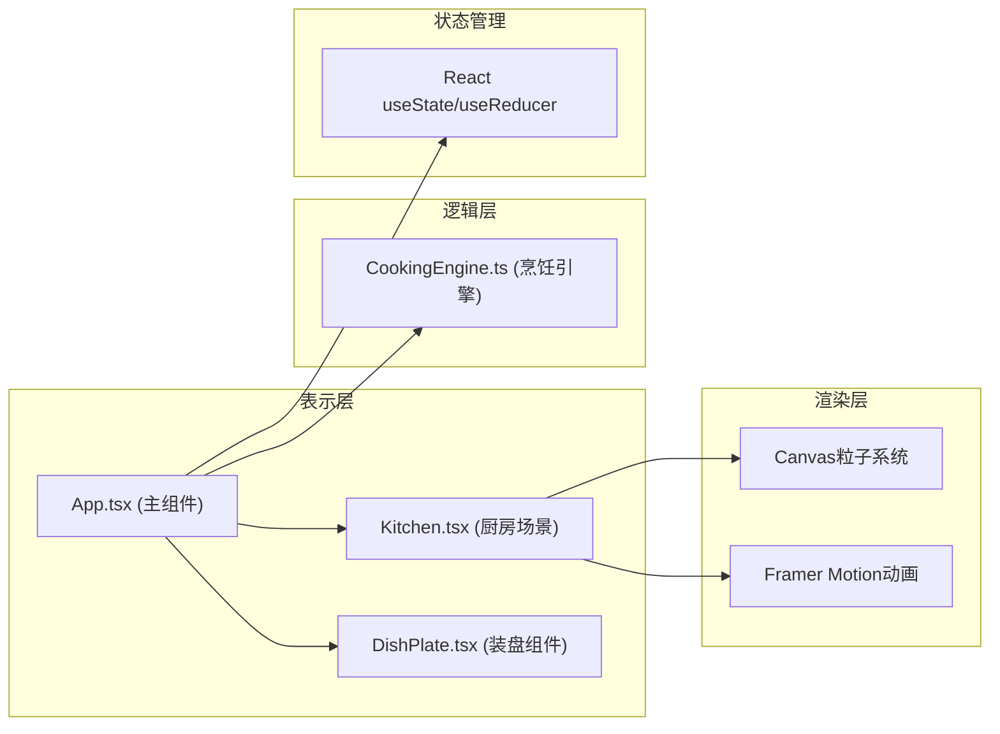

## 1. 架构设计



## 2. 技术栈说明

- **前端框架**: React 18 + TypeScript 5
- **构建工具**: Vite 5
- **动画库**: Framer Motion 11（拖拽、过渡动画）
- **Canvas渲染**: 原生Canvas API（粒子效果、食物熟度变化）
- **工具库**: uuid（唯一标识）、file-saver（文件保存）
- **字体**: Google Fonts - Ma Shan Zheng（毛笔行楷）

## 3. 项目结构

```
├── package.json
├── index.html
├── vite.config.js
├── tsconfig.json
└── src/
    ├── App.tsx              # 主组件，全局状态管理
    ├── Kitchen.tsx          # 厨房场景，菜架/灶台/案板/调味架
    ├── CookingEngine.ts     # 烹饪逻辑引擎
    └── components/
        └── DishPlate.tsx    # 装盘组件，3D堆叠，截图分享
```

## 4. 数据模型定义

### 4.1 类型定义

```typescript
// 食材类型
interface Ingredient {
  id: string;
  name: string;
  type: 'chicken' | 'fish' | 'vegetable' | 'spice';
  optimalHeat: number;
  cookTime: number;
  image: string;
}

// 调味料类型
interface Seasoning {
  id: string;
  name: string;
  type: 'salt' | 'vinegar' | 'sauce' | 'wine' | 'sugar';
  flavor: { salty: number; sour: number; umami: number; sweet: number };
  color: string;
}

// 锅中食物状态
interface FoodInPot {
  ingredient: Ingredient;
  addedTime: number;
  doneness: number; // 0-100: 生->熟->焦
}

// 味道值
interface FlavorProfile {
  salty: number;
  sour: number;
  umami: number;
  sweet: number;
}

// 烹饪状态
interface CookingState {
  heatLevel: number; // 0-100
  foods: FoodInPot[];
  seasonings: FlavorProfile;
  startTime: number | null;
  isCooking: boolean;
}

// 菜品评价
interface DishEvaluation {
  quality: number; // 0-100
  rating: '生涩' | '刚好' | '焦糊' | '绝味';
  comment: string;
}

// 成品菜肴
interface FinishedDish {
  foods: FoodInPot[];
  seasonings: FlavorProfile;
  evaluation: DishEvaluation;
  cookTime: number;
  averageHeat: number;
}
```

## 5. 核心模块设计

### 5.1 CookingEngine 烹饪引擎

```typescript
// 计算食物熟度
calculateDoneness(heat: number, elapsedTime: number, optimalHeat: number): number

// 计算味道值
calculateFlavor(seasonings: FlavorProfile[]): FlavorProfile

// 生成菜品评价
evaluateDish(
  foods: FoodInPot[],
  flavor: FlavorProfile,
  cookTime: number,
  averageHeat: number
): DishEvaluation
```

### 5.2 粒子系统

- 蒸汽粒子：随火候变化，向上飘散
- 调料粒子：点击调料瓶时从瓶口飞向锅中
- 最多同时100个粒子，对象池复用

### 5.3 拖拽系统

- 食材从案板拖拽到铁锅
- 使用 Framer Motion 的 drag 功能
- 碰撞检测判断是否放入锅中

## 6. 状态管理

全局状态由 App.tsx 管理，包括：
- 选中的食材列表
- 烹饪状态（火候、锅中食物、调味）
- 菜品评价
- 成品菜肴数据

## 7. 性能优化

- Canvas 粒子使用 requestAnimationFrame 批量渲染
- 粒子对象池复用，避免频繁 GC
- Framer Motion 使用 transform 进行硬件加速动画
- 烹饪逻辑使用 useMemo 缓存计算结果
