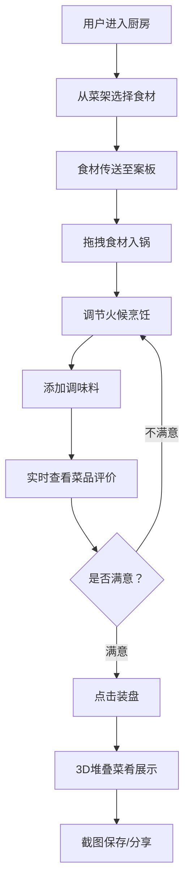

## 1. 产品概述
古代庖厨烹饪交互游戏，通过模拟宋式厨房烹饪过程，解决传统菜谱中食材搭配、火候掌握和调味比例难以直观模拟与反复试错的问题。

- 面向美食爱好者、厨艺学习者及传统文化爱好者，提供沉浸式烹饪体验
- 市场价值：将传统烹饪技艺数字化，寓教于乐，传承中华饮食文化

## 2. 核心 Features

### 2.1 用户角色
| 角色 | 注册方式 | 核心权限 |
|------|----------|----------|
| 普通用户 | 无需注册，直接使用 | 完整烹饪体验、菜品评价、成品分享 |

### 2.2 Feature 模块
1. **厨房主场景**：宋式厨房布局，菜架、灶台、案板、调味架
2. **食材选择系统**：从菜架选取食材（鸡、鱼、蔬菜、香料），悬停显示详情
3. **烹饪交互系统**：拖拽食材入锅，火候调节，食物熟度变化
4. **调味系统**：五种调味料（盐、醋、酱、酒、糖），四维味道数值显示
5. **菜品评价系统**：实时评分与短评，品质分数计算
6. **装盘分享系统**：3D堆叠菜肴展示，截图保存与分享

### 2.3 Page Details
| 页面名称 | 模块名称 | Feature 描述 |
|----------|----------|--------------|
| 主烹饪页面 | 厨房场景渲染 | 宋式厨房背景，青砖地面，木纹台面，案板 |
| 主烹饪页面 | 菜架交互 | 水墨风格食材图标，悬停放大显示名称与火候提示 |
| 主烹饪页面 | 灶台交互 | 铁锅烹饪区，三档火候调节（高中低），滑块微调，火焰动画，粒子蒸汽效果 |
| 主烹饪页面 | 调味架交互 | 五种调料瓶，点击撒入彩色粒子，实时更新味道仪表盘 |
| 主烹饪页面 | 菜品评价 | 毛笔行楷字体显示评价（生涩/刚好/焦糊/绝味），0-100品质分数 |
| 主烹饪页面 | 装盘功能 | 青花瓷盘，3D堆叠菜肴，截图保存与分享按钮 |

## 3. 核心流程

用户从菜架选择食材 → 食材自动传送到案板 → 拖拽食材到铁锅 → 调节火候烹饪 → 添加调味料 → 实时查看菜品评价 → 点击装盘 → 3D展示成品 → 截图保存/分享

## 4. 用户界面设计

### 4.1 设计风格
- **主色调**：暖色调木色与土棕色系，背景色#4e342e，灶台木纹#6d4c41，案板浅木色#d4a373
- **按钮风格**：木纹质感，圆角设计，悬停平滑缩放（0.2-0.3s ease-out）
- **字体**：毛笔行楷字体（Ma Shan Zheng）用于评价文字，搭配清晰易读的正文字体
- **布局风格**：桌面端横向布局（左菜架、右灶台案板），平板端纵向布局（上菜架、中灶台、下案板）
- **视觉风格**：水墨国风，食材图标采用水墨小品风格

### 4.2 Page Design Overview
| 页面名称 | 模块名称 | UI Elements |
|----------|----------|-------------|
| 主烹饪页面 | 菜架区 | 4个水墨食材图标（60x60px），悬停放大1.2倍，浮窗显示食材名称与最佳火候提示 |
| 主烹饪页面 | 灶台区 | 铁锅（直径150px，#3e2723），火焰动画（低火40px/中火80px/高火120px），鼓风口按钮，火候滑块，味道仪表盘（4条圆弧进度条，#d4a373），菜品评价区（毛笔行楷） |
| 主烹饪页面 | 案板区 | 浅木色台面，放置选中的食材，支持拖拽 |
| 主烹饪页面 | 调味架 | 5个调料瓶，点击撒入彩色粒子动画 |
| 主烹饪页面 | 装盘按钮 | 青花瓷盘图案，悬停动画，点击生成3D堆叠菜肴 |

### 4.3 响应式设计
- **桌面端**（1280x720以上）：横向布局，左侧菜架，右侧灶台与案板并排
- **平板端**（768x1024）：纵向布局，菜架在上，灶台居中，案板在下
- **触控优化**：拖拽操作支持触摸事件，点击区域不小于44x44px

### 4.4 性能要求
- 烹饪过程动画保持45fps以上
- 食材粒子效果最多同时100个粒子
- 使用Canvas绘制粒子效果优化性能
