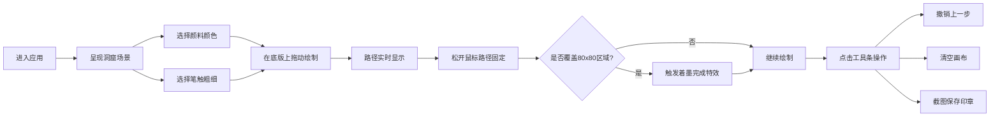

## 1. 产品概述

古代水陆画师绘制壁画互动应用，让用户体验敦煌石窟画师临摹壁画的创作过程，在虚拟洞窟墙面上通过选择画笔与颜料，勾勒飞天、琵琶与祥云形象，完成一幅壁画的线稿与上色，最终截取画布局部保存为纪念图章。

- **核心价值**：沉浸式体验古代壁画创作过程，传承敦煌艺术文化
- **目标用户**：艺术爱好者、文化学习者、普通大众用户
- **市场定位**：文化体验类轻应用，兼具教育性与娱乐性

## 2. 核心功能

### 2.1 用户角色

| 角色 | 注册方式 | 核心权限 |
|------|----------|----------|
| 普通用户 | 无需注册，直接进入 | 完整使用所有绘制功能，保存作品 |

### 2.2 功能模块

1. **洞窟场景**：岩壁纹理背景，壁画底版区域，布幔装饰（宽屏）
2. **调色盘**：颜料选择、笔触粗细调节、当前状态预览
3. **绘制系统**：自由手绘、路径平滑、毛笔效果、着墨完成特效
4. **工具条**：撤销、清空画布、截图保存
5. **响应式适配**：宽屏/窄屏布局自动切换

### 2.3 页面详情

| 页面名称 | 模块名称 | 功能描述 |
|----------|----------|----------|
| 主页面 | 洞窟背景 | 深赭石色背景，CSS/SVG模拟岩壁纹理，高600px |
| 主页面 | 壁画底版 | 400x600px米色画布，支持缩放（0.5-2.0倍）和平移拖动 |
| 主页面 | 垂直调色盘 | 6种颜料色块（石绿、朱砂、石青、土黄、白色、黑色），3档笔触粗细 |
| 主页面 | 绘制交互 | 鼠标/触控拖动绘制，路径实时显示，平滑贝塞尔曲线 |
| 主页面 | 工具条 | 撤销上一步、清空画布（带确认）、截图保存150x150px印章 |
| 主页面 | 着墨特效 | 完全覆盖80x80px区域时触发金色边框闪烁动画 |
| 主页面 | 响应式布局 | 宽屏布幔装饰，窄屏调色盘收缩为浮动按钮 |

## 3. 核心流程

**用户绘制流程**：
1. 用户进入应用，看到沉浸式洞窟内景
2. 左侧调色盘选择颜料（石绿、朱砂等6色）
3. 选择笔触粗细（细2px、中6px、粗12px）
4. 在中央壁画底版上按住鼠标拖动绘制
5. 绘制过程中路径实时平滑显示，具有毛笔效果
6. 松开鼠标路径固定，不可撤销（除非点击撤销按钮）
7. 当绘制墨迹完全覆盖某80x80px区域时，触发金色边框闪烁特效
8. 可随时使用工具条进行撤销、清空或截图保存操作

## 4. 用户界面设计

### 4.1 设计风格

- **主色调**：洞窟暗赭石色系（#2c1810、#1c110c）
- **壁画底版**：米色仿古材质（#f0e6d3），边缘做旧效果
- **颜料色**：石绿#4db56a、朱砂#c0392b、石青#2980b9、土黄#d4ac0d、白色#ffffff、黑色#2c3e50
- **交互反馈**：深金色#b8860b悬停，浅金点击闪烁
- **字体**：Google Fonts Noto Serif SC，古典书法风格
- **动画**：缩放0.2s过渡，着墨特效1.2s金光闪烁，颜料名称半秒淡入
- **整体风格**：古朴典雅，敦煌石窟艺术风格，沉浸感强

### 4.2 页面设计概述

| 页面名称 | 模块名称 | UI元素 |
|----------|----------|--------|
| 主页面 | 洞窟背景 | 深赭石渐变+SVG纹理模拟岩壁，宽度100%高600px |
| 主页面 | 布幔装饰 | 宽屏两侧半透明暗红色SVG布幔，循环飘动动画，宽120px |
| 主页面 | 壁画底版 | 400x600px米色画布，边缘斑驳暗影，支持缩放平移 |
| 主页面 | 垂直调色盘 | 高400px宽80px，上下两栏布局，色块40x40px圆角4px |
| 主页面 | 工具条 | 高50px半透明深色背景#1c110c88，三个操作按钮 |
| 主页面 | 绘制路径 | SVG贝塞尔曲线，毛笔效果（两端渐细），圆角连接 |

### 4.3 响应式设计

- **优先适配**：1366×768分辨率
- **最小支持**：375px宽度屏幕
- **宽屏（>1024px）**：左右布幔装饰，底版和调色盘居中排列
- **窄屏（<768px）**：调色盘收缩为圆形浮动按钮（直径50px），点击弹出横向调色板覆盖在底版下方

### 4.4 交互细节

- **颜料悬停**：色块放大1.1倍，颜料名称半秒淡入
- **笔触按钮**：点击后高亮显示当前选择
- **工具按钮**：悬停背景变深金色#b8860b，点击时浅金闪烁0.1s，撤销按钮有轻微震动反馈
- **清空操作**：点击后弹窗确认，防止误操作
- **截图保存**：以中心150x150px区域裁剪，命名为"壁画印章_时间戳.png"

## 5. 性能要求

- **绘制帧率**：60fps流畅绘制
- **路径优化**：超过10000点后自动优化，删除间距小于1px的冗余点
- **响应延迟**：交互响应延迟不超过16ms
