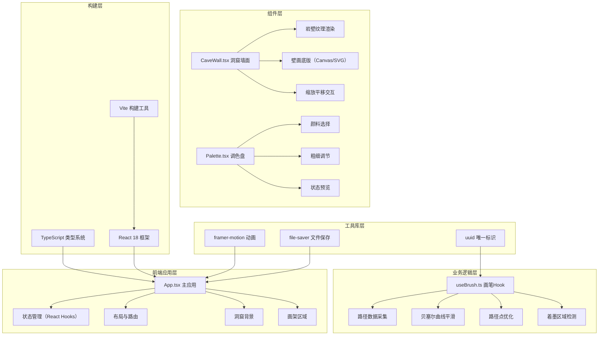

## 1. 架构设计



## 2. 技术栈描述

- **前端框架**：React 18 + TypeScript
- **构建工具**：Vite 5.x + @vitejs/plugin-react
- **动画库**：framer-motion（用于平滑动画和交互反馈）
- **工具库**：uuid（路径唯一标识）、file-saver（图片下载）
- **样式方案**：CSS Modules / CSS-in-JS（内联样式+CSS变量）
- **绘制方案**：SVG + Canvas 混合方案（SVG用于路径渲染，Canvas用于截图导出）

### 技术选型理由

1. **React 18**：提供并发渲染特性，确保绘制过程中UI响应流畅
2. **TypeScript**：严格类型检查，确保路径数据、颜色配置等类型安全
3. **Vite**：快速冷启动和热更新，提升开发体验
4. **framer-motion**：声明式动画API，轻松实现缩放、悬停、特效等动画
5. **SVG绘制**：矢量路径，支持贝塞尔曲线和毛笔效果模拟，缩放不失真
6. **Canvas**：用于最终截图导出，支持像素级操作

## 3. 文件结构定义

| 文件路径 | 职责说明 |
|----------|----------|
| `/package.json` | 项目依赖配置，包含react、react-dom、typescript、vite、@vitejs/plugin-react、framer-motion、uuid、file-saver |
| `/index.html` | 入口HTML，背景色#1c110c，引入Google Fonts Noto Serif SC |
| `/tsconfig.json` | TypeScript配置，严格模式，路径映射@/指向src/ |
| `/vite.config.js` | Vite配置，启用React插件 |
| `/src/App.tsx` | 主应用组件，布局管理、全局状态（路径列表、缩放比例、平移偏移） |
| `/src/components/CaveWall.tsx` | 洞窟墙面组件，岩壁纹理、壁画底版、SVG画布、缩放平移控制 |
| `/src/components/Palette.tsx` | 调色盘组件，颜料色块、粗细按钮、当前状态预览、响应式切换 |
| `/src/hooks/useBrush.ts` | 画笔逻辑Hook，鼠标/触控事件处理、路径点采集、贝塞尔平滑、区域检测 |
| `/src/types/index.ts` | 类型定义（PathPoint、DrawPath、BrushSettings等） |
| `/src/utils/pathUtils.ts` | 路径工具函数（贝塞尔计算、点优化、区域检测算法） |

## 4. 核心数据模型

### 4.1 TypeScript 类型定义

```typescript
// 路径点
interface PathPoint {
  x: number;
  y: number;
  pressure?: number; // 可选，用于未来压感支持
  timestamp: number;
}

// 完整绘制路径
interface DrawPath {
  id: string; // uuid
  points: PathPoint[];
  color: string;
  strokeWidth: number;
  smoothPath: string; // SVG path d属性
}

// 画笔设置
interface BrushSettings {
  color: string;
  strokeWidth: number; // 2 | 6 | 12
}

// 画布变换
interface CanvasTransform {
  scale: number; // 0.5 - 2.0
  offsetX: number;
  offsetY: number;
}

// 着墨区域
interface InkRegion {
  x: number; // 区域左上角x（80px网格对齐）
  y: number; // 区域左上角y（80px网格对齐）
  completed: boolean;
  animated: boolean;
}

// 应用全局状态
interface AppState {
  paths: DrawPath[];
  brushSettings: BrushSettings;
  transform: CanvasTransform;
  inkRegions: InkRegion[];
  isDrawing: boolean;
  showPaletteMobile: boolean;
}
```

## 5. 核心算法

### 5.1 贝塞尔曲线平滑算法

将离散点转换为平滑的贝塞尔曲线路径：

```typescript
function smoothBezier(points: PathPoint[]): string {
  if (points.length < 2) return '';
  let d = `M ${points[0].x} ${points[0].y}`;
  for (let i = 0; i < points.length - 1; i++) {
    const p0 = points[i - 1] || points[i];
    const p1 = points[i];
    const p2 = points[i + 1];
    const p3 = points[i + 2] || p2;
    // 计算控制点
    const cp1x = p1.x + (p2.x - p0.x) / 6;
    const cp1y = p1.y + (p2.y - p0.y) / 6;
    const cp2x = p2.x - (p3.x - p1.x) / 6;
    const cp2y = p2.y - (p3.y - p1.y) / 6;
    d += ` C ${cp1x} ${cp1y}, ${cp2x} ${cp2y}, ${p2.x} ${p2.y}`;
  }
  return d;
}
```

### 5.2 路径点优化算法

超过10000点后自动优化，删除间距小于1px的冗余点：

```typescript
function optimizePoints(points: PathPoint[], threshold: number = 1): PathPoint[] {
  if (points.length <= 10000) return points;
  const result: PathPoint[] = [points[0]];
  for (let i = 1; i < points.length; i++) {
    const last = result[result.length - 1];
    const dist = Math.sqrt(
      Math.pow(points[i].x - last.x, 2) + 
      Math.pow(points[i].y - last.y, 2)
    );
    if (dist >= threshold) {
      result.push(points[i]);
    }
  }
  return result;
}
```

### 5.3 着墨区域检测算法

检测80x80px网格区域是否被完全覆盖：

```typescript
function checkInkRegions(
  paths: DrawPath[], 
  canvasWidth: number, 
  canvasHeight: number
): InkRegion[] {
  const gridSize = 80;
  const regions: InkRegion[] = [];
  const cols = Math.ceil(canvasWidth / gridSize);
  const rows = Math.ceil(canvasHeight / gridSize);
  
  for (let row = 0; row < rows; row++) {
    for (let col = 0; col < cols; col++) {
      const regionX = col * gridSize;
      const regionY = row * gridSize;
      // 检测区域内关键点是否都被路径覆盖
      const samplePoints = [
        [regionX + 10, regionY + 10],
        [regionX + 40, regionY + 10],
        [regionX + 70, regionY + 10],
        [regionX + 10, regionY + 40],
        [regionX + 40, regionY + 40],
        [regionX + 70, regionY + 40],
        [regionX + 10, regionY + 70],
        [regionX + 40, regionY + 70],
        [regionX + 70, regionY + 70],
      ];
      const allCovered = samplePoints.every(([px, py]) => 
        isPointCoveredByPaths(px, py, paths)
      );
      regions.push({
        x: regionX,
        y: regionY,
        completed: allCovered,
        animated: false,
      });
    }
  }
  return regions;
}
```

## 6. 性能优化策略

1. **requestAnimationFrame 绘制**：所有绘制操作在RAF中执行，确保60fps
2. **路径增量渲染**：只重绘当前正在绘制的路径，已完成路径缓存
3. **点数据优化**：超过10000点后自动合并间距小于1px的点
4. **事件节流**：mousemove/touchmove事件使用RAF节流，避免频繁触发
5. **SVG路径缓存**：已完成路径的d属性计算结果缓存，避免重复计算
6. **离屏Canvas**：截图导出时使用离屏Canvas，不阻塞主线程
7. **React.memo**：对Palette等非频繁更新组件使用memo优化
8. **useCallback/useMemo**：合理使用hooks避免不必要的重渲染

## 7. 响应式断点

| 断点 | 布局行为 |
|------|----------|
| > 1024px | 宽屏模式，左右布幔装饰，底版和调色盘居中排列 |
| 768px - 1024px | 中等屏幕，隐藏布幔，保持左右布局 |
| < 768px | 窄屏模式，调色盘收缩为浮动按钮，点击弹出横向调色板 |
