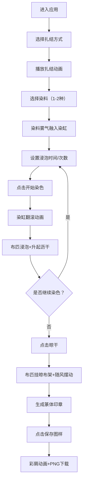

## 1. 产品概述

本项目是一款基于浏览器的古代扎染工艺互动应用，让用户化身染坊匠人，通过选择扎结方式、染料配方和浸泡时间，在白布上生成独一无二的扎染纹理，体验传统扎染工艺的乐趣。

- 核心价值：将传统手工艺通过数字化形式呈现，让用户沉浸式体验古代扎染工艺
- 目标用户：手工艺爱好者、传统文化爱好者、学生群体

## 2. 核心功能

### 2.1 功能模块

1. **主工作台**：扎结方式选择、布匹展示、扎结动画
2. **染料架**：三种天然染料选择、染料混合、染缸动画
3. **染色控制**：浸泡时间滑块、染色次数控制、开始染色按钮
4. **晾布架**：晾干动画、成品展示、篆体印章生成
5. **保存功能**：纹理截图保存、彩色纸屑庆祝动画

### 2.2 页面详情

| 页面名称 | 模块名称 | 功能描述 |
|-----------|-------------|---------------------|
| 主页面 | 扎结选择区 | 三种扎结方式（捆扎、缝扎、折叠扎）卡片，点击播放对应动画 |
| 主页面 | 染料架区 | 三种染料罐（靛蓝、茜草红、栀子黄），点击选择染料，支持混合 |
| 主页面 | 染缸区 | 陶制染缸，显示染色液体翻滚动画，布匹升降动画 |
| 主页面 | 控制面板 | 浸泡时间滑块（5-60秒）、染色次数（1-3遍）、开始染色按钮 |
| 主页面 | 晾布架区 | 5根横杆，晾干的布匹随风轻摆，显示篆体印章 |
| 主页面 | 保存按钮 | 保存当前扎染纹理为PNG，触发彩色纸屑动画 |

## 3. 核心流程

用户进入应用 → 选择扎结方式（播放扎结动画）→ 选择1-2种染料（染料雾气动画）→ 设置浸泡时间和染色次数 → 点击开始染色（染缸翻滚+布匹升降）→ 重复染色或点击晾干（晾布架+印章）→ 点击保存图样（PNG下载+彩屑动画）

## 4. 用户界面设计

### 4.1 设计风格

- **主色调**：土黄色#cbb69d（背景）、深棕色#5d4037（木案）、陶色#8b6914（染缸）
- **辅助色**：靛蓝#1a5276、茜草红#a93226、栀子黄#f4d03f
- **按钮样式**：仿古纸笺，背景#f5f0e0，边框#c1a87a，圆角8px
- **字体**：Google Fonts - Ma Shan Zheng（马善政楷体）
- **图标风格**：古风线条图标，扎结卡片为80x80px悬浮卡片，带阴影悬停上浮6px

### 4.2 页面设计概述

| 页面名称 | 模块名称 | UI元素 |
|-----------|-------------|-------------|
| 主页面 | 整体布局 | 桌面端三列（晾布架15%/工作台70%/染料架15%），平板两列，手机单列 |
| 主页面 | 工作台 | 宽大木案，中央展示布匹，上方扎结选择卡片 |
| 主页面 | 染缸 | 陶制染缸（直径300px，高250px），液体翻滚CSS动画 |
| 主页面 | 晾布架 | 高180px，5根横杆，布匹随风摆动动画（20度摇摆，周期3s） |
| 主页面 | 滑块 | 铜钱纹样手柄，范围5-60秒，步长1秒 |

### 4.3 响应式设计

- **桌面端（≥1200px）**：三列布局，主区域1200px宽
  - 左侧晾布架15%，中央工作台70%，右侧染料架15%
- **平板端（768-1199px）**：两列布局
  - 晾布架与工作台合并，染料架在下方或侧边
- **手机端（<768px）**：单列堆叠
  - 按模块垂直堆叠，优化触控区域

### 4.4 动画设计

- **扎结动画**：麻绳缠绕1.5圈、针线穿梭2次、折叠动作0.8s
- **染缸动画**：CSS keyframes水波浮动，每循环2s
- **晾干动画**：布匹随风轻摆，20度左右摇摆，周期3s，ease-in-out
- **染料雾气**：点击染料罐后，罐口喷出染料雾气融入染缸
- **彩屑动画**：canvas-confetti触发彩色纸屑庆祝效果
