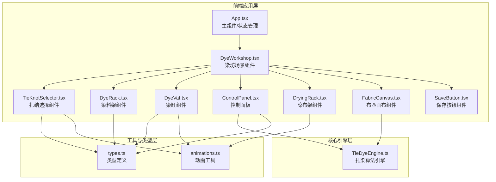

## 1. 架构设计



**数据流向**：
1. 用户操作 → `App.tsx` 状态更新 → 子组件渲染
2. 扎结/染料/参数选择 → `ControlPanel` → `TieDyeEngine.generatePattern()`
3. `TieDyeEngine` 返回像素矩阵 → `FabricCanvas` 渲染到 Canvas
4. 多次染色 → `TieDyeEngine.layerPattern()` 逐层叠加
5. 保存操作 → Canvas `toBlob()` → a标签下载PNG

## 2. 技术栈说明

- **前端框架**：React@18 + TypeScript@5
- **构建工具**：Vite@5 + @vitejs/plugin-react@4
- **动画库**：framer-motion@11
- **UI特效**：canvas-confetti@1.9
- **工具库**：uuid@9
- **状态管理**：React useState/useReducer（无额外状态库）

## 3. 文件结构

```
d:\Solocoder\VersionFast\tasks\auto297\
├── package.json
├── vite.config.js
├── tsconfig.json
├── index.html
└── src\
    ├── App.tsx                    # 主组件，布局和状态管理
    ├── main.tsx                   # 应用入口
    ├── index.css                  # 全局样式
    ├── components\
    │   ├── DyeWorkshop.tsx        # 染坊背景组件
    │   ├── TieKnotSelector.tsx    # 扎结选择器
    │   ├── DyeRack.tsx            # 染料架
    │   ├── DyeVat.tsx             # 染缸组件
    │   ├── ControlPanel.tsx       # 控制面板
    │   ├── DryingRack.tsx         # 晾布架
    │   ├── FabricCanvas.tsx       # 布匹画布
    │   └── SaveButton.tsx         # 保存按钮
    └── utils\
        ├── TieDyeEngine.ts        # 扎染算法引擎（核心）
        ├── types.ts               # 类型定义
        └── animations.ts          # 动画常量/工具
```

**模块调用关系**：
- `App.tsx` → 调用所有子组件，管理全局状态
- `DyeWorkshop.tsx` → 组合场景组件，传递事件
- `FabricCanvas.tsx` → 调用 `TieDyeEngine` 生成纹理
- `TieDyeEngine.ts` → 纯算法，无React依赖

## 4. 核心数据模型

```typescript
// 扎结方式
type TieKnotType = 'bundle' | 'stitch' | 'fold';

// 染料颜色
type DyeColor = 'indigo' | 'madder' | 'gardenia';

// 染料配方（支持混合两种）
interface DyeRecipe {
  primary: DyeColor;
  secondary?: DyeColor;
  mixRatio?: number; // 0-1，主色比例
}

// 染色参数
interface DyeParams {
  soakTime: number;      // 5-60秒
  dyeRound: number;      // 1-3遍
  knotType: TieKnotType;
  recipe: DyeRecipe;
}

// 生成的图案层
interface PatternLayer {
  id: string;
  pixels: Uint8ClampedArray;
  opacity: number;
}

// 布匹状态
type FabricState = 'idle' | 'tying' | 'dyeing' | 'draining' | 'drying' | 'done';
```

## 5. TieDyeEngine 核心算法设计

```typescript
class TieDyeEngine {
  // 生成基础图案
  generatePattern(
    width: number,
    height: number,
    params: DyeParams
  ): Uint8ClampedArray;
  
  // 叠加图案层
  layerPattern(
    base: Uint8ClampedArray,
    newLayer: Uint8ClampedArray,
    opacity: number
  ): Uint8ClampedArray;
  
  // 云纹图案（捆扎）
  private generateCloudPattern(...): void;
  
  // 鱼鳞图案（缝扎）
  private generateFishScalePattern(...): void;
  
  // 螺旋图案（折叠扎）
  private generateSpiralPattern(...): void;
  
  // 颜色混合
  private mixColors(color1: RGB, color2: RGB, ratio: number): RGB;
}
```

**性能约束实现**：
- 使用 `Uint8ClampedArray` 直接操作像素，避免DOM重绘
- 图案生成使用数学公式，减少循环嵌套
- 逐层叠加使用 `ImageData` 批量操作
- 首次渲染 ≤ 50ms，每次叠加 ≤ 30ms

## 6. 性能优化策略

1. **Canvas渲染优化**：
   - 使用离屏Canvas预渲染图案
   - 仅在参数变化时重绘
   - 使用 `requestAnimationFrame` 同步动画

2. **动画优化**：
   - CSS transforms 替代 top/left 动画
   - will-change 提示浏览器优化
   - 晾布架动画使用 CSS @keyframes，GPU加速

3. **内存管理**：
   - 及时释放离屏Canvas
   - 限制历史图案层数（最多3层）
   - 大对象使用后置空

4. **渲染性能**：
   - 扎结/染色动画分层渲染
   - 非活动区域暂停动画
   - 使用 `contain: layout paint` 隔离重绘区域
