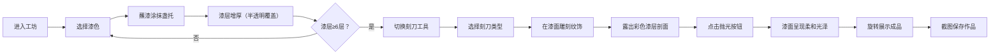

## 1. 产品概述

宋代雕漆工艺坊是一款在浏览器中运行的3D交互可视化项目，让用户化身古代漆器工匠，体验在木胎上逐层髹漆、雕刻纹饰、最终观赏彩色漆层断面的完整工艺过程。

- 核心价值：通过沉浸式3D交互，传承和展示中国传统雕漆技艺，让用户在游戏化体验中了解非遗文化
- 目标用户：文化爱好者、手工艺学习者、艺术教育工作者

## 2. 核心功能

### 2.1 功能模块

1. **3D漆工作坊场景**：木胎盏托、漆案、青砖地面、灰褐色背景
2. **髹漆系统**：8种颜色漆料选择、漆刷涂抹、逐层叠加、半透明覆盖、橘皮纹理
3. **雕刻系统**：3种刻刀、速度感应刻痕、彩色剖面显示、木屑粒子特效
4. **成品处理**：抛光效果、旋转展示、带水印截图保存
5. **交互控制**：视角旋转、滚轮缩放、右键平移、阻尼惯性

### 2.2 页面详情

| 页面名称 | 模块名称 | 功能描述 |
|---------|---------|----------|
| 主界面 | 3D场景画布 | 渲染漆工作坊、盏托模型、漆层动态生成、雕刻交互、粒子系统 |
| 主界面 | 底部工具条 | 漆色选择区（8色块）、工具切换（漆刷/刻刀）、操作按钮（抛光/截图） |

## 3. 核心流程

## 4. 用户界面设计

### 4.1 设计风格

- **主色调**：深赭#2e1f1a、灰褐色#4a3c31、硬木棕#5d4037
- **强调色**：朱红#c62828、石黄#fdd835、石绿#4caf50、石青#1565c0、檀紫#6a1b9a、墨黑#212121、金粉、银粉
- **装饰色**：黄铜#d4a373、淡金色烟尘
- **UI圆角**：4px
- **字体**：思源宋体（Source Han Serif）
- **整体调性**：宋代漆器沉静内敛、古朴雅致的美学风格

### 4.2 页面设计概览

| 页面名称 | 模块名称 | UI元素 |
|---------|---------|--------|
| 主界面 | 3D场景画布 | 灰褐背景、青砖纹理地面、硬木漆案、黑榉木胎盏托、可旋转视角 |
| 主界面 | 工具条 | 深棕背景#3e2723、金色云纹装饰、漆色选择圆块（直径36px，选中发光）、工具切换（滑动过渡0.2s）、操作按钮（悬停烟尘粒子） |

### 4.3 响应式设计

- **宽屏（>1024px）**：工具条高度80px，正常图标大小
- **中屏（768px-1024px）**：工具条高度100px，图标适度缩小
- **窄屏（<768px）**：工具条高度120px，简化图标大小，核心3D区域始终占据主视野
- **触控优化**：支持触控旋转、双指缩放

### 4.4 3D场景设计

- **环境**：灰褐#4a3c31背景色，青砖纹理地面，柔和环境光
- **灯光**：主光源从右上方45度照射，辅以环境光和补光，突出漆层质感
- **摄像机**：初始距离5单位，俯仰角45度，可360度旋转（Y轴），俯仰角限制10-80度，缩放范围2-10单位
- **材质**：木胎使用木质纹理，漆层使用半透明PBR材质带法线扰动，刻刀使用黄铜材质
- **后处理**：抛光时提升环境贴图强度至0.6，高光锐度至0.4
- **性能**：稳定45fps以上，总面数≤10万三角面，粒子≤200/帧
