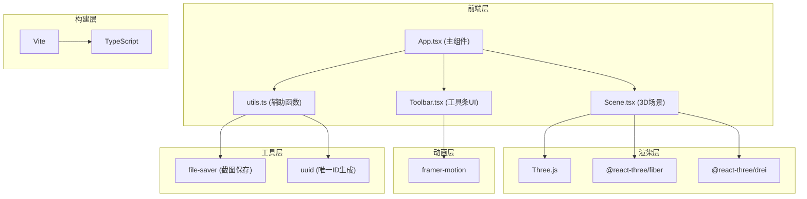

## 1. 架构设计



## 2. 技术描述

- **前端框架**：React 18 + TypeScript
- **3D渲染**：Three.js + @react-three/fiber + @react-three/drei
- **UI动画**：framer-motion
- **构建工具**：Vite 5
- **开发服务器端口**：3000
- **样式方案**：CSS Modules / 内联样式（配合framer-motion）
- **字体**：思源宋体（Google Fonts）

## 3. 目录结构

```
src/
├── App.tsx          # 主组件，状态管理，场景与工具条集成
├── Scene.tsx        # 3D场景渲染，漆层管理，雕刻逻辑
├── Toolbar.tsx      # 底部工具条UI，交互控件
└── utils.ts         # 颜色转换、截图、ID生成等辅助函数
```

## 4. 核心数据结构

### 4.1 漆层数据

```typescript
interface PaintLayer {
  id: string;
  color: string;
  thickness: number;
  timestamp: number;
  brushStrokes: BrushStroke[];
}

interface BrushStroke {
  id: string;
  points: Vector3[];
  width: number;
  timestamp: number;
}
```

### 4.2 刻痕数据

```typescript
interface CarvingMark {
  id: string;
  points: Vector3[];
  depth: number;
  width: number;
  speed: number;
  toolType: 'sharp' | 'bevel' | 'round';
}
```

### 4.3 应用状态

```typescript
type ToolType = 'brush' | 'carving';
type CarvingTool = 'sharp' | 'bevel' | 'round';

interface AppState {
  selectedColor: string;
  currentTool: ToolType;
  selectedCarvingTool: CarvingTool;
  isPolished: boolean;
  paintLayers: PaintLayer[];
  carvingMarks: CarvingMark[];
}
```

## 5. 核心模块说明

### 5.1 Scene.tsx 核心功能

- **盏托模型**：使用Three.js LatheGeometry生成旋转体，外径3单位，高1.5单位，托面下凹
- **漆层系统**：每层使用独立Mesh，半透明材质（opacity 0.85-0.9），逐层向外偏移，法线贴图模拟橘皮感
- **雕刻系统**：射线检测鼠标位置，根据移动速度计算刻痕深度宽度，修改漆层几何体或使用CSG（Constructive Solid Geometry）技术
- **粒子系统**：雕刻时生成木屑粒子，使用Three.js Points，限制最大200个
- **抛光效果**：调整材质envMapIntensity=0.6，roughness=0.15，metalness=0.4
- **相机控制**：OrbitControls，enableDamping=true, dampingFactor=0.1，minPolarAngle=10°, maxPolarAngle=80°, minDistance=2, maxDistance=10

### 5.2 Toolbar.tsx 核心功能

- **漆色选择**：8个圆形色块，选中时box-shadow发光动画
- **工具切换**：漆刷/刻刀tab切换，framer-motion实现滑动过渡
- **操作按钮**：抛光、截图，悬停时淡金色粒子上升动画
- **响应式**：使用CSS media queries根据屏幕宽度调整工具条高度

### 5.3 utils.ts 核心功能

- **hexToRgb**：十六进制颜色转RGB
- **rgbToHex**：RGB转十六进制
- **captureScreenshot**：canvas转Blob，file-saver保存PNG，添加水印
- **generateId**：uuid生成唯一标识

## 6. 性能优化

- **漆层几何体复用**：使用实例化渲染或合并几何体控制面数
- **粒子池化**：对象池管理粒子，避免频繁创建销毁
- **雕刻检测优化**：使用BVH加速射线检测
- **渲染帧率控制**：requestAnimationFrame自动适配，移动端可降级至30fps
- **内存管理**：及时dispose不再使用的几何体和材质

## 7. 依赖列表

- react ^18.2.0
- react-dom ^18.2.0
- typescript ^5.0.0
- vite ^5.0.0
- @vitejs/plugin-react ^4.2.0
- three ^0.160.0
- @react-three/fiber ^8.15.0
- @react-three/drei ^9.92.0
- @types/three ^0.160.0
- framer-motion ^10.16.0
- file-saver ^2.0.5
- uuid ^9.0.0
- @types/file-saver ^2.0.7
- @types/uuid ^9.0.0
