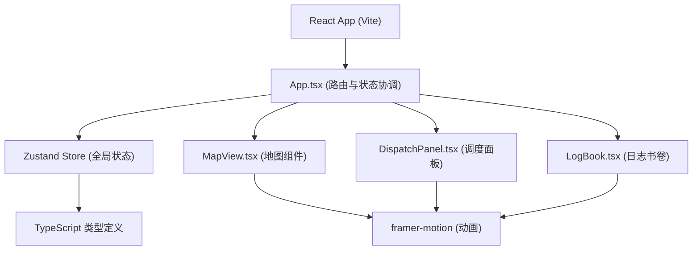

## 1. 架构设计



## 2. 技术描述

- **前端**：React 18 + TypeScript + Vite
- **状态管理**：zustand（轻量级状态管理）
- **动画库**：framer-motion（流畅动画效果）
- **路由**：react-router-dom（单页面路由）
- **样式**：CSS Modules + 内联样式（仿古风格）
- **字体**：思源宋体（Google Fonts）

## 3. 路由定义

| 路由 | 用途 |
|------|------|
| / | 主界面，包含地图、调度面板、日志书卷 |

## 4. 数据模型

### 4.1 TypeScript 类型定义

```typescript
// 驿站类型
interface PostStation {
  id: string;
  name: string;
  position: { x: number; y: number };
  horses: number; // 5-15匹随机
  soldiers: number; // 3-8人随机
  documents: Document[];
}

// 文书紧急等级
type UrgencyLevel = 'normal' | 'urgent' | 'extreme';

// 文书类型
interface Document {
  id: string; // 甲-20250314-003
  urgency: UrgencyLevel;
  fromStation: string;
  toStation: string;
  status: 'pending' | 'in-transit' | 'delivered' | 'delayed';
  dispatchTime?: number;
  arrivalTime?: number;
  timeLimit: number; // 15/10/8秒
}

// 驿马类型
interface Horse {
  id: string;
  name: string;
  available: boolean;
}

// 驿卒类型
interface Soldier {
  id: string;
  stamina: number; // 0-100
  isResting: boolean;
  restEndTime?: number;
}

// 移动中的驿马
interface MovingHorse {
  id: string;
  documentId: string;
  fromStation: string;
  toStation: string;
  startTime: number;
  duration: number;
  progress: number; // 0-1
}

// 粒子效果
interface Particle {
  id: string;
  x: number;
  y: number;
  createdAt: number;
  duration: number;
}

// 日志记录
interface LogEntry {
  id: string;
  documentId: string;
  documentCode: string;
  fromStation: string;
  toStation: string;
  dispatchTime: number;
  arrivalTime?: number;
  duration?: number;
  status: 'delivered' | 'in-transit' | 'delayed';
}

// 全局状态
interface AppState {
  stations: PostStation[];
  horses: Horse[];
  soldier: Soldier;
  movingHorses: MovingHorse[];
  particles: Particle[];
  logs: LogEntry[];
  selectedStation: string | null;
  selectedHorse: string | null;
  selectedDocument: string | null;
  alertMessage: string | null;
}
```

### 4.2 核心状态操作

```typescript
interface AppActions {
  selectStation: (id: string | null) => void;
  selectHorse: (id: string | null) => void;
  selectDocument: (id: string | null) => void;
  dispatchDocument: () => void;
  restSoldier: () => void;
  updateMovingHorses: (deltaTime: number) => void;
  addParticle: (x: number, y: number) => void;
  cleanupParticles: () => void;
  checkTimeouts: () => void;
  dismissAlert: () => void;
}
```

## 5. 核心算法

### 5.1 驿马移动计算

```typescript
// 根据紧急等级计算移动时间（秒/站）
const SPEED_MAP = {
  normal: 1.0,
  urgent: 0.6,
  extreme: 0.3,
};

// 体力影响：体力<30时速度降为70%
const getEffectiveSpeed = (urgency: UrgencyLevel, stamina: number) => {
  const baseSpeed = SPEED_MAP[urgency];
  return stamina < 30 ? baseSpeed / 0.7 : baseSpeed;
};

// 路径插值计算驿马位置
const interpolatePosition = (from: Point, to: Point, progress: number) => ({
  x: from.x + (to.x - from.x) * progress,
  y: from.y + (to.y - from.y) * progress,
});
```

### 5.2 文书编号生成

```typescript
// 格式：甲-20250314-003
const generateDocumentCode = (count: number) => {
  const prefix = '甲乙丙丁戊己庚辛壬癸'[Math.floor(count / 10) % 10];
  const date = new Date().toISOString().slice(0, 10).replace(/-/g, '');
  const suffix = String(count % 1000).padStart(3, '0');
  return `${prefix}-${date}-${suffix}`;
};
```

## 6. 性能优化策略

1. **requestAnimationFrame**：驿马移动和粒子更新使用RAF循环
2. **粒子池**：限制最多10个粒子，超出时复用最早的粒子
3. **虚拟滚动**：日志书卷仅渲染可见区域（使用CSS overflow优化）
4. **will-change**：对动画元素添加will-change提升性能
5. **memo优化**：使用React.memo避免不必要的重渲染
6. **状态分片**：zustand选择器按需订阅状态片段

## 7. 文件结构

```
├── package.json
├── index.html
├── vite.config.js
├── tsconfig.json
└── src/
    ├── App.tsx
    ├── types.ts
    ├── store.ts
    ├── utils.ts
    └── components/
        ├── MapView.tsx
        ├── DispatchPanel.tsx
        ├── LogBook.tsx
        ├── StationPopup.tsx
        ├── HorseIcon.tsx
        └── AlertBanner.tsx
```
