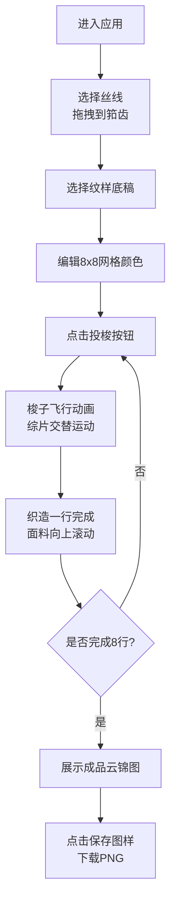

## 1. 产品概述

云锦织造交互游戏应用，通过模拟古代花楼机织造过程，帮助用户直观理解传统云锦织造中复杂提花图案的分色规律与经纬交织关系。目标用户为云锦文化爱好者、工艺美术学习者和历史文化研究者。

- 核心价值：将抽象的织造工艺转化为可交互的视觉体验，降低学习门槛
- 市场定位：文化教育类交互应用，兼具科普与娱乐价值

## 2. 核心功能

### 2.1 用户角色
| 角色 | 注册方式 | 核心权限 |
|------|----------|----------|
| 普通用户 | 无需注册 | 体验完整织造流程、编辑纹样、保存成品 |

### 2.2 功能模块
1. **主场景**：明代南京织造局内景，3D花楼机模型，可水平旋转观察
2. **丝线架**：8种颜色丝线选择，拖拽到筘齿位置，自动吸附效果
3. **纹样编辑器**：8x8像素网格，3种基础纹样底稿，点击切换颜色
4. **织造系统**：逐行投梭动画，综片运动，云锦面料纹理实时生成
5. **成品展示**：完整云锦成品图，云雷纹边框，下载保存功能

### 2.3 页面详情
| 页面名称 | 模块名称 | 功能描述 |
|----------|----------|----------|
| 主页面 | 3D花楼机场景 | 鼠标拖拽水平旋转（左右各40度），展示织机结构与织造过程 |
| 主页面 | 丝线架面板 | 8色丝线展示，悬停发光，拖拽吸附到筘齿，木扣振动音效 |
| 主页面 | 纹样编辑器 | 8x8网格编辑，3种底稿切换，颜色循环切换，实时预览同步 |
| 主页面 | 投梭控制系统 | 投梭按钮触发动画，梭子飞行轨迹，粒子拖尾效果 |
| 主页面 | 成品展示区 | 8行完成后显示成品图，云雷纹边框，PNG下载（1200x1200px） |

## 3. 核心流程

用户进入应用后，首先从丝线架选择丝线并拖拽到织机筘齿位置，然后选择基础纹样底稿并在编辑器中调整颜色，点击投梭按钮开始逐行织造，8行完成后展示成品图，最后可下载保存。

## 4. 用户界面设计

### 4.1 设计风格
- **主色调**：明宫藏蓝色#1a3a5c，金色#c9a96e点缀
- **背景色**：织造局内景灰蓝色#2c3e50，地面青灰色#4a5360
- **按钮样式**：金边八瓣菱花造型，圆角4px，边框1.5px solid #c9a96e，悬停金色渐变填充
- **字体**：Ma Shan Zheng书法字体（标题），系统无衬线字体（正文）
- **布局风格**：三栏布局（左侧纹样编辑器、中央织机、右侧丝线架+成品区）
- **材质效果**：旧纸色#f0e6d3配麻布纹理，丝线筒radial-gradient漫反射光泽

### 4.2 页面设计概述
| 页面名称 | 模块名称 | UI元素 |
|----------|----------|--------|
| 主页面 | 3D织机区域 | 深褐色硬木织机#3e2723，索绪综片结构，织造纹理Canvas |
| 主页面 | 纹样编辑器面板 | 8x8网格（20px/格），旧纸色背景，麻布纹理，金边按钮 |
| 主页面 | 丝线架 | CSS网格布局（55x55px/格），色筒radial-gradient光泽，悬停发光效果 |
| 主页面 | 纹样预览图 | 300x300px，米黄色背景#f5e6c8，120%放大时边缘晕染 |
| 主页面 | 成品展示区 | 600x600px，明黄背景#e6b800，云雷纹边框，底部编号日期 |
| 主页面 | 投梭动画 | requestAnimationFrame粒子系统，彩色粒子拖尾，0.8s渐隐 |

### 4.3 响应式
- Desktop-first设计，视口宽度小于1024px时，侧栏变为可折叠
- 折叠后花楼机占满整个宽度，保证核心交互区域可视
- 触摸设备优化拖拽和点击操作

### 4.4 3D场景指引
- **环境**：明代南京织造局内景，柔和自然光模拟
- **光照**：主光源45度角照射织机，辅助光填充暗部，突出木质纹理
- **相机**：固定在织机正面约1.5米处，水平旋转限制左右各40度
- **构图**：织机位于画面中央，上下留出空间展示纹样预览和成品区
- **交互**：鼠标拖拽控制水平旋转，无缩放操作
- **性能**：CSS 3D transform实现，不使用Three.js以保证60fps帧率
