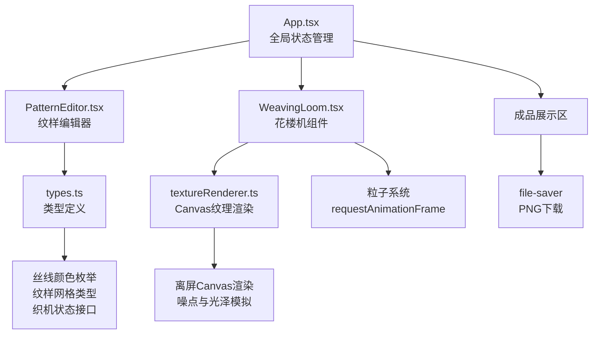
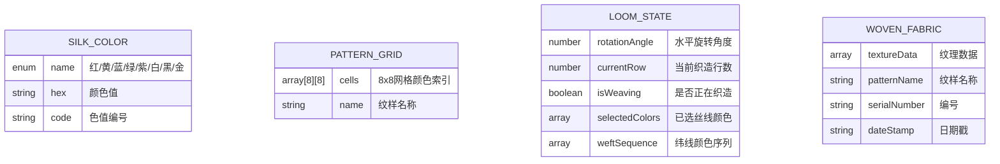

## 1. 架构设计



## 2. 技术描述

- **前端**：React@18 + TypeScript + Vite
- **初始化工具**：vite-init
- **后端**：无（纯前端应用）
- **动画库**：framer-motion（UI动画）、requestAnimationFrame（粒子系统）
- **文件下载**：file-saver
- **唯一标识**：uuid
- **3D效果**：CSS 3D Transform（不使用Three.js，保证轻量高性能）
- **纹理渲染**：HTML5 Canvas API（离屏渲染 + 实时纹理生成）

## 3. 目录结构

```
src/
├── types.ts              # 类型定义
├── App.tsx               # 主容器组件
├── components/
│   ├── WeavingLoom.tsx   # 花楼机3D效果与投梭动画
│   └── PatternEditor.tsx # 纹样网格编辑面板
└── utils/
    └── textureRenderer.ts # Canvas纹理渲染工具
```

## 4. 数据模型

### 4.1 数据模型定义



### 4.2 类型定义（types.ts）

```typescript
export enum SilkColor {
  RED = '#c0392b',
  YELLOW = '#f1c40f',
  BLUE = '#2980b9',
  GREEN = '#27ae60',
  PURPLE = '#8e44ad',
  WHITE = '#ecf0f1',
  BLACK = '#2c3e50',
  GOLD = '#b8860b',
}

export type PatternCell = number; // 颜色索引

export interface PatternGrid {
  name: string;
  cells: PatternCell[][]; // 8x8
}

export interface LoomState {
  rotationAngle: number;
  currentRow: number;
  isWeaving: boolean;
  selectedColors: SilkColor[];
  weftSequence: SilkColor[];
}

export interface WovenResult {
  dataUrl: string;
  patternName: string;
  serialNumber: string;
  dateStamp: string;
}
```

## 5. 核心技术方案

### 5.1 性能优化策略
- **纹样编辑延迟**：使用React状态直接更新，避免重渲染，目标<50ms
- **投梭动画帧率**：requestAnimationFrame驱动，粒子池复用，目标≥55fps
- **成品图生成**：离屏Canvas预渲染，目标<200ms
- **总动画耗时**：投梭过程≤1.5s（梭子飞行0.6s + 综片运动0.4s + 面料滚动0.5s）

### 5.2 Canvas纹理渲染（textureRenderer.ts）
- 离屏Canvas逐行绘制纬线
- 细小噪点模拟织造纹理
- 线性渐变模拟丝光效果
- 支持1倍和2倍分辨率输出

### 5.3 粒子系统
- 粒子对象池，避免频繁GC
- requestAnimationFrame动画循环
- 速度、生命周期、透明度衰减参数控制
- 梭子飞过后残留0.8s渐隐效果

## 6. 组件接口定义

### PatternEditor Props
```typescript
interface PatternEditorProps {
  availableColors: SilkColor[];
  pattern: PatternGrid;
  onPatternChange: (pattern: PatternGrid) => void;
  onSelectBasePattern: (name: string) => void;
}
```

### WeavingLoom Props
```typescript
interface WeavingLoomProps {
  pattern: PatternGrid;
  selectedColors: SilkColor[];
  onWeaveProgress: (row: number) => void;
  onWeaveComplete: (result: WovenResult) => void;
}
```

### App 全局状态
```typescript
interface AppState {
  selectedSilks: SilkColor[];
  currentPattern: PatternGrid;
  loomState: LoomState;
  wovenResult: WovenResult | null;
  sidebarCollapsed: boolean;
}
```
