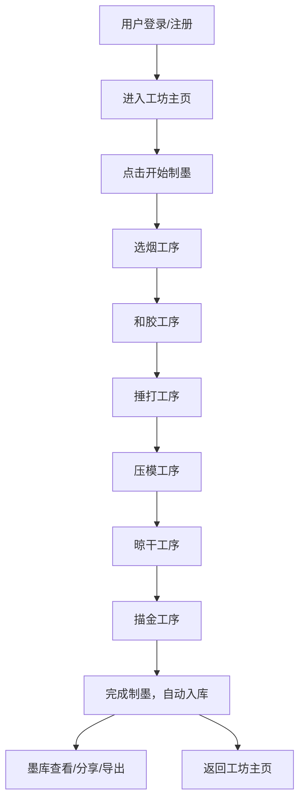

## 1. 产品概述

本产品是一个古代墨工制墨工艺流程的数字化再现与个性化定制全栈Web应用，让用户以徽州墨工的身份，亲身体验从选烟到描金的六个制墨工序，最终制作出一锭可展示和分享的定制墨锭。

- 主要目的：通过数字化手段传承和再现中国传统徽墨制作工艺，让用户沉浸式体验非物质文化遗产的魅力
- 解决的问题：传统制墨工艺学习门槛高、体验机会少，通过Web应用降低体验成本
- 目标用户：传统文化爱好者、文房四宝收藏者、手工艺体验者、教育领域用户
- 产品价值：弘扬中华传统文化，提供寓教于乐的沉浸式手工艺体验

## 2. 核心功能

### 2.1 用户角色

| 角色 | 注册方式 | 核心权限 |
|------|----------|----------|
| 普通用户 | 邮箱/用户名注册登录 | 体验制墨流程、保存和分享墨锭、查看个人统计 |

### 2.2 功能模块

1. **工坊主页 Dashboard**：徽派天井风格布局，展示用户已完成的墨锭卡片
2. **制墨流程 InteractiveWorkshop**：六道工序交互体验（选烟、和胶、捶打、压模、晾干、描金）
3. **墨库 Gallery**：历史成品展示，支持查看详情、分享图片、导出JSON
4. **用户 Profile**：个人资料管理，制墨统计展示

### 2.3 页面详情

| 页面名称 | 模块名称 | 功能描述 |
|----------|----------|----------|
| 工坊主页 | 天井布局 | 中央水池波纹动画，四周回廊展示墨锭卡片 |
| 工坊主页 | 墨锭卡片 | 220x280px仿古宣纸色卡片，洒金效果，悬停浮起动画 |
| 制墨流程 | 选烟工序 | 4种原料选择（松烟、油烟、漆烟、朱砂烟），水墨图标选中放大金边 |
| 制墨流程 | 和胶工序 | 3种胶料（牛皮胶、鹿角胶、桃胶），滑块调节比例，实时颜色变化 |
| 制墨流程 | 捶打工序 | 虚拟石臼点击捶打，15次点击完成，震动动画+音效 |
| 制墨流程 | 压模工序 | 6种模具纹样，实时渲染在3D墨锭模拟图上 |
| 制墨流程 | 晾干工序 | 5秒等待进度条，可加速不可跳过 |
| 制墨流程 | 描金工序 | 金/银/朱红三色描线笔，点击区域上色，反光效果增强 |
| 墨库 | 网格展示 | 所有历史成品墨锭网格布局 |
| 墨库 | 详情查看 | 三视图展示，配方详情（原料、模具、描金） |
| 墨库 | 分享导出 | 生成图片分享，导出JSON数据 |
| 用户资料 | 统计展示 | 总锭数、最高品级、常用原料，环形进度图 |
| 用户资料 | 头像昵称 | 6个预设墨工头像选择，修改昵称 |

## 3. 核心流程

用户注册登录后进入墨工坊仪表板，点击"开始制墨"进入制墨流程页面，依次完成六道工序，每道工序完成后自动进入下一道，全部完成后墨锭自动保存入库，用户可在墨库中查看、分享或导出。

## 4. 用户界面设计

### 4.1 设计风格

- **主色调**：深褐色 #3b2b1f，金色 #c9a84c，仿古宣纸色 #f5e6c8，墨色 #2a1b12
- **整体风格**：徽派建筑美学，传统中式与现代简约结合，沉静贵气
- **按钮样式**：圆角矩形，金色边框，深褐背景，悬停金色填充，点击缩放反馈（0.95→1.0，0.15s）
- **字体**：思源宋体（Google Fonts），标题加粗，正文常规
- **布局风格**：顶部导航栏（游廊造型，60px高），主内容区域三栏/两栏响应式布局
- **图标风格**：水墨风格图标，简洁写意
- **装饰元素**：竹帘、洒金、墨锭圆形图标、波纹动画

### 4.2 页面设计概述

| 页面名称 | 模块名称 | UI元素 |
|----------|----------|--------|
| 工坊主页 | 天井布局 | 中央水池CSS波纹动画，四周回廊布局，墨锭卡片网格 |
| 工坊主页 | 墨锭卡片 | 220x280px，#f5e6c8背景，洒金纹理，悬停浮起15px+#2a1b12阴影，0.4s过渡 |
| 制墨流程 | 时间轴 | 水平排列六个圆形墨锭节点（40px直径），已完成金色带光晕，未完成灰褐色 |
| 制墨流程 | 进度条 | 连接节点的进度条，当前步骤高亮 |
| 制墨流程 | 操作面板 | 从底部滑入，0.3s ease渐变 |
| 制墨流程 | 步骤切换 | 左右推拉动画，0.4s ease-in-out |
| 墨库 | 网格布局 | 响应式网格，三栏/两栏自适应 |
| 墨库 | 详情弹窗 | 三视图展示，配方详情，分享导出按钮 |
| 用户资料 | 统计图表 | 环形进度图展示原料占比 |
| 用户资料 | 头像选择 | 6个预设头像，选中金色边框 |

### 4.3 响应式设计

- **桌面端**（1280px及以上）：三栏布局，完整功能
- **平板端**（768-1279px）：两栏布局，保留核心交互
- **移动端**（768px以下）：单栏布局，基本浏览功能，简化交互

### 4.4 动画与交互

- **按钮反馈**：点击缩放 0.95→1.0，0.15s
- **面板弹出**：底部滑入，0.3s ease
- **步骤切换**：左右推拉，0.4s ease-in-out
- **卡片悬停**：浮起15px，墨色阴影，0.4s
- **粒子动画**：工序完成庆祝效果
- **水池波纹**：CSS动画持续循环
- **帧率要求**：步骤切换动画 ≥55fps
