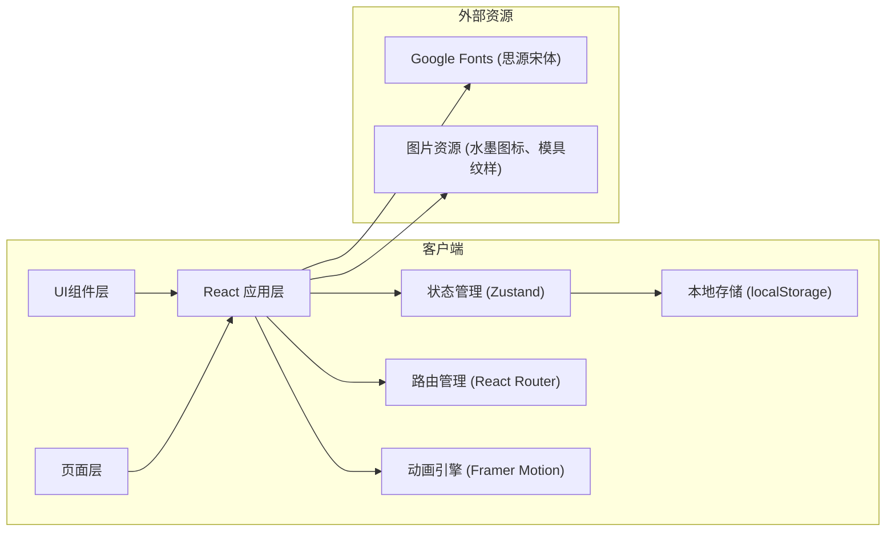

## 1. 架构设计

本项目采用纯前端架构，使用React + TypeScript + Vite构建，数据存储使用localStorage模拟后端。



## 2. 技术描述

- **前端框架**：React 18 + TypeScript
- **构建工具**：Vite 5
- **路由管理**：react-router-dom 6
- **状态管理**：Zustand
- **动画库**：framer-motion
- **CSS方案**：Tailwind CSS 3 + CSS Modules
- **图标库**：lucide-react
- **工具库**：uuid、file-saver
- **HTTP客户端**：axios（预留）
- **数据存储**：localStorage（模拟持久化）

## 3. 项目结构

```
src/
├── components/          # 可复用组件
│   ├── InkCard.tsx      # 墨锭卡片组件
│   ├── StepCard.tsx     # 工序步骤卡片
│   ├── Timeline.tsx     # 时间轴进度条
│   ├── Navigation.tsx   # 导航栏组件
│   ├── ParticleEffect.tsx # 庆祝粒子动画
│   └── Ink3DPreview.tsx # 3D墨锭预览
├── pages/               # 页面组件
│   ├── Dashboard.tsx    # 工坊主页
│   ├── Workshop.tsx     # 制墨流程页
│   ├── Gallery.tsx      # 墨库页
│   ├── Profile.tsx      # 用户资料页
│   └── Login.tsx        # 登录注册页
├── hooks/               # 自定义Hooks
│   ├── useInkMaking.ts  # 制墨流程状态机
│   └── useAudio.ts      # 音效Hook
├── store/               # 状态管理
│   └── useAppStore.ts   # 全局状态
├── types/               # 类型定义
│   └── index.ts
├── utils/               # 工具函数
│   ├── imageExport.ts   # 图片导出工具
│   └── dataExport.ts    # 数据导出工具
├── data/                # 静态数据
│   ├── materials.ts     # 原料数据
│   └── molds.ts         # 模具数据
├── assets/              # 静态资源
│   ├── icons/           # 水墨图标
│   ├── patterns/        # 模具纹样
│   └── avatars/         # 用户头像
├── App.tsx              # 主应用组件
├── main.tsx             # 入口文件
└── index.css            # 全局样式
```

## 4. 路由定义

| 路由 | 页面 | 说明 |
|------|------|------|
| `/login` | Login | 用户登录注册 |
| `/dashboard` | Dashboard | 工坊主页（默认页） |
| `/workshop` | Workshop | 制墨流程页 |
| `/gallery` | Gallery | 墨库展示页 |
| `/profile` | Profile | 用户资料页 |

## 5. 数据模型

### 5.1 类型定义

```typescript
// 原料类型
interface Material {
  id: string;
  name: string;
  type: 'soot' | 'glue';
  description: string;
  icon: string;
  color: string;
}

// 模具类型
interface Mold {
  id: string;
  name: string;
  pattern: string;
  description: string;
}

// 描金颜色
type OutlineColor = 'gold' | 'silver' | 'vermilion';

// 墨锭状态
interface InkState {
  soot: Material | null;
  glue: {
    cowhide: number;
    antler: number;
    peach: number;
  };
  hammerCount: number;
  mold: Mold | null;
  dryingProgress: number;
  outlineAreas: Record<string, OutlineColor>;
}

// 成品墨锭
interface InkProduct {
  id: string;
  name: string;
  createdAt: string;
  grade: number;
  recipe: InkState;
  previewImage: string;
}

// 用户信息
interface User {
  id: string;
  username: string;
  avatar: string;
  totalInks: number;
  highestGrade: number;
  materialStats: Record<string, number>;
  inks: InkProduct[];
}

// 工序步骤
type ProcessStep = 'soot' | 'glue' | 'hammer' | 'mold' | 'dry' | 'outline';
```

### 5.2 状态管理

使用Zustand管理全局状态：

```typescript
interface AppState {
  user: User | null;
  currentStep: ProcessStep;
  inkState: InkState;
  isLoggedIn: boolean;
  
  // Actions
  login: (username: string, password: string) => void;
  logout: () => void;
  updateAvatar: (avatar: string) => void;
  updateUsername: (name: string) => void;
  setSoot: (material: Material) => void;
  setGlue: (glue: InkState['glue']) => void;
  incrementHammer: () => void;
  setMold: (mold: Mold) => void;
  setDryingProgress: (progress: number) => void;
  setOutlineArea: (areaId: string, color: OutlineColor) => void;
  nextStep: () => void;
  completeInk: () => void;
  resetInkState: () => void;
}
```

## 6. 核心组件与逻辑

### 6.1 制墨流程状态机

`useInkMaking` Hook管理六步工序的状态流转：

- 选烟 → 和胶 → 捶打 → 压模 → 晾干 → 描金 → 完成
- 每步完成后自动推进，触发粒子庆祝动画
- 步骤切换使用framer-motion实现左右推拉动画

### 6.2 动画性能优化

- 使用transform和opacity属性实现GPU加速
- 粒子动画使用requestAnimationFrame控制
- 图片资源预加载，避免交互时卡顿
- 步骤切换动画帧率 ≥55fps

### 6.3 响应式断点

```css
/* 桌面端 */
@media (min-width: 1280px) {
  .grid-layout { grid-template-columns: repeat(3, 1fr); }
}

/* 平板端 */
@media (min-width: 768px) and (max-width: 1279px) {
  .grid-layout { grid-template-columns: repeat(2, 1fr); }
}

/* 移动端 */
@media (max-width: 767px) {
  .grid-layout { grid-template-columns: 1fr; }
  .workshop-interactive { display: none; }
}
```

## 7. 性能要求实现

### 7.1 动画帧率保证

- 使用CSS transforms而非top/left定位
- 避免布局抖动（Layout Thrashing）
- 使用will-change提示浏览器优化
- 粒子数量控制在50个以内

### 7.2 资源预加载

```typescript
// 首屏预加载所有图片资源
const preloadImages = async () => {
  const images = [...sootIcons, ...moldPatterns, ...avatars];
  await Promise.all(images.map(src => {
    return new Promise((resolve, reject) => {
      const img = new Image();
      img.onload = resolve;
      img.onerror = reject;
      img.src = src;
    });
  }));
};
```

### 7.3 图片分享生成

- 使用html2canvas或Canvas API生成图片
- 目标生成时间 ≤1秒
- 导出分辨率 1024x1024px

## 8. 配置文件

### 8.1 package.json 关键依赖

```json
{
  "dependencies": {
    "react": "^18.2.0",
    "react-dom": "^18.2.0",
    "react-router-dom": "^6.22.0",
    "framer-motion": "^11.0.0",
    "zustand": "^4.5.0",
    "lucide-react": "^0.344.0",
    "uuid": "^9.0.0",
    "file-saver": "^2.0.5",
    "axios": "^1.6.0"
  },
  "devDependencies": {
    "typescript": "^5.3.0",
    "vite": "^5.1.0",
    "@vitejs/plugin-react": "^4.2.0",
    "tailwindcss": "^3.4.0",
    "@types/file-saver": "^2.0.7",
    "@types/uuid": "^9.0.0"
  },
  "scripts": {
    "dev": "vite --port 3000"
  }
}
```

### 8.2 tsconfig.json

```json
{
  "compilerOptions": {
    "target": "ES2020",
    "useDefineForClassFields": true,
    "lib": ["ES2020", "DOM", "DOM.Iterable"],
    "module": "ESNext",
    "skipLibCheck": true,
    "moduleResolution": "bundler",
    "allowImportingTsExtensions": true,
    "resolveJsonModule": true,
    "isolatedModules": true,
    "noEmit": true,
    "jsx": "react-jsx",
    "strict": true,
    "noUnusedLocals": true,
    "noUnusedParameters": true,
    "noFallthroughCasesInSwitch": true,
    "baseUrl": ".",
    "paths": {
      "@/*": ["src/*"]
    }
  },
  "include": ["src"]
}
```

### 8.3 vite.config.js

```javascript
import { defineConfig } from 'vite';
import react from '@vitejs/plugin-react';
import path from 'path';

export default defineConfig({
  plugins: [react()],
  server: {
    port: 3000,
    open: true
  },
  resolve: {
    alias: {
      '@': path.resolve(__dirname, './src')
    }
  }
});
```
