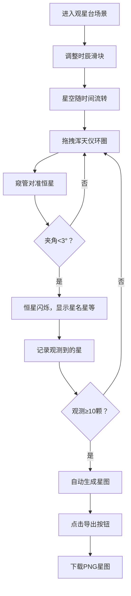

## 1. 产品概述

本项目是一个在浏览器中模拟元代天文观测官使用浑天仪观测星象并绘制星图的3D交互可视化系统。用户可以通过操作青铜浑天仪对准恒星进行观测，系统自动生成中国古代风格的星图，实现沉浸式的古代天文观测体验。

- 核心价值：通过现代3D技术复现中国古代天文观测场景，让用户直观理解浑天仪的工作原理和中国古代天文学成就
- 目标用户：天文爱好者、历史文化爱好者、教育工作者

## 2. 核心功能

### 2.1 用户角色

| 角色 | 注册方式 | 核心权限 |
|------|----------|----------|
| 观测官 | 直接进入 | 操作浑天仪、观测恒星、生成并导出星图 |

### 2.2 功能模块

1. **浑天仪交互模块**：可拖拽旋转的赤经圈、赤纬圈，窥管对准恒星检测
2. **星空穹幕模块**：3D星空穹顶，时辰驱动的天球旋转，大星闪烁效果
3. **星图生成模块**：观测10颗星后自动生成极坐标投影星图，包含星座连线和二十八宿标注
4. **时辰控制模块**：12时辰滑块控制天球旋转，浑天仪同步跟随
5. **状态面板模块**：显示观测进度、当前选中星信息、当前时辰，导出星图按钮

### 2.3 页面详情

| 页面名称 | 模块名称 | 功能描述 |
|----------|----------|----------|
| 主观测台 | 浑天仪交互 | 鼠标拖拽赤经/赤纬圈（-90°到90°），窥管对准检测（<3°触发星名显示） |
| 主观测台 | 星空穹幕 | 半径10单位的3D星空，500颗小星+20颗大星，闪烁周期1.5-3秒 |
| 主观测台 | 时辰滑块 | 子时到亥时12档，控制天球旋转，浑天仪同步（误差<0.5°） |
| 主观测台 | 星图生成 | 观测10颗星后自动生成极坐标星图，可导出PNG |
| 主观测台 | 状态面板 | 显示观测进度、当前星信息、时辰，导出按钮 |

## 3. 核心流程

用户进入观星台场景，面对青铜浑天仪，头顶旋转星空。通过右侧时辰滑块调整当前时间，星空随之流转。拖拽浑天仪的赤经圈和赤纬圈，使窥管对准目标恒星，当对准角度小于3度时，恒星闪烁并显示名称和星等。每成功观测一颗星，进度更新。当观测完成10颗星后，观星台上的纸卷自动展开显示平面星图，用户可点击导出按钮保存PNG格式星图。

## 4. 用户界面设计

### 4.1 设计风格

- **主背景色**：夜色深蓝 #0a0e27
- **观星台地面**：青石灰色 #3a3a3c
- **青铜浑天仪**：渐变金色 #b8860b → #daa520
- **刻度文字**：古体金色 #e0c080
- **星空背景**：深蓝 #040720
- **星星颜色**：白色 #ffffff 与蓝白色 #aaccff 交替
- **时辰滑块**：手柄青铜色水滴形 #b8860b，背景深棕色 #2c1e0e
- **字体**：Google Fonts 的 Liu Jian Mao Cao（古风字体）
- **交互效果**：所有元素有柔光晕和0.2秒过渡动画
- **整体风格**：元代天文仪器风格，古朴典雅

### 4.2 页面设计概述

| 页面名称 | 模块名称 | UI元素 |
|----------|----------|--------|
| 主观测台 | 3D场景 | 夜色背景、青石地面、青铜浑天仪居中、星空穹顶环绕 |
| 主观测台 | 浑天仪 | 多层可旋转圆环（赤经圈、赤纬圈，0.15单位宽），每10°刻度线，窥管 |
| 主观测台 | 星空穹幕 | 内表面星空纹理，500颗小星+20颗大星，大星CSS发光闪烁 |
| 主观测台 | 状态面板 | 左上角半透明白色卷轴样式，显示观测进度、星名、时辰、导出按钮 |
| 主观测台 | 时辰滑块 | 右上角垂直滑块，12时辰档位，拖动时数值浮动显示 |
| 主观测台 | 星图纸卷 | 观星台平面上展开的羊皮纸星图，极坐标投影，星座连线，二十八宿标注 |

### 4.3 响应性

- 桌面端优先，支持窗口自适应
- 3D场景随窗口大小调整
- 移动端简化交互（触摸拖拽支持）

### 4.4 3D场景指导

- **环境氛围**：深夜观星台，月光柔和，星空璀璨，银河横跨天际
- **光照设置**：环境光+月光方向光+浑天仪轮廓光，营造神秘肃穆的观测氛围
- **相机设置**：第三人称视角，距离浑天仪约5单位，可围绕浑天仪轨道旋转观察
- **构图**：浑天仪为视觉中心，星空穹顶为背景，地面观星台提供场景代入感
- **交互动画**：浑天仪环圈旋转有阻尼感，恒星闪烁有呼吸感，星图展开有卷轴动画
- **后期处理**：轻微泛光效果增强星空氛围，Bloom效果突出青铜质感
- **性能要求**：帧率≥25FPS，星点闪烁使用GPU着色器加速，滑块响应<50ms
